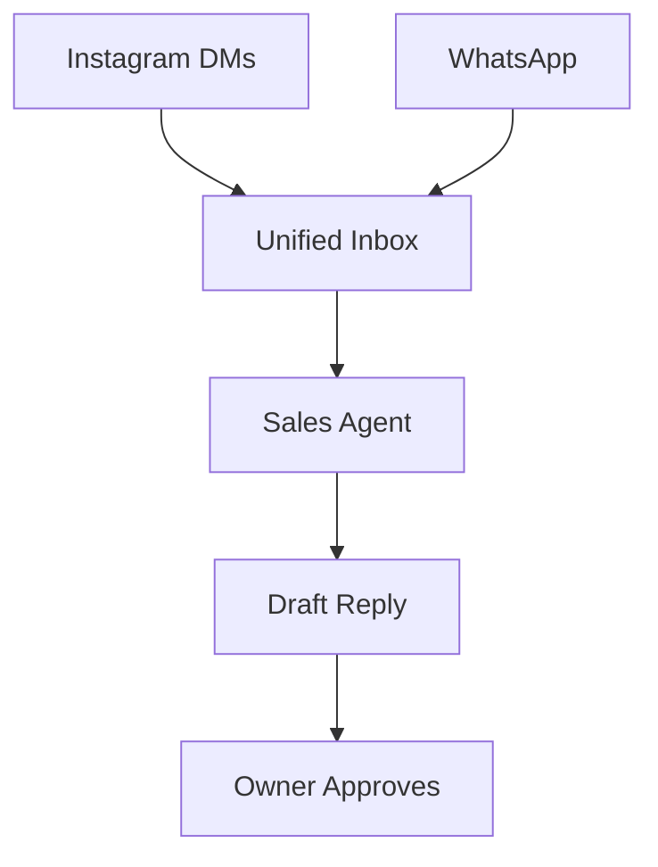

# Unified Agentic Inbox with Auto-Responder

## Problem Statement
Business owners are drowning in messages across Instagram DMs, WhatsApp, and email. They miss leads when busy and lack a centralized, intelligent way to respond to repetitive queries like "What are your hours?" or "Do you have this in size M?"

## Research Report
- **Findings**: 68% of small business owners report losing sales due to delayed responses.
- **Competitors**: Shopify requires third-party apps like Gorgias. Wix has a basic inbox but lacks true autonomous agentic replies.
- **Evidence**: r/ecommerce discussions (Jan 2024) complain about the lack of integrated multi-channel chat without exorbitant monthly fees.

## Design Doc
- **Architecture Flow**:
  - Webhooks from Meta (WhatsApp/IG) funnel into a central Inbox entity.
  - KAIROS agent intercepts incoming messages.
  - Agent queries the business context (inventory, FAQs).
  - Agent drafts or auto-sends replies.
- **Mobile UX (375px first)**:
  - Single consolidated chat interface.
  - Agent drafts appear with a 1-tap "Approve & Send" button.

## Implementation Prompt
**Outcome**: A unified messaging interface on mobile and desktop where an AI agent reads incoming customer queries, checks the store's inventory and policies, and proposes a reply.
**Critical User Journey (CUJ)**:
1. Customer messages the store on Instagram.
2. Message appears in OHC Unified Inbox.
3. Agent automatically drafts a response.
4. Business owner opens the app and taps 'Approve'.
**Acceptance Criteria**: Must consolidate at least two channels. AI drafts must be visible to the user before sending, with an option to enable "Auto-pilot".

## Priority
P0

## Estimated Scope
Medium
