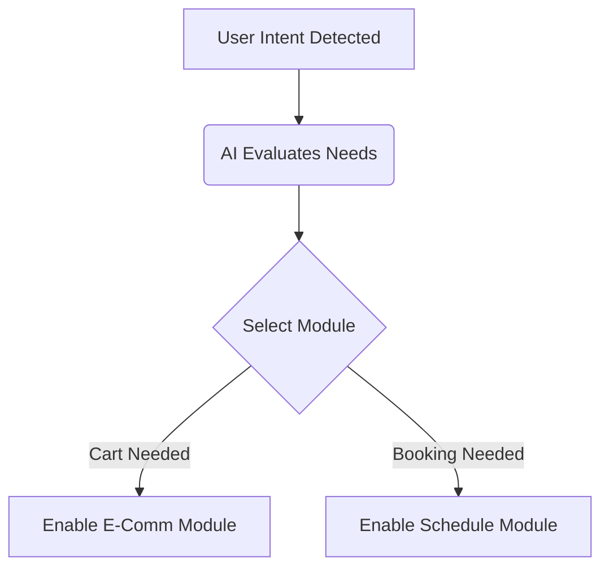

# Competitive Feature Matrix Analysis

## Problem Statement
While high-level positioning is well understood, the engineering and product teams lack a granular, feature-by-feature understanding of where OHC stands against the incumbents. Without this matrix, prioritization discussions devolve into subjective opinions rather than objective gap analysis.

## Research Report
A deep dive into the feature sets of Shopify, Wix, Squarespace, and GoDaddy was conducted, comparing them against the planned OHC capabilities.

### Key Observations
1.  **E-commerce Commoditization**: Basic cart and checkout functionality is a commodity. Differentiation here is minimal.
2.  **The Scheduling Gap**: Shopify completely ignores native scheduling, relying on apps. This is a massive vulnerability.
3.  **AI as a Feature vs. Core Architecture**: Competitors treat AI as an add-on tool (like a spellchecker). OHC is designing it as the core orchestration layer.

### Detailed Matrix Data
*   **Mobile Management**: OHC (100% Native Mobile App for Setup/Run), Shopify (Great for running, poor for setup), Wix/Squarespace (Limited).
*   **Booking Native**: OHC (Yes), Wix/Squarespace (Yes), Shopify (No, requires app).
*   **Subscription Native**: OHC (Yes), Squarespace (Yes), Shopify/Wix (Requires app).

## Design Doc
The platform architecture must decouple these features into micro-services that the AI can enable/disable based on the user's conversational onboarding.

### Architecture Overview
- Core Platform: Handles Identity, Billing, Tenant Isolation.
- Feature Modules: E-Commerce, Scheduling, Subscriptions.
- AI Orchestrator: Maps intent to modules.

### Mobile UX Flow (375px First)
The user should never see a "Settings > Features" screen. The AI proactively suggests enabling a module based on context.

## Implementation Prompt
Ensure the modular architecture allows for the hot-loading of feature sets without requiring a redeployment or complex user-facing configuration screens. The AI must be able to turn on a booking module and configure the UI layout autonomously.

## Priority
P1

## Estimated Scope
Medium
