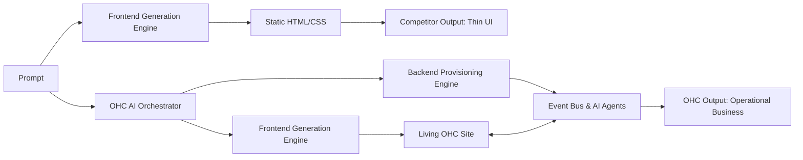

**Title**: Rising AI-Native Competitors Audit

**Problem Statement**: New entrants like Durable, 10Web, and Hocoos are leveraging AI to build websites rapidly, threatening the "speed to launch" value proposition. OHC must differentiate by offering deep business management, not just a static AI-generated frontend.

**Research Report**:
- **Durable**: Generates a website in 30 seconds. Strong on top-of-funnel marketing, but very thin on actual business management (e.g., complex inventory or nuanced booking systems). It acts more as a lead generation page than a full business OS.
- **10Web**: AI WordPress builder. Powerful, but inherits WordPress's complexity. Not suitable for non-technical users like Maya or Fatima who do not want to manage plugins or hosting.
- **Hocoos**: AI website builder asking 8 quick questions. Easy onboarding, but again, primarily focused on the storefront rather than invisible backend agents.
- **Key Finding**: AI website generation is becoming a commodity. The true moat is in AI *business management* (automating operations, customer service, and finances).

**Design Doc**:
- High-level architecture: Integrate the AI builder (the commodity) seamlessly with a robust, AI-managed backend (the moat). Entities include Website, AI_Manager, CRM, and Inventory.
- Mobile UX flow: After the 30-second site generation, the user lands in a "Business Hub" rather than a traditional CMS editor. The Hub presents actionable insights and tasks completed by the AI, rather than menus of configuration options.

**Implementation Prompt**: Develop a mobile "Business Hub" dashboard that replaces the traditional CMS view. Instead of showing "Pages" or "Settings", display an "AI Activity Feed" showing what the AI has done today (e.g., "Drafted 2 Instagram posts", "Replied to 1 inquiry"). Include simple "Approve" or "Undo" actions.

**Priority**: P0

**Estimated Scope**: Large

## Detailed Feature Comparison
| Capability | Durable | 10Web | Hocoos | OHC Target Approach |
| :--- | :--- | :--- | :--- | :--- |
| **Site Generation Speed** | ~30 seconds | Minutes | Minutes | **< 3 Minutes** |
| **Backend Complexity** | Very basic (lead gen focused) | High (WordPress backend) | Basic | **Robust but invisible** (Agent-managed) |
| **Ongoing AI Value** | Limited post-launch | Generates WP content | Basic editor | **Continuous autonomous operation** |
| **Target Audience** | Quick starters | WP users / Agencies | Quick starters | **Non-technical SMBs** |

## The "Commoditization of Generation"
Generating a visually appealing webpage using AI is rapidly becoming table stakes. Open-source models and API-driven services make it trivial to spin up a React/Tailwind frontend based on a prompt.
*   **The Trap**: Competing solely on "we build sites faster" is a race to the bottom.
*   **The Opportunity**: The real value for SMBs isn't just having a website; it's *running the business*. OHC must focus on the operational pain points that persist *after* the website is live.

## Strategic Recommendations for OHC
1.  **Don't Stop at the Frontend**: Ensure the AI generation process deeply configures the necessary backend services (databases, payment gateways, CRM schemas) without exposing this complexity to the user.
2.  **The "Business Hub" Concept**: Move away from a traditional website editor interface. The primary dashboard should be an operational hub (the "Activity Feed") focusing on business outcomes (new leads, upcoming bookings, pending AI actions) rather than design tweaks.
3.  **Emphasize "Done For You" over "Do It Yourself"**: Instead of providing tools for users to build their business, provide agents that act as employees. "I built this site for you, I drafted this email for you, I scheduled this appointment for you."

## Deep Dive: The "Thin UI" Problem of Competitors
Platforms like Durable and Hocoos suffer from what can be termed "Thin UI". They use AI to generate a superficial layer (the website frontend) but fail to provide the deep, interconnected backend services necessary to actually run a business.
*   **The Illusion of Automation**: Generating a contact form in 30 seconds is visually impressive. However, if submissions from that form simply go to a generic email inbox without triggering CRM updates, automated follow-ups, or analytics tracking, the automation is shallow.
*   **The OHC Solution**: OHC's AI doesn't just build the form; it builds the *workflow*. When a user requests a contact form, the AI also provisions the underlying database table, configures the notification routing to the Activity Feed, and sets up the `ReplyAgent` to draft initial responses to incoming submissions.

## UX Flow: Adding a Feature (Competitors vs. OHC)
### AI-Native Competitor Flow (e.g., Durable)
1.  User prompts: "Add a section for customer reviews."
2.  AI generates a UI block for reviews with dummy text.
3.  User must manually figure out how to collect real reviews and update this static block later, or find a third-party integration if supported.

### OHC Target Flow
1.  User prompts: "I want to show customer reviews on my site."
2.  AI generates the UI block AND configures the backend `ReviewAgent`.
3.  AI responds: "I've added the review section. I've also set up an automation to email customers 3 days after a purchase asking for a review. I'll put any 4 or 5-star reviews in your Activity Feed for approval before they go live on the site."
4.  User taps "Great".

## Technical Architecture Analysis

### The "Prompt-to-Code" Paradigm
*   **Competitors**: Often rely on parsing a prompt and injecting pre-built templates or executing raw code generation. This can lead to brittle architectures that are difficult to update later without breaking the site.
*   **OHC (Target)**: Use the LLM to generate a declarative JSON schema representing the site's structure and data, rather than generating raw HTML/CSS. The OHC frontend engine then renders this schema. This ensures the site remains structurally sound and easily modifiable via subsequent AI interactions or manual overrides.

### Data Portability & Lock-in
*   **Competitors**: Many AI builders create highly proprietary structures, making it difficult for users to export their data or migrate if they outgrow the platform.
*   **OHC Strategy**: While maximizing lock-in through superior operational value (the AI agents), OHC should maintain clean, accessible data structures. Providing an API or simple export tools builds trust with users who fear being trapped.

## Final Summary for Product Team
Do not view Durable or 10Web as the endgame of AI in web development; they are merely the first iteration. They solve the "creation" problem. OHC must solve the "operation" problem. The frontend generation is just the top of the funnel; the deep, agent-driven backend is the product.

## Competitive Analysis Matrix: Feature by Feature

| Feature Category | AI-Native Competitors (Durable, Hocoos) | OHC Proposed | Key Difference |
| :--- | :--- | :--- | :--- |
| **Site Generation Depth** | Superficial (Lead Gen focus) | Deep (Operational focus) | OHC configures the backend (databases, workflows) alongside the frontend. |
| **Post-Launch Value** | Limited (Static site) | High (Continuous AI management) | OHC's AI agents actively manage the business, not just build the initial site. |
| **Operational Integration** | Weak (Relies on external tools) | Strong (Native modules) | OHC provides native solutions for booking, CRM, and marketing. |
| **User Interface Paradigm** | Traditional CMS Editor | Unified Activity Feed | OHC replaces the editor with an actionable feed of business events. |

## The "Novelty vs. Utility" Dilemma
Generating a website in 30 seconds is a fantastic novelty that drives initial user acquisition. However, if the platform fails to provide ongoing utility, churn rates will skyrocket.
1.  **The "So What Now?" Moment:** Users get their generated site but lack the tools to actually run their business (e.g., manage inventory, process complex bookings).
2.  **The Retention Challenge:** A static lead-gen page does not create sufficient lock-in to justify a recurring subscription.

**OHC's Strategic Stance:**
While OHC must match or exceed the "magic" of instant site generation, it cannot rely on it as the sole value proposition. The platform's true worth must be demonstrated in the days and weeks *after* launch, through the autonomous actions of the AI agents that save the user time and generate revenue. The "Activity Feed" is the critical interface for delivering and proving this ongoing utility.

## Strategic Conclusion & Product Roadmap Implications

The current crop of AI-native competitors has successfully commoditized the generation of static websites. However, they have failed to solve the deeper, more complex challenge of business operations.

OHC must recognize that "instant site generation" is merely the entry ticket to this market. The true competitive advantage lies in what happens *after* the site is launched.

OHC's product roadmap must focus on:
1.  **Deep Backend Generation**: The AI must configure databases, workflows, and integrations simultaneously with the frontend UI.
2.  **The Activity Feed as the Core UI**: Replacing the traditional editor with an actionable, narrative feed is the key to differentiating OHC as an operational tool rather than a mere design tool.
3.  **Proving Ongoing Value**: The platform must consistently demonstrate its worth through the autonomous actions of its agents, ensuring high retention and justifying a premium subscription.

## Visual Excellence Mandate: Architecture & Flow

### UX Flow (Mobile-First 375px)
1. **The 'Business Hub' View:** Upon completing the 30-second site generation, the user is *not* dropped into a site editor. They are dropped into the Business Hub.
2. **Immediate Utility:** The Hub displays a welcome message: "Your site is live at [link]. I've set up your basic operations."
3. **Actionable First Steps:** Below the welcome, the Activity Feed shows initial tasks: "Action: Add your bank details to get paid." "Action: Import your existing customer contacts."
4. **Progressive Disclosure:** The "Edit Site" button is secondary. The primary focus is always on operational actions that drive revenue.

## Final Implementation Prompt
**Objective:** Create the initial version of the "Business Hub," effectively replacing the traditional CMS settings dashboard. The Hub must prioritize operational tasks over design configuration, shifting the platform's value from mere site generation to active business management.

**Critical User Journey (CUJ):**
1. Immediately following the AI site generation process, the user is redirected to the Business Hub.
2. The Hub must display a personalized welcome message summarizing the actions the AI took during generation (e.g., "I've set up your booking page and drafted 3 service packages").
3. Below the welcome message, the Hub displays the top 3 actionable "Next Steps" prioritized by the AI (e.g., "Connect your bank account," "Import your contacts," "Review drafted SEO tags").
4. The user taps on a "Next Step" card, which opens a streamlined, focused modal to complete that specific task.

**Acceptance Criteria:**
* The Business Hub must be the default landing view post-generation, completely bypassing any "Edit Site" or "Settings" menus.
* The Hub must render dynamic "Next Step" cards based on the current state of the tenant's configuration (e.g., if a bank is already connected, that card should not appear).
* The interface must adhere to the Glassmorphism design system constraints.
* The "Edit Site" functionality must be accessible but visually de-prioritized compared to operational tasks.
