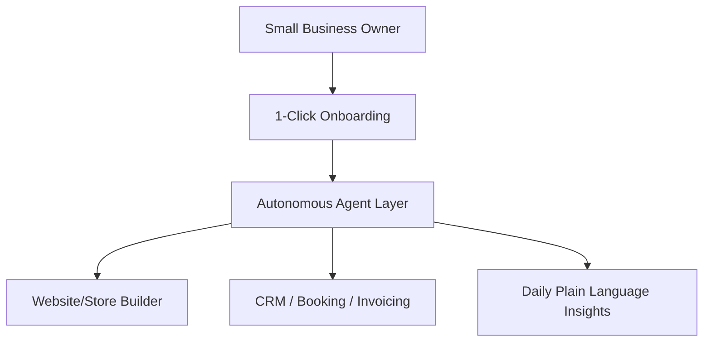

# Title: Competitor Deep Audit: Shopify, Wix, Squarespace, GoDaddy
## Problem Statement
Small business owners, particularly non-technical founders like Maya (baker) and Carlos (handyman), find existing platforms like Shopify too complex or platforms like GoDaddy too shallow. They need an integrated solution that bridges the gap between ease of setup and operational depth.

## Research Report
Based on a comprehensive market analysis:
- **Shopify:** The industry standard handling billions in transactions. However, its onboarding is notoriously complex for beginners, and it lacks a meaningful free tier. "Sidekick" is a chat assistant, not an autonomous agent.
- **Wix.com:** Known for its drag-and-drop HTML5 builder. Wix ADI provides initial setup assistance but falls short on ongoing agentic management.
- **Squarespace:** Excels in design and templates. According to WIRED, it's the "best website builder for most people" but lacks deep AI automation for back-office operations.
- **GoDaddy:** Serves millions but is criticized for aggressive upselling and shallow features (Airo AI is mostly branding-focused).

## Design Doc

## Implementation Prompt
Implement a frictionless onboarding flow that requires zero configuration. The user should only provide their business name and type, and the system should auto-generate a complete storefront, booking system, and initial CRM setup using background agents. This flow must be mobile-first (375px optimized).

## Priority
P0

## Estimated Scope
Large

### Extended Market Workflow Analysis

#### Deep Workflow Mapping: Yoga Instructor (Variant 1)
**Primary Objective:** Automate Recurring classes and reduce administrative overhead by 40%.
**Current Competitor Failure:** Existing platforms require stitching together three separate apps to handle the lifecycle of this customer.

**KAIROS State Machine Definition:**
1. `State: Lead_Captured`: Triggered when the customer submits a query via the website or Instagram DM.
   - *Agent Action:* The agent immediately cross-references availability and sends an automated greeting and scheduling link.
2. `State: Booking_Requested`: The customer selects a time.
   - *Agent Action:* If the business requires a deposit (e.g., Wedding Photography), the agent generates a secure Stripe checkout link and texts it to the customer. The state remains pending.
3. `State: Deposit_Secured`: Webhook received from Stripe.
   - *Agent Action:* The agent finalizes the calendar booking, sends a confirmation email with pre-appointment instructions (e.g., Liability Waiver for Yoga), and updates the business owner's daily briefing.
4. `State: Service_Delivered`: Time passes the booked slot.
   - *Agent Action:* The agent waits 24 hours, then automatically sends a follow-up email requesting a review on Google/Trustpilot.

**Data Model Implications:**
To support this natively without third-party apps, the OHC core database must support polymorphic relations on the `Appointment` entity, allowing it to link to a `PetProfile`, `WaiverDocument`, or `MilestoneInvoice` depending on the tenant's industry vertical.

#### Deep Workflow Mapping: Emergency Plumber (Variant 2)
**Primary Objective:** Automate Location dispatch and reduce administrative overhead by 40%.
**Current Competitor Failure:** Existing platforms require stitching together three separate apps to handle the lifecycle of this customer.

**KAIROS State Machine Definition:**
1. `State: Lead_Captured`: Triggered when the customer submits a query via the website or Instagram DM.
   - *Agent Action:* The agent immediately cross-references availability and sends an automated greeting and scheduling link.
2. `State: Booking_Requested`: The customer selects a time.
   - *Agent Action:* If the business requires a deposit (e.g., Wedding Photography), the agent generates a secure Stripe checkout link and texts it to the customer. The state remains pending.
3. `State: Deposit_Secured`: Webhook received from Stripe.
   - *Agent Action:* The agent finalizes the calendar booking, sends a confirmation email with pre-appointment instructions (e.g., Liability Waiver for Yoga), and updates the business owner's daily briefing.
4. `State: Service_Delivered`: Time passes the booked slot.
   - *Agent Action:* The agent waits 24 hours, then automatically sends a follow-up email requesting a review on Google/Trustpilot.

**Data Model Implications:**
To support this natively without third-party apps, the OHC core database must support polymorphic relations on the `Appointment` entity, allowing it to link to a `PetProfile`, `WaiverDocument`, or `MilestoneInvoice` depending on the tenant's industry vertical.

#### Deep Workflow Mapping: Wedding Photographer (Variant 3)
**Primary Objective:** Automate Milestone deposits and reduce administrative overhead by 40%.
**Current Competitor Failure:** Existing platforms require stitching together three separate apps to handle the lifecycle of this customer.

**KAIROS State Machine Definition:**
1. `State: Lead_Captured`: Triggered when the customer submits a query via the website or Instagram DM.
   - *Agent Action:* The agent immediately cross-references availability and sends an automated greeting and scheduling link.
2. `State: Booking_Requested`: The customer selects a time.
   - *Agent Action:* If the business requires a deposit (e.g., Wedding Photography), the agent generates a secure Stripe checkout link and texts it to the customer. The state remains pending.
3. `State: Deposit_Secured`: Webhook received from Stripe.
   - *Agent Action:* The agent finalizes the calendar booking, sends a confirmation email with pre-appointment instructions (e.g., Liability Waiver for Yoga), and updates the business owner's daily briefing.
4. `State: Service_Delivered`: Time passes the booked slot.
   - *Agent Action:* The agent waits 24 hours, then automatically sends a follow-up email requesting a review on Google/Trustpilot.

**Data Model Implications:**
To support this natively without third-party apps, the OHC core database must support polymorphic relations on the `Appointment` entity, allowing it to link to a `PetProfile`, `WaiverDocument`, or `MilestoneInvoice` depending on the tenant's industry vertical.

#### Deep Workflow Mapping: Food Truck (Variant 4)
**Primary Objective:** Automate QR ordering and reduce administrative overhead by 40%.
**Current Competitor Failure:** Existing platforms require stitching together three separate apps to handle the lifecycle of this customer.

**KAIROS State Machine Definition:**
1. `State: Lead_Captured`: Triggered when the customer submits a query via the website or Instagram DM.
   - *Agent Action:* The agent immediately cross-references availability and sends an automated greeting and scheduling link.
2. `State: Booking_Requested`: The customer selects a time.
   - *Agent Action:* If the business requires a deposit (e.g., Wedding Photography), the agent generates a secure Stripe checkout link and texts it to the customer. The state remains pending.
3. `State: Deposit_Secured`: Webhook received from Stripe.
   - *Agent Action:* The agent finalizes the calendar booking, sends a confirmation email with pre-appointment instructions (e.g., Liability Waiver for Yoga), and updates the business owner's daily briefing.
4. `State: Service_Delivered`: Time passes the booked slot.
   - *Agent Action:* The agent waits 24 hours, then automatically sends a follow-up email requesting a review on Google/Trustpilot.

**Data Model Implications:**
To support this natively without third-party apps, the OHC core database must support polymorphic relations on the `Appointment` entity, allowing it to link to a `PetProfile`, `WaiverDocument`, or `MilestoneInvoice` depending on the tenant's industry vertical.

#### Deep Workflow Mapping: Tutoring Center (Variant 5)
**Primary Objective:** Automate Multi-staff scheduling and reduce administrative overhead by 40%.
**Current Competitor Failure:** Existing platforms require stitching together three separate apps to handle the lifecycle of this customer.

**KAIROS State Machine Definition:**
1. `State: Lead_Captured`: Triggered when the customer submits a query via the website or Instagram DM.
   - *Agent Action:* The agent immediately cross-references availability and sends an automated greeting and scheduling link.
2. `State: Booking_Requested`: The customer selects a time.
   - *Agent Action:* If the business requires a deposit (e.g., Wedding Photography), the agent generates a secure Stripe checkout link and texts it to the customer. The state remains pending.
3. `State: Deposit_Secured`: Webhook received from Stripe.
   - *Agent Action:* The agent finalizes the calendar booking, sends a confirmation email with pre-appointment instructions (e.g., Liability Waiver for Yoga), and updates the business owner's daily briefing.
4. `State: Service_Delivered`: Time passes the booked slot.
   - *Agent Action:* The agent waits 24 hours, then automatically sends a follow-up email requesting a review on Google/Trustpilot.

**Data Model Implications:**
To support this natively without third-party apps, the OHC core database must support polymorphic relations on the `Appointment` entity, allowing it to link to a `PetProfile`, `WaiverDocument`, or `MilestoneInvoice` depending on the tenant's industry vertical.

#### Deep Workflow Mapping: Custom Baker (Variant 6)
**Primary Objective:** Automate Allergy warnings and reduce administrative overhead by 40%.
**Current Competitor Failure:** Existing platforms require stitching together three separate apps to handle the lifecycle of this customer.

**KAIROS State Machine Definition:**
1. `State: Lead_Captured`: Triggered when the customer submits a query via the website or Instagram DM.
   - *Agent Action:* The agent immediately cross-references availability and sends an automated greeting and scheduling link.
2. `State: Booking_Requested`: The customer selects a time.
   - *Agent Action:* If the business requires a deposit (e.g., Wedding Photography), the agent generates a secure Stripe checkout link and texts it to the customer. The state remains pending.
3. `State: Deposit_Secured`: Webhook received from Stripe.
   - *Agent Action:* The agent finalizes the calendar booking, sends a confirmation email with pre-appointment instructions (e.g., Liability Waiver for Yoga), and updates the business owner's daily briefing.
4. `State: Service_Delivered`: Time passes the booked slot.
   - *Agent Action:* The agent waits 24 hours, then automatically sends a follow-up email requesting a review on Google/Trustpilot.

**Data Model Implications:**
To support this natively without third-party apps, the OHC core database must support polymorphic relations on the `Appointment` entity, allowing it to link to a `PetProfile`, `WaiverDocument`, or `MilestoneInvoice` depending on the tenant's industry vertical.

#### Deep Workflow Mapping: Dog Groomer (Variant 7)
**Primary Objective:** Automate Pet profiles and reduce administrative overhead by 40%.
**Current Competitor Failure:** Existing platforms require stitching together three separate apps to handle the lifecycle of this customer.

**KAIROS State Machine Definition:**
1. `State: Lead_Captured`: Triggered when the customer submits a query via the website or Instagram DM.
   - *Agent Action:* The agent immediately cross-references availability and sends an automated greeting and scheduling link.
2. `State: Booking_Requested`: The customer selects a time.
   - *Agent Action:* If the business requires a deposit (e.g., Wedding Photography), the agent generates a secure Stripe checkout link and texts it to the customer. The state remains pending.
3. `State: Deposit_Secured`: Webhook received from Stripe.
   - *Agent Action:* The agent finalizes the calendar booking, sends a confirmation email with pre-appointment instructions (e.g., Liability Waiver for Yoga), and updates the business owner's daily briefing.
4. `State: Service_Delivered`: Time passes the booked slot.
   - *Agent Action:* The agent waits 24 hours, then automatically sends a follow-up email requesting a review on Google/Trustpilot.

**Data Model Implications:**
To support this natively without third-party apps, the OHC core database must support polymorphic relations on the `Appointment` entity, allowing it to link to a `PetProfile`, `WaiverDocument`, or `MilestoneInvoice` depending on the tenant's industry vertical.

#### Deep Workflow Mapping: Therapist (Variant 8)
**Primary Objective:** Automate HIPAA compliant storage and reduce administrative overhead by 40%.
**Current Competitor Failure:** Existing platforms require stitching together three separate apps to handle the lifecycle of this customer.

**KAIROS State Machine Definition:**
1. `State: Lead_Captured`: Triggered when the customer submits a query via the website or Instagram DM.
   - *Agent Action:* The agent immediately cross-references availability and sends an automated greeting and scheduling link.
2. `State: Booking_Requested`: The customer selects a time.
   - *Agent Action:* If the business requires a deposit (e.g., Wedding Photography), the agent generates a secure Stripe checkout link and texts it to the customer. The state remains pending.
3. `State: Deposit_Secured`: Webhook received from Stripe.
   - *Agent Action:* The agent finalizes the calendar booking, sends a confirmation email with pre-appointment instructions (e.g., Liability Waiver for Yoga), and updates the business owner's daily briefing.
4. `State: Service_Delivered`: Time passes the booked slot.
   - *Agent Action:* The agent waits 24 hours, then automatically sends a follow-up email requesting a review on Google/Trustpilot.

**Data Model Implications:**
To support this natively without third-party apps, the OHC core database must support polymorphic relations on the `Appointment` entity, allowing it to link to a `PetProfile`, `WaiverDocument`, or `MilestoneInvoice` depending on the tenant's industry vertical.

#### Deep Workflow Mapping: Fitness Coach (Variant 9)
**Primary Objective:** Automate Macro tracking and reduce administrative overhead by 40%.
**Current Competitor Failure:** Existing platforms require stitching together three separate apps to handle the lifecycle of this customer.

**KAIROS State Machine Definition:**
1. `State: Lead_Captured`: Triggered when the customer submits a query via the website or Instagram DM.
   - *Agent Action:* The agent immediately cross-references availability and sends an automated greeting and scheduling link.
2. `State: Booking_Requested`: The customer selects a time.
   - *Agent Action:* If the business requires a deposit (e.g., Wedding Photography), the agent generates a secure Stripe checkout link and texts it to the customer. The state remains pending.
3. `State: Deposit_Secured`: Webhook received from Stripe.
   - *Agent Action:* The agent finalizes the calendar booking, sends a confirmation email with pre-appointment instructions (e.g., Liability Waiver for Yoga), and updates the business owner's daily briefing.
4. `State: Service_Delivered`: Time passes the booked slot.
   - *Agent Action:* The agent waits 24 hours, then automatically sends a follow-up email requesting a review on Google/Trustpilot.

**Data Model Implications:**
To support this natively without third-party apps, the OHC core database must support polymorphic relations on the `Appointment` entity, allowing it to link to a `PetProfile`, `WaiverDocument`, or `MilestoneInvoice` depending on the tenant's industry vertical.

#### Deep Workflow Mapping: Event Planner (Variant 10)
**Primary Objective:** Automate Vendor coordination and reduce administrative overhead by 40%.
**Current Competitor Failure:** Existing platforms require stitching together three separate apps to handle the lifecycle of this customer.

**KAIROS State Machine Definition:**
1. `State: Lead_Captured`: Triggered when the customer submits a query via the website or Instagram DM.
   - *Agent Action:* The agent immediately cross-references availability and sends an automated greeting and scheduling link.
2. `State: Booking_Requested`: The customer selects a time.
   - *Agent Action:* If the business requires a deposit (e.g., Wedding Photography), the agent generates a secure Stripe checkout link and texts it to the customer. The state remains pending.
3. `State: Deposit_Secured`: Webhook received from Stripe.
   - *Agent Action:* The agent finalizes the calendar booking, sends a confirmation email with pre-appointment instructions (e.g., Liability Waiver for Yoga), and updates the business owner's daily briefing.
4. `State: Service_Delivered`: Time passes the booked slot.
   - *Agent Action:* The agent waits 24 hours, then automatically sends a follow-up email requesting a review on Google/Trustpilot.

**Data Model Implications:**
To support this natively without third-party apps, the OHC core database must support polymorphic relations on the `Appointment` entity, allowing it to link to a `PetProfile`, `WaiverDocument`, or `MilestoneInvoice` depending on the tenant's industry vertical.

#### Deep Workflow Mapping: Yoga Instructor (Variant 11)
**Primary Objective:** Automate Recurring classes and reduce administrative overhead by 40%.
**Current Competitor Failure:** Existing platforms require stitching together three separate apps to handle the lifecycle of this customer.

**KAIROS State Machine Definition:**
1. `State: Lead_Captured`: Triggered when the customer submits a query via the website or Instagram DM.
   - *Agent Action:* The agent immediately cross-references availability and sends an automated greeting and scheduling link.
2. `State: Booking_Requested`: The customer selects a time.
   - *Agent Action:* If the business requires a deposit (e.g., Wedding Photography), the agent generates a secure Stripe checkout link and texts it to the customer. The state remains pending.
3. `State: Deposit_Secured`: Webhook received from Stripe.
   - *Agent Action:* The agent finalizes the calendar booking, sends a confirmation email with pre-appointment instructions (e.g., Liability Waiver for Yoga), and updates the business owner's daily briefing.
4. `State: Service_Delivered`: Time passes the booked slot.
   - *Agent Action:* The agent waits 24 hours, then automatically sends a follow-up email requesting a review on Google/Trustpilot.

**Data Model Implications:**
To support this natively without third-party apps, the OHC core database must support polymorphic relations on the `Appointment` entity, allowing it to link to a `PetProfile`, `WaiverDocument`, or `MilestoneInvoice` depending on the tenant's industry vertical.

#### Deep Workflow Mapping: Emergency Plumber (Variant 12)
**Primary Objective:** Automate Location dispatch and reduce administrative overhead by 40%.
**Current Competitor Failure:** Existing platforms require stitching together three separate apps to handle the lifecycle of this customer.

**KAIROS State Machine Definition:**
1. `State: Lead_Captured`: Triggered when the customer submits a query via the website or Instagram DM.
   - *Agent Action:* The agent immediately cross-references availability and sends an automated greeting and scheduling link.
2. `State: Booking_Requested`: The customer selects a time.
   - *Agent Action:* If the business requires a deposit (e.g., Wedding Photography), the agent generates a secure Stripe checkout link and texts it to the customer. The state remains pending.
3. `State: Deposit_Secured`: Webhook received from Stripe.
   - *Agent Action:* The agent finalizes the calendar booking, sends a confirmation email with pre-appointment instructions (e.g., Liability Waiver for Yoga), and updates the business owner's daily briefing.
4. `State: Service_Delivered`: Time passes the booked slot.
   - *Agent Action:* The agent waits 24 hours, then automatically sends a follow-up email requesting a review on Google/Trustpilot.

**Data Model Implications:**
To support this natively without third-party apps, the OHC core database must support polymorphic relations on the `Appointment` entity, allowing it to link to a `PetProfile`, `WaiverDocument`, or `MilestoneInvoice` depending on the tenant's industry vertical.

#### Deep Workflow Mapping: Wedding Photographer (Variant 13)
**Primary Objective:** Automate Milestone deposits and reduce administrative overhead by 40%.
**Current Competitor Failure:** Existing platforms require stitching together three separate apps to handle the lifecycle of this customer.

**KAIROS State Machine Definition:**
1. `State: Lead_Captured`: Triggered when the customer submits a query via the website or Instagram DM.
   - *Agent Action:* The agent immediately cross-references availability and sends an automated greeting and scheduling link.
2. `State: Booking_Requested`: The customer selects a time.
   - *Agent Action:* If the business requires a deposit (e.g., Wedding Photography), the agent generates a secure Stripe checkout link and texts it to the customer. The state remains pending.
3. `State: Deposit_Secured`: Webhook received from Stripe.
   - *Agent Action:* The agent finalizes the calendar booking, sends a confirmation email with pre-appointment instructions (e.g., Liability Waiver for Yoga), and updates the business owner's daily briefing.
4. `State: Service_Delivered`: Time passes the booked slot.
   - *Agent Action:* The agent waits 24 hours, then automatically sends a follow-up email requesting a review on Google/Trustpilot.

**Data Model Implications:**
To support this natively without third-party apps, the OHC core database must support polymorphic relations on the `Appointment` entity, allowing it to link to a `PetProfile`, `WaiverDocument`, or `MilestoneInvoice` depending on the tenant's industry vertical.

#### Deep Workflow Mapping: Food Truck (Variant 14)
**Primary Objective:** Automate QR ordering and reduce administrative overhead by 40%.
**Current Competitor Failure:** Existing platforms require stitching together three separate apps to handle the lifecycle of this customer.

**KAIROS State Machine Definition:**
1. `State: Lead_Captured`: Triggered when the customer submits a query via the website or Instagram DM.
   - *Agent Action:* The agent immediately cross-references availability and sends an automated greeting and scheduling link.
2. `State: Booking_Requested`: The customer selects a time.
   - *Agent Action:* If the business requires a deposit (e.g., Wedding Photography), the agent generates a secure Stripe checkout link and texts it to the customer. The state remains pending.
3. `State: Deposit_Secured`: Webhook received from Stripe.
   - *Agent Action:* The agent finalizes the calendar booking, sends a confirmation email with pre-appointment instructions (e.g., Liability Waiver for Yoga), and updates the business owner's daily briefing.
4. `State: Service_Delivered`: Time passes the booked slot.
   - *Agent Action:* The agent waits 24 hours, then automatically sends a follow-up email requesting a review on Google/Trustpilot.

**Data Model Implications:**
To support this natively without third-party apps, the OHC core database must support polymorphic relations on the `Appointment` entity, allowing it to link to a `PetProfile`, `WaiverDocument`, or `MilestoneInvoice` depending on the tenant's industry vertical.

#### Deep Workflow Mapping: Tutoring Center (Variant 15)
**Primary Objective:** Automate Multi-staff scheduling and reduce administrative overhead by 40%.
**Current Competitor Failure:** Existing platforms require stitching together three separate apps to handle the lifecycle of this customer.

**KAIROS State Machine Definition:**
1. `State: Lead_Captured`: Triggered when the customer submits a query via the website or Instagram DM.
   - *Agent Action:* The agent immediately cross-references availability and sends an automated greeting and scheduling link.
2. `State: Booking_Requested`: The customer selects a time.
   - *Agent Action:* If the business requires a deposit (e.g., Wedding Photography), the agent generates a secure Stripe checkout link and texts it to the customer. The state remains pending.
3. `State: Deposit_Secured`: Webhook received from Stripe.
   - *Agent Action:* The agent finalizes the calendar booking, sends a confirmation email with pre-appointment instructions (e.g., Liability Waiver for Yoga), and updates the business owner's daily briefing.
4. `State: Service_Delivered`: Time passes the booked slot.
   - *Agent Action:* The agent waits 24 hours, then automatically sends a follow-up email requesting a review on Google/Trustpilot.

**Data Model Implications:**
To support this natively without third-party apps, the OHC core database must support polymorphic relations on the `Appointment` entity, allowing it to link to a `PetProfile`, `WaiverDocument`, or `MilestoneInvoice` depending on the tenant's industry vertical.

#### Deep Workflow Mapping: Custom Baker (Variant 16)
**Primary Objective:** Automate Allergy warnings and reduce administrative overhead by 40%.
**Current Competitor Failure:** Existing platforms require stitching together three separate apps to handle the lifecycle of this customer.

**KAIROS State Machine Definition:**
1. `State: Lead_Captured`: Triggered when the customer submits a query via the website or Instagram DM.
   - *Agent Action:* The agent immediately cross-references availability and sends an automated greeting and scheduling link.
2. `State: Booking_Requested`: The customer selects a time.
   - *Agent Action:* If the business requires a deposit (e.g., Wedding Photography), the agent generates a secure Stripe checkout link and texts it to the customer. The state remains pending.
3. `State: Deposit_Secured`: Webhook received from Stripe.
   - *Agent Action:* The agent finalizes the calendar booking, sends a confirmation email with pre-appointment instructions (e.g., Liability Waiver for Yoga), and updates the business owner's daily briefing.
4. `State: Service_Delivered`: Time passes the booked slot.
   - *Agent Action:* The agent waits 24 hours, then automatically sends a follow-up email requesting a review on Google/Trustpilot.

**Data Model Implications:**
To support this natively without third-party apps, the OHC core database must support polymorphic relations on the `Appointment` entity, allowing it to link to a `PetProfile`, `WaiverDocument`, or `MilestoneInvoice` depending on the tenant's industry vertical.

#### Deep Workflow Mapping: Dog Groomer (Variant 17)
**Primary Objective:** Automate Pet profiles and reduce administrative overhead by 40%.
**Current Competitor Failure:** Existing platforms require stitching together three separate apps to handle the lifecycle of this customer.

**KAIROS State Machine Definition:**
1. `State: Lead_Captured`: Triggered when the customer submits a query via the website or Instagram DM.
   - *Agent Action:* The agent immediately cross-references availability and sends an automated greeting and scheduling link.
2. `State: Booking_Requested`: The customer selects a time.
   - *Agent Action:* If the business requires a deposit (e.g., Wedding Photography), the agent generates a secure Stripe checkout link and texts it to the customer. The state remains pending.
3. `State: Deposit_Secured`: Webhook received from Stripe.
   - *Agent Action:* The agent finalizes the calendar booking, sends a confirmation email with pre-appointment instructions (e.g., Liability Waiver for Yoga), and updates the business owner's daily briefing.
4. `State: Service_Delivered`: Time passes the booked slot.
   - *Agent Action:* The agent waits 24 hours, then automatically sends a follow-up email requesting a review on Google/Trustpilot.

**Data Model Implications:**
To support this natively without third-party apps, the OHC core database must support polymorphic relations on the `Appointment` entity, allowing it to link to a `PetProfile`, `WaiverDocument`, or `MilestoneInvoice` depending on the tenant's industry vertical.

#### Deep Workflow Mapping: Therapist (Variant 18)
**Primary Objective:** Automate HIPAA compliant storage and reduce administrative overhead by 40%.
**Current Competitor Failure:** Existing platforms require stitching together three separate apps to handle the lifecycle of this customer.

**KAIROS State Machine Definition:**
1. `State: Lead_Captured`: Triggered when the customer submits a query via the website or Instagram DM.
   - *Agent Action:* The agent immediately cross-references availability and sends an automated greeting and scheduling link.
2. `State: Booking_Requested`: The customer selects a time.
   - *Agent Action:* If the business requires a deposit (e.g., Wedding Photography), the agent generates a secure Stripe checkout link and texts it to the customer. The state remains pending.
3. `State: Deposit_Secured`: Webhook received from Stripe.
   - *Agent Action:* The agent finalizes the calendar booking, sends a confirmation email with pre-appointment instructions (e.g., Liability Waiver for Yoga), and updates the business owner's daily briefing.
4. `State: Service_Delivered`: Time passes the booked slot.
   - *Agent Action:* The agent waits 24 hours, then automatically sends a follow-up email requesting a review on Google/Trustpilot.

**Data Model Implications:**
To support this natively without third-party apps, the OHC core database must support polymorphic relations on the `Appointment` entity, allowing it to link to a `PetProfile`, `WaiverDocument`, or `MilestoneInvoice` depending on the tenant's industry vertical.

#### Deep Workflow Mapping: Fitness Coach (Variant 19)
**Primary Objective:** Automate Macro tracking and reduce administrative overhead by 40%.
**Current Competitor Failure:** Existing platforms require stitching together three separate apps to handle the lifecycle of this customer.

**KAIROS State Machine Definition:**
1. `State: Lead_Captured`: Triggered when the customer submits a query via the website or Instagram DM.
   - *Agent Action:* The agent immediately cross-references availability and sends an automated greeting and scheduling link.
2. `State: Booking_Requested`: The customer selects a time.
   - *Agent Action:* If the business requires a deposit (e.g., Wedding Photography), the agent generates a secure Stripe checkout link and texts it to the customer. The state remains pending.
3. `State: Deposit_Secured`: Webhook received from Stripe.
   - *Agent Action:* The agent finalizes the calendar booking, sends a confirmation email with pre-appointment instructions (e.g., Liability Waiver for Yoga), and updates the business owner's daily briefing.
4. `State: Service_Delivered`: Time passes the booked slot.
   - *Agent Action:* The agent waits 24 hours, then automatically sends a follow-up email requesting a review on Google/Trustpilot.

**Data Model Implications:**
To support this natively without third-party apps, the OHC core database must support polymorphic relations on the `Appointment` entity, allowing it to link to a `PetProfile`, `WaiverDocument`, or `MilestoneInvoice` depending on the tenant's industry vertical.

#### Deep Workflow Mapping: Event Planner (Variant 20)
**Primary Objective:** Automate Vendor coordination and reduce administrative overhead by 40%.
**Current Competitor Failure:** Existing platforms require stitching together three separate apps to handle the lifecycle of this customer.

**KAIROS State Machine Definition:**
1. `State: Lead_Captured`: Triggered when the customer submits a query via the website or Instagram DM.
   - *Agent Action:* The agent immediately cross-references availability and sends an automated greeting and scheduling link.
2. `State: Booking_Requested`: The customer selects a time.
   - *Agent Action:* If the business requires a deposit (e.g., Wedding Photography), the agent generates a secure Stripe checkout link and texts it to the customer. The state remains pending.
3. `State: Deposit_Secured`: Webhook received from Stripe.
   - *Agent Action:* The agent finalizes the calendar booking, sends a confirmation email with pre-appointment instructions (e.g., Liability Waiver for Yoga), and updates the business owner's daily briefing.
4. `State: Service_Delivered`: Time passes the booked slot.
   - *Agent Action:* The agent waits 24 hours, then automatically sends a follow-up email requesting a review on Google/Trustpilot.

**Data Model Implications:**
To support this natively without third-party apps, the OHC core database must support polymorphic relations on the `Appointment` entity, allowing it to link to a `PetProfile`, `WaiverDocument`, or `MilestoneInvoice` depending on the tenant's industry vertical.

#### Deep Workflow Mapping: Yoga Instructor (Variant 21)
**Primary Objective:** Automate Recurring classes and reduce administrative overhead by 40%.
**Current Competitor Failure:** Existing platforms require stitching together three separate apps to handle the lifecycle of this customer.

**KAIROS State Machine Definition:**
1. `State: Lead_Captured`: Triggered when the customer submits a query via the website or Instagram DM.
   - *Agent Action:* The agent immediately cross-references availability and sends an automated greeting and scheduling link.
2. `State: Booking_Requested`: The customer selects a time.
   - *Agent Action:* If the business requires a deposit (e.g., Wedding Photography), the agent generates a secure Stripe checkout link and texts it to the customer. The state remains pending.
3. `State: Deposit_Secured`: Webhook received from Stripe.
   - *Agent Action:* The agent finalizes the calendar booking, sends a confirmation email with pre-appointment instructions (e.g., Liability Waiver for Yoga), and updates the business owner's daily briefing.
4. `State: Service_Delivered`: Time passes the booked slot.
   - *Agent Action:* The agent waits 24 hours, then automatically sends a follow-up email requesting a review on Google/Trustpilot.

**Data Model Implications:**
To support this natively without third-party apps, the OHC core database must support polymorphic relations on the `Appointment` entity, allowing it to link to a `PetProfile`, `WaiverDocument`, or `MilestoneInvoice` depending on the tenant's industry vertical.

#### Deep Workflow Mapping: Emergency Plumber (Variant 22)
**Primary Objective:** Automate Location dispatch and reduce administrative overhead by 40%.
**Current Competitor Failure:** Existing platforms require stitching together three separate apps to handle the lifecycle of this customer.

**KAIROS State Machine Definition:**
1. `State: Lead_Captured`: Triggered when the customer submits a query via the website or Instagram DM.
   - *Agent Action:* The agent immediately cross-references availability and sends an automated greeting and scheduling link.
2. `State: Booking_Requested`: The customer selects a time.
   - *Agent Action:* If the business requires a deposit (e.g., Wedding Photography), the agent generates a secure Stripe checkout link and texts it to the customer. The state remains pending.
3. `State: Deposit_Secured`: Webhook received from Stripe.
   - *Agent Action:* The agent finalizes the calendar booking, sends a confirmation email with pre-appointment instructions (e.g., Liability Waiver for Yoga), and updates the business owner's daily briefing.
4. `State: Service_Delivered`: Time passes the booked slot.
   - *Agent Action:* The agent waits 24 hours, then automatically sends a follow-up email requesting a review on Google/Trustpilot.

**Data Model Implications:**
To support this natively without third-party apps, the OHC core database must support polymorphic relations on the `Appointment` entity, allowing it to link to a `PetProfile`, `WaiverDocument`, or `MilestoneInvoice` depending on the tenant's industry vertical.

#### Deep Workflow Mapping: Wedding Photographer (Variant 23)
**Primary Objective:** Automate Milestone deposits and reduce administrative overhead by 40%.
**Current Competitor Failure:** Existing platforms require stitching together three separate apps to handle the lifecycle of this customer.

**KAIROS State Machine Definition:**
1. `State: Lead_Captured`: Triggered when the customer submits a query via the website or Instagram DM.
   - *Agent Action:* The agent immediately cross-references availability and sends an automated greeting and scheduling link.
2. `State: Booking_Requested`: The customer selects a time.
   - *Agent Action:* If the business requires a deposit (e.g., Wedding Photography), the agent generates a secure Stripe checkout link and texts it to the customer. The state remains pending.
3. `State: Deposit_Secured`: Webhook received from Stripe.
   - *Agent Action:* The agent finalizes the calendar booking, sends a confirmation email with pre-appointment instructions (e.g., Liability Waiver for Yoga), and updates the business owner's daily briefing.
4. `State: Service_Delivered`: Time passes the booked slot.
   - *Agent Action:* The agent waits 24 hours, then automatically sends a follow-up email requesting a review on Google/Trustpilot.

**Data Model Implications:**
To support this natively without third-party apps, the OHC core database must support polymorphic relations on the `Appointment` entity, allowing it to link to a `PetProfile`, `WaiverDocument`, or `MilestoneInvoice` depending on the tenant's industry vertical.

#### Deep Workflow Mapping: Food Truck (Variant 24)
**Primary Objective:** Automate QR ordering and reduce administrative overhead by 40%.
**Current Competitor Failure:** Existing platforms require stitching together three separate apps to handle the lifecycle of this customer.

**KAIROS State Machine Definition:**
1. `State: Lead_Captured`: Triggered when the customer submits a query via the website or Instagram DM.
   - *Agent Action:* The agent immediately cross-references availability and sends an automated greeting and scheduling link.
2. `State: Booking_Requested`: The customer selects a time.
   - *Agent Action:* If the business requires a deposit (e.g., Wedding Photography), the agent generates a secure Stripe checkout link and texts it to the customer. The state remains pending.
3. `State: Deposit_Secured`: Webhook received from Stripe.
   - *Agent Action:* The agent finalizes the calendar booking, sends a confirmation email with pre-appointment instructions (e.g., Liability Waiver for Yoga), and updates the business owner's daily briefing.
4. `State: Service_Delivered`: Time passes the booked slot.
   - *Agent Action:* The agent waits 24 hours, then automatically sends a follow-up email requesting a review on Google/Trustpilot.

**Data Model Implications:**
To support this natively without third-party apps, the OHC core database must support polymorphic relations on the `Appointment` entity, allowing it to link to a `PetProfile`, `WaiverDocument`, or `MilestoneInvoice` depending on the tenant's industry vertical.

#### D

## Research: Shopify

Shopify Inc., stylized as shopify, is a Canadian multinational e-commerce company headquartered in Ottawa, Ontario that operates a platform for retail point-of-sale systems. The company has over 5 million customers and processed US$292.3 billion in transactions in 2024, of which 57% was in the United States. Major customers include Tesla, LVMH, Nestlé, PepsiCo, AB InBev, Kraft Heinz, Lindt, Whole Foods Market, Red Bull, and Hyatt.

The company's software has been praised for its ease of use and reasonable fee structure. It has been described as the "go-to e-commerce platform for startups".

Shopify was founded in 2006 by friends Tobias Lütke, Daniel Weinand and Scott Lake after launching Snowdevil, an online store for snowboarding equipment, in 2004. Dissatisfied with the existing e-commerce products on the market, Lütke, a computer programmer by trade, instead built his own.

Lütke used the open source web application framework Ruby on Rails to build Snowdevil's online store and launched it after two months of development. The Snowdevil founders launched the platform as Shopify in June 2006. Shopify created an open-source template language called Liquid, which is written in Ruby and has been used since 2006.

In June 2009, Shopify launched an application programming interface (API) platform and App Store. The API allows developers to create applications for Shopify online stores and then sell them on the Shopify App Store.

In January 2010, Shopify started its Build-A-Business competition, in which participants create a business using its commerce platform. The winners of the competition received cash prizes and mentorship from entrepreneurs, such as Richard Branson, Eric Ries and others. In April of that year, Shopify launched a free mobile app on the Apple App Store. The app allows Shopify store owners to view and manage their stores from iOS mobile devices.

In December 2010, Shopify raised $7 million from a series A round from Bessemer Venture Partners, FirstMark Capital, and Felicis Ventures at a $20 million pre-money valuation. At that time, the company had annualized transaction value of $132 million. In October 2011, it raised $15 million in a Series B round.

In August 2013, Shopify launched Shopify Payments in partnership with Stripe. Shopify Payments allows merchants to accept payments without requiring a third-party payment gateway. The company also announced the launch of a point of sale system to enable in-person sales in addition to online. The company received $100 million in Series C funding in December 2013. Shopify earned $105 million in revenue in 2014, twice as much as it raised the previous year. In February 2014, Shopify released "Shopify Plus" for large e-commerce businesses seeking access to additional features and support.

Shopify went public via an initial public offering on May 21, 2015 raising more than $131 million. In September 2015, Amazon.com closed its Amazon Webstore service for merchants and selected Shopify as the preferred migration provider;

In April 2016, Shopify announced Shopify Capital, a cash advance product. Shopify Capital was initially piloted to merchants within the US and allowed merchants to receive an advance on future earnings processed through its payment gateway. Since its launch in 2016, Shopify Capital has provided more than $5.1 billion in funding to Shopify merchants, with a maximum advance of $2 million. On June 7, 2016, Shopify launched its Shopify Plus Partners Program, to help agencies connect with evolving businesses in ecommerce space. On October 3, 2016, Shopify acquired Boltmade. In November 2016, Shopify partnered with Paystack which allowed Nigerian online retailers to accept payments from customers around the world. On November 22, 2016, Shopify launched Frenzy, a mobile app that improves flash sales.

In January 2017, Shopify announced integration with Amazon that would allow merchants to sell on Amazon from their Shopify stores. In April 2017, Shopify introduced its Chip & Swipe Reader, a Bluetooth enabled debit and credit card reader for brick and mortar retail purchases. The company has since released additional technology for brick and mortar retailers, including a point-of-sale system with a Dock and Retail Stand similar to that offered by Square, and a tappable chip card reader.

Shopify announced a one-click accelerated checkout feature called Shopify Pay in April 2017 as an exclusive feature for merchants using Shopify Payments as their payment processor. Customers can save their shipping and payment information for future purchases from all participating Shopify stores. In November 2017 Shopify announced Arrive, a mobile application to help customers track packages from both Shopify merchants and other e-commerce websites.

In September 2018, Shopify announced plans to expand its office space in Toronto's King West neighborhood in 2022 as part of "The Well" complex, jointly owned by Allied Properties REIT and RioCan REIT. In October 2018, Shopify opened its first flagship, a physical space for business owners in Los Angeles. The space offered educational classes, coworking space, a "genius bar" for companies that use Shopify software, and workshops. Online cannabis sales in Ontario, Canada, used Shopify's software when the drug was legalized in October 2018.  Shopify's software is also used for in-person cannabis sales in Ontario since becoming legal in 2019.

In January 2019, Shopify announced the launch of Shopify Studios, a full-service television and film content and production house. On March 22, 2019, Shopify and email marketing platform Mailchimp ended an integration agreement over disputes involving customer privacy and data collection. In April 2019, Shopify announced an integration with Snapchat to allow Shopify merchants to buy and manage Snapchat Story ads directly on the Shopify platform. The company had previously secured similar integration partnerships with Facebook and Google. On August 14, 2019, Shopify launched Shopify Chat, a new native chat function that allows merchants to have real-time conversations with customers visiting Shopify stores online.

In January 2020, the company announced plans to hire in Vancouver, Canada. Additionally, the effects of the COVID-19 pandemic contributed to lifting stock prices. On February 21, 2020, Shopify announced plans to join the Diem Association, known as Libra Association at the time. Also that month, Shopify Pay was rebranded as Shop Pay. In April, Arrive was rebranded as Shop, combining both customer-facing features under a single brand. In May, during the COVID-19 pandemic, Shopify announced it would shift most of its global workforce to permanent remote work. It was reported that Shopify's valuation would likely rise on the back of options it had in the company Affirm that was expecting to go public shortly. In November 2020, Shopify announced a partnership with Alipay to support merchants with cross-border payments. Shopify also provided the opportunity for users to connect Alibaba and AliExpress to Shopify through a Alibaba Dropshipping app that could be purchased through the Shopify App Store. Multiple applications launched between 2021 and 2024 allowed customers to connect their Shopify store to their Alibaba account and then import and publish your products. The integration automatically syncs inventory and orders between both platforms so that Alibaba vendors can ship directly to dropshipping customers. As a result of Affirm's January 13, 2021 IPO, Shopify's 8% stake in Affirm was worth $2 billion. About half of Shopify's C-level executives left the company in early 2021. On June 29, 2021, Shopify removed the 20% revenue share for app developers that make less than US$1 million per year.

On January 18, 2022, Shopify announced a partnership with JD.com to let U.S. merchants expand their operations in China, listing their products on JD's cross-border e-commerce platform JD Worldwide. On March 22, 2022, Shopify introduced Linkpop, a product to create a branded, social marketplace through which merchants can advertise and market their products via links to be added on social media channels. The following month, Shopify, Alphabet Inc., Meta Platforms, McKinsey & Company, and Stripe, Inc. announced a $925 million advance market commitment of carbon dioxide removal (CDR) from companies that are developing CDR technology over the next 9 years.

In June 2022, Shopify partnered with Twitter. As a part of the deal, Twitter announced that it would launch a sales channel app for all of Shopify's U.S. merchants through its app store. Shopify also partnered with PayPal to offer Shopify Payments to merchants in France. On July 26, 2022, Lütke announced immediate layoffs totalling roughly 10 percent of its workforce. In a message to employees, the CEO and founder said the company's planning on growth rates continuing on the trajectory of the past two years "didn't pay off" and forced the company to downsize. In August 2022, Shopify announced it was making e-commerce marketing automation platform, Klaviyo, the recommended email solution partner for its Shopify Plus merchant platform, with a US$100 million strategic investment into the company.

In May 2023, Shopify laid off approximately 20% of its workforce and sold Shopify Logistics, its in-house logistics arm, to Flexport, which subsequently became the preferred logistics partner for the e-commerce platform.

On March 18, 2025, Shopify announced that it will transfer its U.S. listing from the NYSE to the Nasdaq Global Select Market. Shopify began trading as a Nasdaq-listed security on March 31, and became a component of the Nasdaq-100 index on May 19 at the stock market open.

On December 1, 2025, Shopify ended the trading day down 5.9% as some business owners were unable to log into their administrative portals and process retail sales on Shopify's point of sale.

In January 2026, Shopify and Google announced the Universal Commerce Protocol (UCP), an open standard enabling AI agents to discover products and complete transactions with merchants.

In 2025, Shopify founder and CEO Tobias Lütke criticized the federal Canadian government for its decision to impose retaliatory tariffs on the United States after President Donald Trump enacted 25% tariffs on Canadian goods. Lütke expressed disappointment with Trump's tariffs decision, but added, "Trump believes that Canada has not held its side of the bargain, and he set terms to prove that we still work together: get the borders under control and crack down on fentanyl dens." Shopify chief operating officer Kaz Nejatian similarly criticized Canadian policies, saying "Canada has turned a blind eye to being used as a training ground for foreign countries, gangs and terrorist groups."

In February 2026, Shopify reported Q4 2025 revenue of $3.67 billion, a 31% year-over-year increase, and full-year 2025 revenue of $11.56 billion, up 30% from 2024, driven by growth in B2B sales and expanded AI commerce tools. The company also announced a $2 billion share buyback program.

Shopify was initially built on Ruby on Rails in 2004, using a single MySQL instance. In 2014, Shopify introduced sharding to distribute Shopify to multiple databases. Over the years, Shopify later moved to fully isolated instances.

Shopify maintains Hydrogen, an open-source headless JavaScript stack created in 2021, for its client-facing storefront applications. Developers are able to deploy their Hydrogen applications to Oxygen, Shopify's managed hosting and content delivery network. Hydrogen is built on top of the React library for client-side JavaScript, and Remix for its server-side routing capabilities.

In 2025 Shopify announced that over the last five years it had migrated all of its apps to React Native so that the same code could be employed for all client platforms.

Shopify launched its app store on June 2, 2009. By 2024, the app store had over 10,000 apps available. As of 2021, a typical Shopify merchant used six apps to manage their business and, in 2020, Shopify app partners collectively earned over $230 million on the platform.

The app store enables merchants to extend their store’s functionality across a wide range of categories, including:

Marketing & Automation – email marketing, SEO, product upsells, and SMS campaigns (e.g., Klaviyo, Privy, SMSBump)

Sales Channels – integrations with Amazon, eBay, TikTok, Instagram, and Facebook

Store Design – product page editors, theme customizers, and navigation tools

Inventory & Fulfillment – dropshipping platforms, print-on-demand, and warehouse management (e.g., Oberlo, Printful)

Customer Engagement – live chat, product reviews, loyalty programs, and help desks (e.g., LoyaltyLion, Smile.io, Yotpo, Gorgias, LiveChat)

Analytics & Finance – reporting dashboards, tax automation, and bookkeeping tools (e.g., QuickBooks, Report Pundit, Avalara, Vertex, Inc.)

Checkout Upsells & Customization – tools for adding upsell offers and customizing the checkout experience, particularly for Shopify Plus merchants

The app ecosystem has played a central role in Shopify’s platform strategy, enabling it to scale merchant capabilities through third-party innovation while maintaining a streamlined core product. Jean-Michel Lemieux, then Shopify CTO, emphasized the platform’s “app-first” approach in 2020, stating that it lets developers “build the right tools for millions of merchants.” By 2025, Shopify listed over 16,000 apps in its ecosystem, reflecting ongoing investment in modular expansion.

In 2021, Shopify announced that it would cut its commission on the first million dollars earned by developers in its app store to 0% following similar moves by Apple, Google, and Amazon. In 2022, Shopify partnered with Twitter to allow merchants to sell products via those social media apps. This followed a similar offering with TikTok in 2020. TikTok discontinued this service in 2023.

In 2016, Shopify acquired Kit CRM, an app designed to help merchants manage their stores. Klaviyo, the public company providing a marketing automation platform, was originally launched on the Shopify app store in 2012 and received a $100 million strategic investment from Shopify in 2022.

In January 2026, Shopify announced new commerce technologies aimed at enabling merchants to participate in AI-driven shopping experiences at scale. As part of this vision, Shopify co-developed the Universal Commerce Protocol (UCP), an open standard designed to allow artificial intelligence agents to connect and transact with merchants across different platforms and user interfaces. UCP was developed in collaboration with Google, and has been endorsed by numerous retailers and commerce platforms; it is intended to standardize how agentic commerce interactions — from product discovery to checkout and post-purchase support — are executed without bespoke integrations for each agent or store.

According to Shopify, the protocol supports typical commerce features such as discount codes, loyalty programs, and subscription billing while allowing merchants to retain control over business-critical checkout customizations. The company also announced expanded integrations with major AI platforms, including native shopping in Google’s AI Mode, the Gemini app, and embedded checkout experiences in Microsoft Copilot, enabling merchants to sell directly through these channels while managing their commerce operations through the Shopify admin.

The Shopify Partner Directory is a public listing of third-party experts, agencies, and freelancers certified by Shopify to assist merchants in building, customizing, or managing their online stores. Launched as part of the Shopify Partners program, the directory includes developers, designers, marketers, and consultants who meet Shopify’s eligibility criteria, such as completing training or demonstrating expertise. Merchants can filter partners by services, location, or client reviews.

Shop Pay (formerly Shopify Pay) is a checkout and payment method developed by Shopify. Users add shipping and billing information to a Shop account, which enables one-click checkout on online stores that offer Shop Pay. Launched in April 2017, it was rebranded as Shop Pay in 2020 and later became an accepted payment method on Facebook and Instagram. In 2024, Shopify reported that Shop Pay had over 150 million users worldwide.

In February 2021, Shopify announced that the company has formed an esports organization called Shopify Rebellion, and put together a professional StarCraft II team to compete in international tournaments. The team members include former 2016 world champion "ByuN" (Byun Hyun-woo) as well as "Scarlett" (Sasha Hostyn).

In September 2023, Shopify Rebellion announced it had purchased Team SoloMid's spot in the LCS, the main North American League of Legends esports competition.

In April 2021, Shopify made its first entry in last-mile logistics by investing in Swyft, a Toronto-based digital logistics startup. As part of a Series A round of funding, a total of $17.5 million was raised for Swyft, co-led by Inovia Capital and Forerunner Ventures with participation from Shopify.

On May 5, 2022, Shopify announced its acquisition of Deliverr, a San Francisco, California-based ecommerce fulfilment startup, for US$2.1 billion in cash and stock. In May 2023, Shopify wound down its logistics business, selling off its prior related acquisitions; Deliverr and 6 River Systems to Flexport and Ocado Group respectively. As part of the Flexport deal, Shopify received a 13% stake in it, besides making Flexport its official logistics partner.

In February 2012, Shopify acquired Select Start Studios Inc ("S3"), a mobile software developer, along with 20 of the company's mobile engineers and designers. In August 2013, Shopify acquired Jet Cooper, a 25-person design studio based in Toronto.

On December 5, 2016, Shopify acquired Toronto-based mobile product development studio Tiny Hearts. The Tiny Hearts building has been turned into a Shopify research and development office.

In May 2019, Shopify acquired Handshake, a business-to-business e-commerce platform for wholesale goods. The Handshake team was integrated into Shopify Plus, and Handshake founder and CEO Glen Coates was made Director of Product for Shopify Plus. In June 2019, Shopify announced that it would launch its Fulfilment Network. The service promises to handle shipping logistics for merchants and will compete with an established leader, Amazon FBA. Shopify Fulfillment Network will be available to qualifying U.S. merchants in select states. On September 9, 2019, Shopify announced the acquisition of 6 River Systems, a Massachusetts-based company that makes warehouse robots. The acquisition was finalized in October, resulting in a cash-and-share deal worth US$450 million.

On June 11, 2021, Shopify announced its acquisition of Primer, an AR app on the App Store that allows users to preview home improvement items digitally. On April 11, 2022, Shopify announced its acquisition of Dovetale, an influencer marketing startup from New York. In October, the company acquired Remix, a full-stack TypeScript framework that provides "snappy page loads and instant transitions".

On June 3, 2024, Shopify announced its acquisition of Checkout Blocks, an app on its App Store "that enables merchants to unlock customized extensibility" with no-code customizations in checkout. Also in June 2024, Shopify acquired business communication startup Threads for an undisclosed amount of money.

Shopify was named Ottawa's Fastest Growing Company by the Ottawa Business Journal in 2010.

By 2014, the platform had hosted approximately 120,000 online retailers, and was listed as #3 in Deloitte's Fast50 in Canada, as well as #7 in Deloitte's Fast 500 of North America.

The company has stirred controversy for hosting stores for far-right figures and organizations, including merchandise for Holocaust denial.

In 2017, the #DeleteShopify hashtag campaign called for a boycott of Shopify for allowing Breitbart News to host a shop on its platform. Shopify's CEO, Tobias Lütke, responded to the criticism, saying "refusing to do business with the site would constitute a violation of free speech".

In October 2017, Citron Research founder, short-seller Andrew Left released a report which claimed Shopify was overstating the number of merchants using the e-commerce platform and described it as a "get-rich-quick" scheme in contravention of Federal Trade Commission regulations. The day the report was released, the stock plunged more than 11%. Left wrote another report about Shopify in April 2019, stating he believed Shopify's stock price would come down 50% in the next 12 months. In January 2020, Left announced in his annual letter to investors that Citron Research had exited the short position. The reports did not lead to an investigation into Shopify by the FTC.

In October 2018, The Logic found that several of Southern Poverty Law Center's identified hate groups were using Shopify’s platform for their online stores.

In July 2022, Shopify was criticized by left-leaning media watchdog Media Matters for hosting the online store of far-right, anti-LGBT influencer Libs of TikTok. In response to Media Matters, a Shopify spokesperson stated that Libs of TikTok was not in violation of the company's Acceptable Use Policy, which "clearly outlines the activities that are not permitted on [the] platform." In November 2022, this criticism was renewed when an article published by the Canadian Broadcasting Corporation (CBC) highlighted Ottawa City Council member Ariel Troster's criticism of the company in light of a recent shooting at an LGBTQ nightclub. Sharing the CBC article, Nandini Jammi of Check My Ads criticized Shopify on Twitter. In response to Jammi, CEO Tobias Lütke tweeted, "Shopify has a published acceptable use policy and a principled process to apply it. Pressure groups on all sides try to influence it sometimes and CBC needs to see through that not amplify bad faith narrative."

In November 2024, Bloomberg revealed that the Anti-Defamation League and Stop Antisemitism were critical of Shopify hosting an online store full of antisemitic merchandise and engaging in holocaust denial, a crime in Canada. Sarah Fogg of the Montreal Holocaust Museum told Bloomberg that some of the merchandise “would absolutely consist of Holocaust distortion and denial” Bloomberg also noted that while Shopify used to ban "hateful content" under previous version; they removed it in July 2024.

In February 2025, Shopify received criticism from The Simon Wiesenthal Center and former Shopify executives for hosting Kanye West's Yeezy shop after West took out a television advertisement during Super Bowl LIX promoting it while its only featured item was a white t-shirt with the Nazi swastika. In the lead-up to the advertisement, West had made posts praising Adolf Hitler to X (formerly Twitter). Initially, Shopify told its support staff to give “no comment”, if merchant clients asked about it. However, 24 hours later, Shopify eventually decided to take down West's website, not because it was selling a Nazi t-shirt but because of risk of potential fraud.

In December 2021, a group of publishers including; Pearson Education Inc., Macmillan Learning, Cengage Learning, Inc., Elsevier Inc., and McGraw Hill sued Shopify claiming that it had failed to remove listings and stores selling pirated copies of their books and learning materials. The lawsuit was settled "amicably" out of court; the details were not disclosed. A class-action lawsuit for $130 million was filed in May 2023 by employees who had been laid off.

In June 2023 Shopify announced a fight against "patent trolls" who "stealthily orchestrate hundreds of patent litigation cases yearly", and filed a lawsuit.

In September 2020, Shopify confirmed a data breach in which customer data for up to 200 merchants was stolen. One of those merchants later said over 4,900 of its customers alone had had their information accessed. Shopify claims that the data stolen included names, addresses and order details, but not "complete payment card numbers or other sensitive personal or financial information." Shopify said that there was no evidence that the data had been misused, and identified two "rogue members" of its support team as having been responsible. They were fired, and the matter was forwarded to the United States Federal Bureau of Investigation.

## Research: Wix.com

Wix.com Ltd. (Hebrew: וויקס.קום, romanized: wix.com) or simply Wix is an Israeli software company, publicly listed in the US, that provides cloud-based web development services. It offers tools for creating HTML5 websites for desktop and mobile platforms using online drag-and-drop editing. Along with its headquarters and other offices in Israel, Wix also has offices in Brazil, Canada, Germany, India, Ireland, Japan, Lithuania, Poland, the Netherlands, the United States, Ukraine, and Singapore.

Users can add applications for social media, e-commerce, online marketing, contact forms, e-mail marketing, and community forums to their websites. The Wix website builder is built on a freemium business model, earning its revenues through premium upgrades. According to the W3Techs technology survey website, Wix was used by 2.5% of websites as of September 2023; at the end of May 2025, it was 3.8%.

Wix was founded in 2006 by Israeli developers Avishai Abrahami, Nadav Abrahami, and Giora Kaplan. With its main offices in Tel Aviv, Wix was backed by investors Insight Venture Partners, Mangrove Capital Partners, Bessemer Venture Partners, DAG Ventures, and Benchmark Capital.

By April 2010 Wix had 3.5 million users and raised US$10 million in Series C funding provided by Benchmark Capital and existing investors Bessemer Venture Partners and Mangrove Capital Partners. In March 2011, Wix had 8.5 million users and raised US$40 million in Series D funding, bringing its total funding to that date to US$61 million.

By August 2013, the Wix platform had more than 34 million registered users.

On 5 November 2013, Wix had an initial public offering on NASDAQ, raising about US$127 million for the company and some share holders.

In 2016, Mark Tluszcz became the chair of the board of directors.

In 2020, Wix's revenue increased to $989 million, a 30% rise year-on-year, primarily due to the shift of businesses online during the coronavirus pandemic. The company added over 31 million new registered users in 2020, reaching a total of 196.7 million by year's end. Wix added approximately 1 million net new premium subscriptions in 2020, surpassing $1 billion in annual collections for the first time. By the end of the year, there were 5.5 million premium subscriptions, a 22% increase compared to the end of 2019.

As of its most recent reporting in June 2024, Wix has over 260 million users worldwide.

Wix entered an open beta phase in 2007 using a platform based on Adobe Flash.

In June 2011, Wix launched the Facebook store module, making its first step into social commerce.

In March 2012, Wix launched a new HTML5 site builder, replacing the Adobe Flash technology.

In October 2012, Wix launched an app market for users to sell applications built with the company's automated web development technology.

In August 2014, Wix launched Wix Hotels, a booking system for hotels, bed and breakfasts, and vacation rentals that use Wix websites.

In June 2016, Wix introduced Wix ADI (Artificial Design Intelligence), a platform that uses artificial intelligence to design websites.

In 2020, Wix launched an additional CMS, EditorX, which included additional CSS features to the original builder.

In July 2023, Wix announced that it would be building on its ADI technology to create an AI powered website generator

In October 2023, Wix launched the Wix Studio website builder. Co-founder and CEO, Avishai Abrahami described the platform as a “product for agencies”.

In March 2024, the AI web builder, which uses a chatbot to help users create content was launched to the public.

In March 2025, the digital publisher CNET has identified Wix as the "Best overall website builder overall."

In August 2025, Wix announced it would launch banking services—including checking accounts and loans for small businesses—via a partnership with Israeli fintech Unit Finance, as it sought to diversify amid what it described as threats to its core website-building business from artificial intelligence.

In January 2026, Wix launched Wix Harmony. Wix harmony is an AI website builder that uses agentic technology, generative design and vibe coding—with manual editing features for additional control.

In April 2014, Wix announced the acquisition of Appixia, an Israeli startup for creating native mobile commerce (mCommerce) apps. In October 2014, Wix announced its acquisition of OpenRest, a developer of online ordering systems for restaurants.

In April 2015, Wix acquired Moment.me, a mobile website builder for events and marketing tools for social lead generation.

On 23 February 2017, Wix acquired the online art community DeviantArt for US$36 million.

In January 2017, the company acquired Flok, a provider of customer loyalty programs tools.

In February 2020, Wix acquired Inkfrog for eBay sellers, a web design company that provides customized business management software for eBay sellers.

On 2 March 2021, Wix acquired SpeedETab, a Miami-based restaurant online technology provider.

In May 2021, Wix acquired Rise.ai, a gift card and customer re-engagement package for online brands. A month later, Wix acquired Modalyst, a marketplace and drop-shipping platform.

In May 2025, Wix acquired Hour One, a startup specializing in AI-powered video creation tools, to enhance its generative AI capabilities.

In June 2025, the company acquired Base44, owned by independent entrepreneur Maor Shlomo, with the intention of integrating Base44's artificial intelligence capabilities and conversational interface into Wix's website and app building platform.

Wix uses a freemium business model. Users can create websites for free then must purchase premium packages to connect their sites to their own domains, remove Wix ads, access the form builder, add e-commerce capabilities, or buy extra data storage and bandwidth.

Wix provides customizable website templates and a drag-and-drop HTML5 website builder that includes apps, graphics, image galleries, fonts, vectors, animations, and other options. Users also may opt to create their web sites from scratch. In October 2013, Wix introduced a mobile editor for mobile viewing customization.

Wix App Market offers both free and subscription-based applications, with a revenue split of 80% for the developer and 20% for Wix. Customers can integrate third-party applications into their own web sites, such as photograph feeds, blogging, music playlists, online community, e-mail marketing, and file management.

Custom JavaScript code can be inserted into Wix webpages using the Velo API.

In October 2016, there was a controversy over Wix's use of WordPress's GPL-licensed code. In response, Avishai Abrahami, Wix's CEO, published a response describing which open-source code was used and how Wix says it collaborates with the open-source community. However, it was subsequently noted that collaboration with the open-source community was not sufficient under the terms of the GPL license, which requires any code built on GPL-licensed code to be released under the same license.

On 31 May 2021, 2021 Hong Kong Charter, a Wix-hosted website run by exiled Hong Kong activists, was shut down at the request of the Hong Kong Police. This was the first known case of Hong Kong's National Security Law being used to censor content on an overseas website. Wix later apologized for "mistakenly removing the website" and reinstated the website after it had been down for four days.

In October 2023, Wix fired an employee in Dublin, Ireland for having made social media posts critical of Israel. This incident led to criticism of Wix from members of the Irish Parliament (Dáil Éireann) and the head of the Irish government, Taoiseach Leo Varadkar, who said it was "not okay to dismiss somebody because of their political views". Deputy head of government, Tánaiste Micheál Martin also condemned their dismissal, stating "we tolerate debate with freedom of speech, freedom of opinion, and people have different opinions on these issues." The dismissed employee, Courtney Carey, successfully sued the company for unfair dismissal. Wix did not contest the charge, admitting liability.

In October 2023, The Irish Times reported that an Israeli advertising agency advised Wix staff how they can tailor posts for "outreach abroad". This included advice for Wix employees to “show Westernity” in social media posts supporting Israel, stating that “unlike the Gazans, we look and live like Europeans or Americans.”

## Research: Squarespace

Squarespace, Inc. is an American website building,  hosting, and domain registration company based in New York City. It provides software as a service for website building, e-commerce, domain registration, marketing, and online scheduling. The platform allows users to use pre-built website templates, drag-and-drop editing, and artificial intelligence-powered design tools.

In 2003, Anthony Casalena founded Squarespace as a blog hosting service while attending the University of Maryland, College Park. He was its only employee until 2006 when it reached $1 million in revenue. The company grew from 30 employees in 2010 to 550 by 2015. Over the years, the company evolved to become more than a website builder, expanded internationally, and grew its employee base. It began trading on the New York Stock Exchange on May 19, 2021, and was taken private in October 2024. According to W3Techs, Squarespace is used by 2.5% websites worldwide. In its 2026 review of website builders, WIRED listed Squarespace as the "best website builder for most people," emphasizing its balance of usability and design flexibility.

Casalena began developing Squarespace for his personal use while attending the University of Maryland. He started sharing it with friends and family members and participated in a "business incubator" program at the university. In January 2004, he launched Squarespace as do-it-yourself website builder for the public, with a $30,000 seed fund from his father, a small grant from the university, and 300 beta testers who paid a discounted rate. At that time, Casalena was the company's sole developer and employee, and worked out of his dorm room.

In 2006, Casalena hired two full-time W2 employees, a principal designer and a customer support representative. By the time Casalena graduated in 2005, Squarespace was making annual revenues of $1 million. He moved to New York City, continued hiring, and had 30 employees by 2010. That year, Squarespace received $38.5 million in its first round of venture capital funding led by Index Ventures and Accel Partners, enabling it to hire more staff, continue to develop its software, and double its marketing budget. From 2009 to 2012, it grew an average of 266% in yearly revenue. In April 2014, it received another $40 million in funding. By 2015, it had reached $100 million in revenue and 550 employees.

Squarespace purchased Super Bowl advertising spots from 2014 to 2026. Its 2017 ad won an Emmy Award for Outstanding Commercial. In 2017, it signed a sponsorship deal with the New York Knicks to add the Squarespace logo to their uniforms.

Squarespace acquired appointment scheduling company Acuity Scheduling in April 2019. In October 2019, Squarespace acquired Unfold, an app co-founded by Alfonso Cobo that allows users to editorialize their social media content. In April 2021, the company bought hospitality industry management platform Tock for more than $400 million. It sold Tock to American Express in June 2024.

In early 2021, the company filed paperwork with the U.S. Securities and Exchange Commission (SEC) to go public through direct listing on the New York Stock Exchange under the symbol "SQSP". In March 2021, Squarespace raised $300 million in a round of funding led by Dragoneer, Tiger Global, D1 Capital Partners and Fidelity Management & Research Company with participation from existing investors. This funding round valued the company at $10 billion.

On June 15, 2023, Squarespace concluded an agreement to purchase the Google Domains business, including approximately 10 million registered domain names.

In May 2024, Squarespace signed a deal with British private equity firm Permira to be taken private. The transaction was finalized in October 2024.

Squarespace is managed by CEO and Founder Anthony Casalena. Other key executives are:

Squarespace was initially built for creating and hosting blogs. In 2011, Squarespace was upgraded to version 6, with new templates, a grid-based user interface, and other enhancements. Version 7, which went live in 2014, replaced its coding backend with a drag and drop interface, and added integration with Google Workspace (formerly G Suite and Google Apps for Work) and Getty Images. The platform includes responsive templates and integrated SEO tools. In 2026, Squarespace was ranked as the "best all-around website builder" by SiteBuilderReport for a range of site types including small businesses, portfolios, and online stores.

E-commerce functionality, such as integration with Stripe for accepting credit card payments, was added in 2013. Additional commerce features were added in 2014 and beyond, including payments integration and analytics. In 2023, Squarespace introduced a native payment solution to expand its commerce infrastructure.

Squarespace started selling domains in 2016. In 2023, it acquired the Google Domains business, adding approximately 10 million domains under management. The acquisition significantly expanded its presence as a domain registrar, and is now one of the largest domain providers worldwide according to Domain Name Stat.

Starting in 2024, Squarespace introduced AI-driven features for automating website layout generation, AI-generated copy suggestions, SEO recommendations and content optimization.

## Research: GoDaddy

GoDaddy Inc. is an American publicly traded Internet domain registry, domain registrar and web hosting company headquartered in Tempe, Arizona, and incorporated under the Delaware General Corporation Law. As of 2023, GoDaddy is the world's fifth-largest web host by market share, with over 62 million registered domains. The company primarily serves small and micro companies, which make up most of its 20 million customers.

GoDaddy was founded in 1997 in Phoenix, Arizona by entrepreneur Bob Parsons. He had sold his financial software services company Parsons Technology in 1994 to Intuit for $65 million, but he came out of his retirement in 1997 to launch Jomax Technologies, taking its name from a road in Phoenix.

In 1999, a group of employees at Jomax Technologies was brainstorming a new company name, with "Big Daddy" being a popular suggestion. However, they discovered that this domain name was already taken, so they purchased "Go Daddy" instead. Parsons believed this to be a simple and memorable name. Jomax Technologies rebranded to GoDaddy in February 2006.

By 2001, GoDaddy was approximately the same size as competitors Dotster and eNom. In April 2005, it became the largest ICANN-accredited registrar on the Internet. GoDaddy received a strategic investment in 2011 from private equity funds KKR, Silver Lake, and Technology Crossover Ventures.

In 2017, GoDaddy acquired the security platform Sucuri and the Host Europe Group, including firms 123 Reg (at that point the UK's largest domain name registrar), Domain Factory, and Heart Internet for 1.69 billion euros ($1.82 billion). In March 2018, Amazon Web Services (AWS) announced that GoDaddy was migrating the vast majority of its infrastructure to AWS as part of a multi-year transition.

In January 2020, GoDaddy unveiled a new logo with a simple, sans-serif type accompanied by a heart-shaped design that spells out "GO". In April 2021, the headquarters relocated from Scottsdale, Arizona to Tempe, Arizona.

In April 2026, GoDaddy partnered with Cloudflare to add AI Crawl Control which would allow site owners to decide how AI bot crawlers interact with their content.

In 2013, GoDaddy was reported as the largest ICANN-accredited registrar in the world, at the size of four times its closest competitor. It also has a 270,000-square-foot (25,000 m2) facility in Phoenix, Arizona.

The website PeeringDB records that GoDaddy maintains two autonomous systems. They allow services to be accessed across the global internet. AS-26496, the main autonomous system, is reachable from six cities at nine public & private peering facilities.

In 2020, GoDaddy completed the acquisition of the domain registry services of Neustar and renamed the service "GoDaddy Registry". Initially, GoDaddy Registry operated the country code top-level domains .co and .us, and generic top-level domains such as .biz and .club.

On October 31, 2022, Robert Breker, the Senior Director of Engineering at GoDaddy, reported on Behind the Scenes information of GoDaddy's Webhosting Infrastructure referring to patterns focusing on customer satisfaction, single platform service, keeping Datacenter-grade hardware for all servers, and optimally using hardware.

As of January 2025, operating under the legal name "Registry Services, LLC", GoDaddy Registry operates the following top-level domains according to the IANA root database:. abogado, .beer, .biz, .blackfriday, .boston, .casa, .club, .compare, .cooking, .courses, .dds, .design, .fashion, .fishing, .fit, .garden, .gay, .health, .horse, .ink, .law, .luxe, .miami, .photo, .rodeo, .select, .study, .surf, .tattoo, .us, .vip, .vodka, .wedding, .wiki, .work, .yoga

GoDaddy is known for its advertising on TV and in newspapers, particularly in the US market.

Celebrity endorsers have included WWE Diva Candice Michelle, racecar driver Danica Patrick, motorcycle drag and land speed racer Valerie Thompson, Dale Earnhardt Jr., Mark Martin, Michael & Mario Andretti, James Hinchcliffe, Olympic swimmer Amanda Beard, pro-golfer Anna Rawson, Marina Orlova, Ella Koon, Leeann Dearing Natalia Velez, personal trainer Jillian Michaels, Chad Johnson, professional poker player Vanessa Rousso, Bar Refaeli, Jesse Heiman, comedienne Joan Rivers, Jean-Claude Van Damme and Walton Goggins.

GoDaddy started advertising in the Super Bowl in 2005. Since then, the company has expanded its marketing to include sports sponsorships.

Also, GoDaddy was co-sponsor for ICC Cricket World Cup 2019 that was hosted in England and Wales.

GoDaddy's 2007 Super Bowl XLI advertisement was criticized in the New York Times as being "cheesy"; in National Review as "raunchy, 'Girls-Gone-Wild' style"; and "just sad" by Barbara Lippert in Adweek, who gave the advertisement a "D" grade.

The 2008 Super Bowl XLII GoDaddy advertisement received a negative response from the press. Adweek's Barbara Lippert described it as a "poorly produced scene in a living room where people are gathered to watch the Super Bowl. As we watch them watch, a guy at his computer in the corner of the room drags the crowd over to GoDaddy.com to view the banned ad instead." Lippert also said, "it will probably produce a Pavlovian response in getting actual viewers in their own living rooms to do the same."

In 2009, GoDaddy purchased spots for two different commercials featuring GoDaddy Girl and IndyCar Series driver Danica Patrick for Super Bowl XLIII. In "Shower", Danica takes a shower with Simona Fusco Stratten as three college students control the women's maneuvers from a computer. "Baseball" is a spoof of the steroids scandal. While "Shower" won GoDaddy's online vote, "Baseball" was the most popular of the Super Bowl. Both helped increase domain registrations by 110 percent above 2008 post-Super Bowl levels. GoDaddy posted Internet-only versions of its commercials during the game, which were extended versions containing more risque content. "Baseball" was the most watched Super Bowl commercial according to TiVo, Inc. According to Comscore, GoDaddy ranked first in advertiser Web site follow-through. Rob Goulding, head of business-to-business markets for Google, offered an in-depth analysis of Super Bowl spots that aired during Sunday's championship game. He said the most successful were multichannel-oriented, driving viewers to Web sites and "focusing on conversion as never before". GoDaddy experienced significant Web traffic and a strong "hangover" effect of viewer interest in the days that followed due to a provocative "teaser" advertisement pointing to the Web, Goulding said.

GoDaddy also advertised during the 2010 Super Bowl XLIV, purchasing two spots. The commercials "Spa" and "News" starred GoDaddy Girl and racecar driver Danica Patrick. In "Spa", Patrick is getting a lavish massage when the masseuse breaks into a spontaneous GoDaddy Girl audition. In "News", anchors conduct a 'gotcha' interview with GoDaddy Girl Danica Patrick about commercials known for being too hot for television. According to Akamai, there was a large spike in Internet traffic late in the fourth quarter of the game. This spike was tied to GoDaddy's "News" advertisement airing. CEO Bob Parsons said GoDaddy received "a tremendous surge in Web traffic, sustained the spike, converted new customers and shot overall sales off the chart".

In 2013, GoDaddy moved away from salacious advertising practices in an attempt to improve its brand image. In 2016, GoDaddy did not advertise during the Super Bowl for the first time in over a decade, but returned in 2017 with its "The Internet Wants You" campaign.

In 2025, GoDaddy returned to Super Bowl advertising for the first time in eight years with a commercial promoting its AI service Airo starring actor Walton Goggins.

For the Las Vegas race in 2011, GoDaddy created a promotion wherein driver Dan Wheldon would have won $2.5m each for himself and fan Ann Babenco if he won the race, starting from last place. A 15-car pileup, 11 laps into the race, injured four drivers and killed Wheldon.

GoDaddy sponsored Brad Keselowski in the #25 for Hendrick Motorsports on a limited basis in the Sprint Cup series (owing to the "part-time rookie exemption" to a four-car limit). After a successful 2008 season, GoDaddy is expanding its 2009 NASCAR sponsorship with the JR Motorsports organization, sponsoring 20 Nationwide Series races as the primary sponsors, split between the #5 and #88 teams. The #88 deal gave Keselowski a full 35-race NASCAR Nationwide Series sponsorship for 2009 split with Delphi and Unilever.  GoDaddy will also be the primary sponsor for seven races in the Sprint Cup Series with Keselowski driving. GoDaddy.com signed a one-year deal with Darlington Raceway to sponsor the 53rd Annual Rebel 500, the fifth-oldest race on the Sprint Cup circuit.  Keselowski got his third Nationwide victory at Dover – his first in the #88 GoDaddy.com Chevrolet.  In the same season, Keselowski scored a second Nationwide victory in the #88 GoDaddy.com Chevrolet at the first ever NASCAR race at Iowa Speedway and then at Michigan.

For 2010, the Hendrick/GoDaddy association continued; Danica Patrick drove a 12-race schedule in the #7 GoDaddy.com Chevrolet for JR Motorsports, while GoDaddy.com was also the primary sponsor for Mark Martin in the #5 Chevrolet Impala for most of the 2010 and 2011 seasons.

In 2012, Danica Patrick moved from the IndyCar Racing Series to race full-time in the NASCAR Nationwide Series in the #7 and part-time in the NASCAR Sprint Cup Series in the #10 for Stewart Haas Racing where GoDaddy.com was the primary sponsor for the full season on both cars. After finishing 10th in the Nationwide Series standings with one pole award in 2012, Patrick moved to full-time in the Sprint Cup Series in 2013 where GoDaddy sponsored her full-season schedule. Patrick rewarded GoDaddy for its sponsorship by winning the pole for the 2013 Daytona 500, becoming the first woman to do so.

GoDaddy chose not to continue its sponsorship of NASCAR in 2016, intending to shift sponsorship to avenues with greater international reach. However, GoDaddy is trying to retain Patrick on a personal service contract.

For the 2010 through 2015 college football seasons, GoDaddy was the sponsor of the GoDaddy Bowl, a postseason bowl game played in Mobile, Alabama, which was previously branded as the GMAC Bowl before GMAC took TARP funding in 2009. The game matched teams from the Sun Belt Conference and the Mid-American Conference. The bowl was renamed the Dollar General Bowl after the variety store chain Dollar General took over sponsorship in 2016.

In 2009, GoDaddy donated $50,000 to the Lincoln Family Downtown YMCA in Arizona, despite the organization requesting only $1,000. In December 2009, at GoDaddy's annual Holiday Party, Executive Chairman and Founder Bob Parsons and Danica Patrick announced that GoDaddy would be donating $500,000 to the Phoenix-based UMOM New Day Center to fund the Danica Patrick GoDaddy.com Domestic Violence Center.

An order was placed with Orange County Choppers for a custom motorcycle to raise contributions for charity. This was documented by the reality show American Chopper.

On April 12, 2006, Marketwatch reported that GoDaddy.com, Inc., had hired Lehman Brothers to manage an initial stock offering that could raise more than $100 million and value the company at several times that amount. On May 12, 2006, GoDaddy filed an S-1 registration statement prior to an initial public offering. On August 8, 2006, Bob Parsons, announced that he had withdrawn the company's IPO filing due to "market uncertainties".

In September 2010, GoDaddy put itself up for auction. GoDaddy called off the auction several weeks later, despite reports that bids exceeded the asking price of $1.5 billion to $2 billion. On June 24, 2011, the Wall Street Journal reported that private-equity firms KKR and Silver Lake Partners, along with a third investor, were nearing a deal to buy the company for between $2–2.5 billion. On July 1, 2011, GoDaddy confirmed that KKR, Silver Lake Partners, and Technology Crossover Ventures had closed the deal. Although the purchase price was not officially announced it was reported to be $2.25 billion, for 65% of the company.

As of December 2011, Bob Parsons stepped down as CEO into the role of Executive Chairman.

In March 2012, a class action lawsuit was filed against GoDaddy regarding private registration charges for services it advertises as free.

In June 2014, GoDaddy once again filed a $100 million IPO with the Security and Exchange Commission. The filing gave an inside look into GoDaddy's finances and showed that the company has not made a profit since 2009 and since 2012 has experienced a total loss of $531 million. Along with the IPO announcement, GoDaddy's founder Bob Parsons announced he is stepping down as Executive Chairman though he will remain on the board. CEO Blake Irving, joined GoDaddy on January 6, 2013 and served as chief executive officer before retiring on December 31, 2017.

On April 1, 2015, GoDaddy had a successful IPO on the New York Stock Exchange, with the stock soaring 30% on the first day of trading.

Scott W. Wagner (and former GoDaddy Chief Operating Officer and Chief Financial Officer) was appointed chief executive officer on December 31, 2017. The newly appointed CEO Aman Bhutani has replaced the former CEO Scott W. Wagner and had assumed the charge of his duties from September 4, 2019.

GoDaddy has been involved in several controversies related to unethical business practices and censorship.

On January 24, 2007, GoDaddy deactivated the domain of computer security site Seclists.org, taking 250,000 pages of security content offline. The shutdown resulted from a complaint from MySpace to GoDaddy regarding 56,000 user names and passwords posted a week earlier to the full-disclosure mailing list and archived on the Seclists.org site as well as many other websites. Seclists.org administrator Gordon Lyon, who goes by the handle "Fyodor," provided logs to CNET showing GoDaddy de-activated the domain 52 seconds after leaving him a voicemail, and he had to go to great lengths to get the site reactivated. GoDaddy general counsel Christine Jones stated that GoDaddy's terms of service "reserves the right to terminate your access to the services at any time, without notice, for any reason whatsoever." The site seclists.org is now hosted with Linode. The suspension of seclists.org led Lyon to create NoDaddy.com, a consumer activist website where dissatisfied GoDaddy customers and whistleblowers from GoDaddy's staff share their experiences. On July 12, 2011, an article in The Register reported that, shortly after Bob Parsons' sale of GoDaddy, the company purchased gripe site No Daddy. The site had returned a top 5 result on Google for a search for GoDaddy.

On March 24, 2010, GoDaddy stopped registering .cn domains (China) due to the high amount of personal information that is required to register in that country. Some called it a public relations campaign since it closely followed Google's revolt in China. GoDaddy's top lawyer Christine Jones told Congress, "We were having to contact Chinese users to ask for their personal information and begrudgingly give it to Chinese authorities. We decided we didn't want to become an agent of the Chinese government."

GoDaddy resumed registering .cn domain names in February 2016 as part of its push into the Asia market.

On January 27, 2015, GoDaddy released its Super Bowl ad on YouTube. Called "Journey Home", the commercial featured a Retriever puppy named Buddy who was bounced out of the back of a truck. After making a journey home his owners are relieved because they just sold him on a website they built with GoDaddy. GoDaddy claims the ad was supposed to be funny and an attempt to make fun of all the puppies shown in Super Bowl ads. Most notably, Budweiser's famous Super Bowl ad also featured a Retriever puppy. The ad found very few fans from the online community. Animal advocates took to social media calling the ad disgusting, callous, and accusing the commercial of advocating for puppy mills. An online petition collected 42,000 signatures.

GoDaddy's CEO, Blake Irving, wrote a blog entry later that day promising that the commercial would not air during the Super Bowl. He wrote on his blog "At the end of the day, our purpose at GoDaddy is to help small businesses around the world build a successful online presence. We hoped our ad would increase awareness of that cause. However, we underestimated the emotional response. And we heard that loud and clear." He goes on to say that Buddy was purchased from a reputable breeder and is part of the GoDaddy family as Chief Companion Officer.

On December 11, 2011, rival domain name registrar Namecheap claimed that GoDaddy was in violation of ICANN rules by providing incomplete information in order to hinder the protest moves of domain names from GoDaddy to Namecheap, an accusation which GoDaddy denied, claiming that it was following its standard business practice to prevent WHOIS abuse. GoDaddy still maintains the strict policy of 60 days lock in inter-registrar domain transfers, if there is a change in registrant information. Many other registrars are giving an option for their customers to opt-out from this 60-day lock as per the ICANN Policy which states: "The Registrar must impose a 60-day inter-registrar transfer lock following a Change of Registrant, provided, however, that the Registrar may allow the Registered Name Holder to opt out of the 60-day inter-registrar transfer lock prior to any Change of Registrant request".

At this time GoDaddy does allow customers who update their domain contact information to opt out of the 60-day lock upon verification.

On December 22, 2011, a thread was started on the social news website Reddit, discussing the identity of supporters of the United States Stop Online Piracy Act (SOPA), which included GoDaddy. GoDaddy subsequently released additional statements supporting SOPA. A boycott and transfer of domains were proposed. This quickly spread across the Internet, gained support, and was followed by a proposed Boycott GoDaddy Day on December 29, 2011. One strong supporter of this action was Cheezburger CEO Ben Huh, who threatened that the organization would remove over 1,000 domains from GoDaddy if they continued their support of SOPA. Wikipedia founder Jimmy Wales also announced that all Wikipedia domains would be moved away from GoDaddy as their position on SOPA was "unacceptable". After a brief campaign on Reddit, imgur owner Alan Schaaf transferred his domain from GoDaddy.

GoDaddy pulled its support for SOPA on December 23, releasing a statement saying "GoDaddy will support it when and if the Internet community supports it." Later that day, CEO Warren Adelman could not commit to changing GoDaddy's position on the record in Congress when asked, but said "I'll take that back to our legislative guys, but I agree that's an important step." When pressed, he said "We're going to step back and let others take leadership roles." He felt that the public statement removing their support would be sufficient for now, though further steps would be considered. Further outrage was due to the fact that many Internet sites and domain registrars would be subject to shutdowns under SOPA, but GoDaddy is in a narrow class of exempted businesses that would have immunity, whereas many other domain operators would not.

By December 24, 2011, GoDaddy had lost 37,000 domains as a result of the boycott. GoDaddy gained a net 20,748 domains.

In December 2020, amid the COVID-19 pandemic pandemic and related economic crisis, the company conducted a phishing simulation by sending employees an email suggesting they were eligible for a $650 bonus. The message was part of a cybersecurity awareness test designed to educate staff on social engineering tactics. Employees who interacted with the email were informed they had failed the simulation and were directed to complete additional training. Following public criticism, the company issued an apology to employees, though no actual bonuses were distributed.

On January 11, 2021, the company deplatformed the web forum AR15.com following the U.S. Capitol attack. GoDaddy told Axios that the action was due to the site's failure to moderate content "that both promoted and encouraged violence." The National Shooting Sports Foundation, in a message from its president, condemned what it called the "de-platforming of gun sites" as a "dark harbinger" for discussion of controversial issues and an "indiscriminate silencing of opinion and debate."

In September 2021, the company canceled a contract with the pro-life group Texas Right to Life which was running a website encouraging whistleblowing of those who were breaking the Texas Heartbeat Act. Owned by the Texas Right to Life group, the website was used as a platform for the public to submit tips on suspected pregnancy terminations in Texas. In a statement to Ars Technica, Texas Right to Life Director of Media and Communication Kimberlyn Schwartz noted that, "We will not be silenced. If anti-Lifers want to take our website down, we'll put it back up."

On February 16, 2023, the company filed its compulsory annual 10-K report with the US SEC. Under the sub-heading "Operational Risks," it revealed that the company suffered multiple data breaches in the last three years, which impacted more than one million GoDaddy customers.

## Research: Automattic

Automattic Inc. is an American global distributed company most notable for WordPress.com and its contributions to the WordPress system. The company was founded in 2005.

Automattic's other brands and products include Akismet, Gravatar, BuddyPress, Simplenote, WooCommerce, Atavist, Tumblr, Parse.ly, Day One, Pocket Casts, and Beeper.

Matt Mullenweg co-founded the open-source blogging platform WordPress in 2003. Two years later, he founded Automattic to monetize the platform.

Initially the company developed commercial products related to WordPress, including WordPress.com for WordPress-managed hosting and the spam filtering service Akismet. Toni Schneider, a former executive at Yahoo, became chief executive officer (CEO) in 2006. Automattic acquired Gravatar in 2007, then IntenseDebate and PollDaddy in 2008.

Automattic transferred the WordPress source code and trademarks to the WordPress Foundation in 2010 and it also acquired the prompt generator Plinky. In 2011, the company created Jetpack, a WordPress extension.

Automattic acquired Lean Domain Search and CloudUp in 2013. In 2014, Automattic raised $160 million in a venture round, acquired Longreads, and Mullenweg became CEO. Schneider remained as an adviser while Mullenweg led product development. Automattic acquired WooCommerce and relaunched the hosted version of its content manager, WordPress.com, in 2015. This version replaced PHP with JavaScript and simplified administrative design. Automattic also launched a WordPress application with Mac support.

Automattic's remote working culture was the topic of a participative journalism project by Scott Berkun, resulting in the 2013 book The Year Without Pants: WordPress.com and the Future of Work.

On November 21, 2016, Automattic managed the launch and development of the .blog gTLD.

In 2017, Automattic announced that it would close its San Francisco office, which had served as an optional co-working space for its employees, alongside similar spaces near Portland, Maine and in Cape Town, South Africa.

Automattic acquired Atavist Magazine in 2018. The following year, it raised $300 million in a Series D funding round led by Salesforce Ventures in 2019, giving it a $3 billion valuation. The 2019 round of funding brought the total amount raised by Automattic to more than $600 million since its founding. Verizon sold Tumblr to Automattic in August 2019 for approximately $3 million. As part of the acquisition, Automattic retained approximately 200 Tumblr staffers. The same year, Google and Automattic partnered to create Newspack, a publishing platform for local news organizations. Google, the Lenfest Institute for Journalism, the Knight Foundation, and Civil Media invested $2.2 million in the project.

The COVID-19 pandemic boosted Automattic's growth as more businesses moved online. In August 2020, Automattic released P2, a collaboration platform with a blog-like interface, designed for asynchronous distributed teams. That year, Automattic had approximately 1,200 employees. By 2021, Automattic's valuation reached $7.5 billion. At the time, the WordPress open-source software was powering 28 million websites, or 40 percent of all websites on the Internet that used a content management system (CMS). Automattic acquired the journaling app Day One and Frontity, a React framework for WordPress website development, and podcast streaming service Pocket Casts in July 2021. The following year, it acquired Parse.ly in its largest deal to date. The company launched the Jetpack AI Assistant for WordPress in 2023.

Automattic acquired multiservice messaging apps Texts in 2023. The company purchased messaging app Beeper, grammar checking tool Harper, and WordPress artificial intelligence plugin maker WPAI in 2024. Automattic was included in the 2024 Forbes Cloud 100 list. In February 2024, it was reported that the company would begin selling user data from Tumblr and WordPress.com to Midjourney and OpenAI.

On April 2, 2025, the company announced a restructuring that resulted in the layoff of 16% of its workforce, or 281 positions.

Towards the end of September 2024, Automattic was involved in a controversy with WP Engine, in which Automattic claimed WP Engine used the WordPress trademark in a way that confused consumers. One of the main claims made is that WP Engine does not pay trademark royalties to the WordPress Foundation. Over 8 percent of Automattic's staff resigned after CEO Matt Mullenweg offered $30,000 or six months' salary as severance to those who disagreed with his stance. The next month, Mullenweg made another offer, this time of nine months' salary.

As of December 2024, Automattic's board consisted of the following directors:

## Research: WooCommerce

WooCommerce is an open-source e-commerce plugin for WordPress. It is designed for online merchants of all sizes using WordPress. Launched on September 27, 2011, the plugin quickly became popular for its simplicity to install and customize and for the market position of the base product as freeware (even though many of its optional extensions are paid and proprietary). WooCommerce is developed and supported by Woo and includes contributions from a global community of developers.

WooCommerce was first developed by WordPress theme developer WooThemes, who hired Mike Jolley and James Koster, developers at Jigowatt, to work on a fork of Jigoshop that became WooCommerce. In January 2020, it was estimated that WooCommerce is used by around 3.9 million websites.

In November 2014, the first WooConf, a conference focusing on eCommerce using WooCommerce, was held in San Francisco, California. It attracted 300 attendees.

In May 2015, WooThemes and WooCommerce were acquired by Automattic, operator of WordPress.com and core contributor to the WordPress software.

In December 2020, WooCommerce acquired MailPoet, a popular WordPress newsletter management plugin. Subsequently, WooCommerce launched the WooCommerce Mobile App for iOS and Android. The app lets WooCommerce store owners view and manage their stores from mobile devices.

On October 31, 2023, WooCommerce changed its branding to Woo. Woo is how Automattic starts referring to the brand/company, while WooCommerce is the open-source e-commerce platform for WordPress — Woo's core product.

For the 3rd week of September 2015, Trends indicated that WooCommerce ran on 30% of e-commerce sites and millions of active installs. According to W3Techs, WooCommerce is used by 9.2% of all websites in October 2024.

Since Automattic's acquisition, WooCommerce has kept gaining market share to become one of the leading E-commerce platforms on the Internet.

WooCommerce has attracted significant popularity because the base product, in addition to many extensions and plugins, is free and open-source. WooCommerce has hundreds of extensions and over 1,000 plugins. In addition, there are thousands of paid add-ons for fixed prices. Many Premium Themes now offer capability with WooCommerce as well as plugins that make a theme framework compatible.

A study conducted in 2017 by Todd Wilkins, Head of WooCommerce, suggests that WooCommerce stores would collectively account for nearly $10 billion in sales.

## Research: BigCommerce

BigCommerce Inc. is a NASDAQ-listed ecommerce platform that provides software as a service services to retailers. The company's platform includes online store creation, search engine optimization, hosting, and marketing and security from small to Enterprise sized businesses.

BigCommerce was founded in Sydney, Australia in 2009 by Australians Eddie Machaalani and Mitchell Harper, who met in an online chatroom in 2003. One year after meeting, Machaalani and Harper launched their first company, Interspire, which evolved into BigCommerce. The company opened its first United States office in Austin, Texas in 2009.

The company raised $15 million in Series A funding from General Catalyst in July 2011.

In 2014, the company expanded its presence on the West Coast, opening a San Francisco office and hiring personnel from PayPal and Amazon. In 2015, BigCommerce acquired Zing, a checkout and inventory software startup.

Brent Bellm, the former HomeAway COO who led HomeAway through its IPO, replaced Machaalani and Harper as CEO in 2015.

BigCommerce partnered with Amazon in 2016 to provide its retailers with the capability to sync inventory across both channels.

In 2019, the company opened its ecommerce platforms to legally-operating U.S.-based CBD and hemp merchants.

In July 2020, BigCommerce filed for IPO. The company went public on August 5, 2020.

In October 2024, Travis Hess replaced Brent Bellm as BigCommerce CEO.

In 2025, the company launched its new parent brand, Commerce. The rebranded entity includes BigCommerce, Feedonomics and Makeswift, and operates under Commerce.com.

## Research: Magento

Magento is an open-source e-commerce platform written in PHP. Magento source code is distributed under the Open Software License. Magento was acquired by Adobe Inc in May 2018 for $1.68 billion.

More than 150,000  online stores have been created on the platform. The platform code has been downloaded more than 2.5 million times, and $155 billion worth of goods were sold through Magento-based systems in 2019. As of April 2021, Magento holds a 2.32% market share in global e-commerce platforms.

Roy Rubin, the former CEO of Varien, sold a share of the company to eBay, which eventually completely acquired and then sold the company to Permira in 2015; Permira later sold it to Adobe.

Magento began development in early 2007. It was originally developed by Varien Inc., a U.S.-based private company headquartered in Culver City, California, with contributions from volunteers and open-source developers. The first public beta version was released on August 31, 2007.

Varien had previously worked with osCommerce and initially considered forking it, but ultimately chose to create Magento from scratch. The first general-availability release of Magento was published on March 31, 2008.

In its early years, Magento won several awards, including the Best of Open Source Software Awards and the SourceForge Community Choice Awards.

In February 2011, eBay announced that it had acquired a 49% stake in Magento in 2010. On June 6, 2011, eBay revealed it would acquire the remaining shares and integrate Magento into its X. Commerce initiative. Magento co-founder Roy Rubin stated the platform would continue operating from Los Angeles under his and Yoav Kutner's leadership.

Yoav Kutner left Magento in April 2012, stating that changes in leadership had shifted the company's original vision post-acquisition.

Following the eBay–PayPal split driven by activist investor Carl Icahn, Magento was spun off and sold to Permira, a private equity firm, on November 3, 2015.

In May 2018, Adobe Inc. announced it would acquire Magento for $1.68 billion to integrate the platform into Adobe Experience Cloud. The acquisition was finalized on June 19, 2018.

Magento employs the MySQL or MariaDB relational database management system, the PHP programming language, and elements of the Zend Framework. It uses multiple other PHP frameworks such as Laminas (formerly known as Zend Framework) and Symfony. It applies the conventions of object-oriented programming and model–view–controller architecture. Magento also uses the entity–attribute–value model to store data and as of version 2.4 it requires Elasticsearch for its catalog search capability. On top of that, Magento 2 introduced the Model-View-ViewModel pattern to its front-end code using the JavaScript library Knockout.js.

Magento Open Source, previously Magento Community Edition, is an open-source e-commerce platform. Developers can implement the core files and extend their functionality by adding new plug-in modules provided by other developers.

As of 2017, both the latest release and each of the historical releases of the version 1.x and 2.x branches of Magento Open Source were available on the Magento Commerce, Inc. website for download. Development of the version 2 branch of Magento Open Source is coordinated publicly on GitHub.

Adobe announced after its acquisition that Magento would remain open source. Magento 1.9.4, the last version of the Magento 1.x branch, reached end-of-life on June 30, 2020.

Magento 2 was announced in 2010 with an initial release planned for 2011. However, delays postponed its rollout, and a merchant beta version was eventually made available in July 2015.

The stable release of Magento 2 occurred on November 17, 2015. It introduced a re-architected codebase with improved performance, scalability, and modernized development tools. For a period, Magento 1 and Magento 2 were maintained concurrently to support merchant migration.

OpenMage is a fork of Magento 1.x (version 1.9.4.5) maintained by the community on GitHub to offer long-term support and continued bug fixes for Magento 1.x installations.

Adobe Commerce is an e-commerce platform as a service released on April 11, 2016. It initially launched as Magento Commerce. In April 2021, Magento Commerce was rebranded to Adobe Commerce, as part of a long-term project to integrate Magento within the Adobe Experience Cloud business unit.

Adobe Commerce is available in an on-premises version and as a service hosted by Adobe in the cloud. The hosted version launched as Magento Enterprise Cloud Edition and later became Adobe Commerce Managed Services.

Adobe Commerce On-Premise is derived from Magento Open Source and designed for large businesses. It shares the same core files as Magento Open Source but is not freely licensed and has additional proprietary features and functionality. It was originally called Magento Enterprise Edition, and later Magento Commerce (On-Premises), before rebranding to Adobe Commerce On-Premise.  The latest actively supported version of Magento Commerce is 2.3.4 (EE and CE) released on October 8, 2019.

There were also two former platforms, Magento Professional Edition, and Magento Go.

Find All Latest Release Notes and important information related to specific releases of all Adobe Commerce products

Magento Solution Partners are certified agencies that specialize in delivering eCommerce solutions on the Magento platform (now Adobe Commerce). These partners have demonstrated expertise in implementing, customizing, and maintaining Magento-based websites for merchants across B2B, B2C, and D2C channels.

Many Solution Partners also develop proprietary extensions, integrations, and performance enhancements that extend the capabilities of the core platform. Adobe maintains a directory of certified partners to help merchants identify implementation experts with proven success in Magento Commerce projects.

Magento Technology Partners—now Adobe Commerce Technology Partners—are third-party companies that provide integrated products and services to extend the capabilities of Adobe Commerce stores. These partners support key areas such as marketing automation, payments, content management, shipping, taxation, hosting, performance optimization, and more.

In 2015, it was reported that outdated or unpatched Magento web stores were susceptible to a cross-site scripting attack, which allowed attackers to perform online skimming to steal user credit card information. According to a security expert, more than 4000 Magento web stores were vulnerable to such an attack in October 2016.

In 2017, security company DefenseCode reported that Magento CE web stores were susceptible to a remote code execution attack, which allowed attackers to perform web skimming, steal stored credit card information of future and previous customers, take control of the database, and in some instances even the complete server - including other Magento instances. It's suspected that up to 260,000 Magento web stores could be vulnerable to such an attack in April 2017.

In 2019, Magento reported a potential vulnerability in its administration URL location for its 2.1.x, 2.2.x, and 2.3.x versions. It also reported a critical security breach for customers running version 1.0.2 (and earlier versions) of the Magestore Store Locator extension. Similar incidences of a Magecart attack and Magento killer have also been faced by e-commerce store owners.

In the following years, Adobe has continued to release regular security updates for Adobe Commerce and Magento Open Source to address critical vulnerabilities. These updates have included fixes for privilege escalation, arbitrary file system access, cross-site scripting (XSS), and other high-severity issues. Notable examples include security bulletins APSB25-71 (August 2025), APSB25-50 (April 2025), and earlier releases, which addressed multiple vulnerabilities that could potentially allow attackers to bypass security features, read sensitive files, or disrupt store functionality if left unpatched.

"Imagine eCommerce" is the annual Magento eCommerce conference that has run since 2011. The first event was held in February 2011 in Los Angeles with more than 600 Magento merchants, partners, and developers. The goals of the event are sharing e-commerce ideas and providing networking opportunity sessions.

Besides Imagine, Magento also organizes local "Magento Live" events in which the participants will have opportunities to learn more about e-commerce in general, get introduced to local Magento partners, and learn about upcoming changes to the Magento software itself. Magento Live events have been held in Australia (Sydney), UK (London), The Netherlands (Amsterdam), Spain (Barcelona), France (Paris) and Germany (München).

There is a non-profit organization that was established in 2019 and that contributes up to more than 24 global "Meet Magento" events per year named "Magento Association" The association is open to all companies who are active in e-commerce in any way and want using Magento commerce now or in future. The project has been run on all developed markets of Magento like Germany, Austria, Switzerland, France, Sweden, Denmark, Italy, Spain, the Netherlands, Poland, Romania, Russia, India and also Vietnam.

There are four different Magento certifications: three of them aim to prove developers' competency in implementing modules; one (Certified Solution Specialist) targets business users (consultants, analysts, project managers). Magento Front End Developer Certification is mainly focused on improving the user interface (UI) of back-end developers who implement the core modules. The Plus certification tests a deep understanding of Magento Enterprise modules and the entire architecture.

The docker-magento project allows Magento development environments to be easily set up. It works for both new and existing Magento instances, and has been maintained and supported by M.academy since September 20, 2015.

Magento Open Source 2.0.0 was released on November 17, 2015, and the latest version 2.4.8-p4 was released on March 10, 2026.

Magento 1 migration to Magento 2 can be done by the official Data Migration Tool. The migration can be performed by developers with extensive Magento 1 and 2 experience.

In 2011, a TechCrunch article reported that according to its sources, former Magento employees claim they have been collectively "cheated out" of nearly 7–10% of Magento, a stake that would have been worth approximately $18 million when eBay acquired the company earlier that year.

## Research: PrestaShop

PrestaShop is a freemium, open source e-commerce platform. The software is published under the Open Software License (OSL). It is written in the PHP programming language with support for the MySQL database management system. It has a software dependency on the Symfony PHP framework.

PrestaShop is currently used by 300,000 shops worldwide and is available in 60 different languages.

PrestaShop started in 2005 as a student project within the EPITECH IT School in Paris, France. Originally named phpOpenStore, the software was first available in two languages: English and French. Three months after its launch, the project was translated into thirteen languages.

The company, PrestaShop SA, was founded in 2007 by Igor Schlumberger and Bruno Lévêque.

Between May 2010 and April 2012, PrestaShop grew from 17 employees to more than a hundred. In 2011, it established a secondary headquarters in the United States in Miami. As of April 2016, PrestaShop has over 120 employees and offices in 6 countries.

In March 2014, PrestaShop SA secured $9.3M in Series B Funding to continue its global expansion efforts.

In January 2015, the company launched PrestaShop Cloud, a free self-hosted version of its software, but at least since 2017 is no longer available.

The 1.7.x branch of PrestaShop was first released as a stable version in November 2016.

Initially, maintenance for the 1.6 version was planned to expire in October 2018. For various reasons, PrestaShop decided to extend this maintenance period until June 30, 2019.

PrestaShop has been built as a monolith following traditional object-oriented PHP practices. Originally based on a custom framework, it is progressively being migrated to Symfony.

In February 2018, Alexandre Eruimy took over as CEO of PrestaShop. Since then, the company has been signing large-scale strategic partnerships with companies such as Paypal, Google, Meta, TikTok and many others, in order to make the latest technological solutions available to e-retailers.

In April 2019, PrestaShop reached 32% market share of all online shopping sites in France, according to BuiltWith.

PrestaShop's worldwide marketshare of sites using open-source shopping cart software was 0.31% in October 2021 according to BuiltWith. According to W3Techs's August 2023 report, 0.8% of the top 10 million websites worldwide are built using PrestaShop.

In October 2019, PrestaShop closed the Miami headquarters and ceased its operations in the Americas.

In 2019, PrestaShop received the Acteurs du Libre International Award for its international development strategy.

A beta version of PrestaShop 8 was released in August 2022 along with a migration path from PrestaShop 1.7. In October 2022, PrestaShop 8.0 was released. In June 2025 version 9.0 was released.

In November 2021, PrestaShop was taken over by the MBE Worldwide to accelerate its growth and become the leading commerce platform for accelerating business growth worldwide. MBE Worldwide later renamed itself into Fortidia.

After the takeover Prestashop was divided into an opensource software project (website prestashop-project.com) and the Prestashop Corporation. The project maintains the main software. The corporation provides a couple of extra modules that are included in the distributed software.

As an open-source organization, PrestaShop is faced with the challenge of generating revenues. By leveraging the size and international scope of its open-source community, the company established two main sources of revenue:

PrestaShop Addons, a marketplace through which merchants purchase custom addons and themes for their stores

Strategic partnerships with e-commerce industry leaders such as PayPal or Google

PrestaShop has more than three hundred built-in features for managing product listing, payments, shipping, manufacturers and suppliers. PrestaShop uses a web template system that allows users to customize store themes and add new features through add-on modules. The PrestaShop Addons marketplace provides a platform for third-party developers to sell themes and modules to merchants.

PrestaShop provides a basic responsive theme by default. Users can install or develop their own themes that change the display of the website without altering its content.

Add-on modules extend the software's built-in functionalities. Users may install modules directly within the software administration panel or develop their own.

On June 14, 2021, Wish announced a partnership with PrestaShop to provide over 300k merchants with access to the Wish marketplace.

In June 2023, Prestashop forms an official, co-branded partnership with marketing automation platform Klaviyo launching Prestashop Automation with Klaviyo
