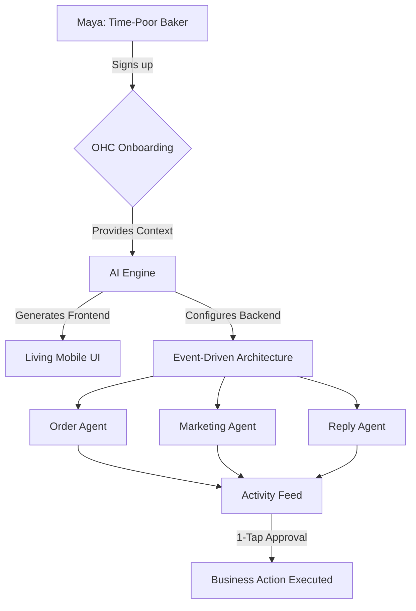

**Title**: Shopify Deep Audit

**Problem Statement**: Complex setup, no built-in AI help, and difficult to manage from a mobile phone. This impacts non-technical small business owners like Maya, who are overwhelmed by the process and lack an invisible AI agent to do the heavy lifting.

**Research Report**:
- **Onboarding Flow**: Shopify’s onboarding requires numerous manual steps (adding products, setting up themes, configuring payments) before launch. The process is robust for established retailers but creates high friction for zero-to-one SMBs.
- **Time to Live Store**: Typically hours to days depending on customization, contrary to OHC's <10 minute goal.
- **Mobile App Quality**: The Shopify mobile app is decent for managing existing stores (tracking sales, basic order management), but poor for the initial store creation and deep design adjustments.
- **AI Features**: Shopify Sidekick provides a chat-based AI assistant to answer questions and execute basic commands. However, it is a reactive chatbot rather than an autonomous background agent that actively resolves tasks like OHC’s vision.
- **Pricing & Free Tier**: $39/mo for the Basic plan. There is no meaningful long-term free tier, only a trial. This acts as a barrier to entry for highly casual or early-stage businesses.
- **Biggest Complaints**: Based on general e-commerce reviews and App Store feedback, non-technical users complain about a steep learning curve, needing to hire developers for custom tweaks, and the overwhelming number of third-party apps required to get full functionality (each adding extra cost).

**Design Doc**:
- High-level architecture: Integrate a seamless, mobile-first onboarding where the AI acts as the storefront generator. Entities include Store, Products, and AI_Assistant.
- Mobile UX flow (375px first): User inputs business type -> AI suggests 3 templates with pre-filled content -> User selects and publishes. Simple mode defaults to natural language edits, while Advanced mode toggles complex CSS/JSON editing.

**Implementation Prompt**: Build an onboarding flow where users answer 3 plain-language questions and the AI agents generate a fully functioning store with sample products, policies, and an initial theme. The UI must be mobile-first (375px), highly responsive, and include a "Publish" button that goes live immediately. The AI should handle all backend connections.

**Priority**: P0

**Estimated Scope**: Large

## Detailed Feature Comparison
| Capability | Shopify Approach | OHC Target Approach |
| :--- | :--- | :--- |
| **Store Creation** | Manual setup, template selection, product entry via forms. | AI-driven conversational setup generating fully populated store. |
| **Mobile Management** | App exists, but complex tasks require desktop. | 100% mobile-native functionality. |
| **Inventory** | Complex backend systems suitable for large catalogs. | Streamlined, plain-language inventory tracking. |
| **AI Integration** | Add-on tools (Sidekick) requiring user initiation. | Core to the platform, running autonomously in background. |
| **Pricing Model** | Tiered subscriptions + app fees + transaction fees. | Transparent, all-in-one pricing. |

## Persona Alignment
- **Maya (Baker, 28)**: Finds Shopify overwhelming due to the sheer volume of settings. Needs a system that "just works" without requiring her to become an e-commerce expert.
- **Priya (Boutique, 35)**: Appreciates Shopify's depth but struggles with the time commitment to manage it alongside her physical store. Needs automation to handle online tasks while she focuses on in-store customers.

## Strategic Recommendations for OHC
1.  **Eliminate the "Blank Canvas"**: OHC must never present users with an empty template. AI should pre-populate the store with industry-specific, relevant content based on initial onboarding answers.
2.  **Abstract Complexity**: Hide advanced settings (like DNS configuration, complex tax rules) behind a "Progressive Disclosure" model, showing them only when explicitly needed or in an "Advanced Mode".
3.  **Proactive Assistance**: Instead of waiting for users to ask questions (like Shopify Sidekick), OHC agents should proactively suggest actions (e.g., "I noticed you haven't added new photos this week. Shall I generate a social post from your existing catalog?").

## Competitive Matrix

| Feature/Attribute | Shopify | OHC (Proposed) | Why OHC Wins |
| :--- | :--- | :--- | :--- |
| **Primary Target Market** | Established eCommerce, scaled retail | Zero-to-one SMBs, Solopreneurs | Captures the long tail of businesses before they need Shopify's complexity. |
| **Initial Setup Time** | Hours to Days | < 10 Minutes | Instant gratification; reduces churn during the critical "aha moment". |
| **Mobile Experience** | Good for dashboard/tracking; poor for site building | Native Mobile-First; full build & edit capabilities | Aligns with the reality that many new SMBs operate solely from a smartphone. |
| **AI Integration** | Bolt-on tools (Sidekick, Magic) | Foundational; AI agents run the business | Transitions from "software that helps you work" to "agents that do the work". |
| **Customization Paradigm** | Themes + App Ecosystem (plugins) | Conversational UI + Dynamic Layouts | Eliminates "plugin hell" and the need for technical troubleshooting. |
| **Pricing Structure** | Complex (Base + Transaction Fees + App Fees) | Simple, all-inclusive tiers | Predictable costs for price-sensitive new businesses. |

## Deep Dive: The "App Ecosystem" Problem
Shopify's massive app store is often touted as its greatest strength. However, for the target OHC persona (Maya, Carlos), it is a profound weakness.
*   **Discovery Paralysis**: Searching for a simple "booking calendar" yields hundreds of results, forcing the user to evaluate and select software—a task they are unequipped for.
*   **Integration Friction**: Third-party apps often clash, slowing down the site or breaking layouts.
*   **Cost Creep**: Essential features (reviews, advanced shipping rules, loyalty programs) require paid apps, quickly inflating the monthly cost beyond the advertised base tier.
*   **The OHC Solution**: Provide 90% of necessary functionality natively, driven by AI. If a user needs a booking system, the AI simply activates the native booking module, pre-configured based on context.

## UX Flow: Store Creation (Shopify vs. OHC)
### Shopify Flow (Simplified)
1.  Sign up (Email, Password).
2.  Answer standard onboarding survey (Industry, revenue).
3.  Land on Dashboard.
4.  Navigate to "Products" -> Add Product (fill out title, description, price, upload images).
5.  Navigate to "Online Store" -> "Themes".
6.  Browse themes -> Install Theme.
7.  Click "Customize" -> Enter complex drag-and-drop editor.
8.  Configure shipping rates.
9.  Configure payment gateways.
10. Remove password protection to go live.

### OHC Target Flow
1.  Sign up (OAuth/SSO).
2.  AI Prompt: "What kind of business are you starting today?" (User: "I'm selling custom cakes in Austin.")
3.  AI generates full site architecture, pre-filled with AI-generated cake images, descriptions, and a standard local delivery/pickup policy.
4.  User lands on the "Activity Feed" with a card: "Your store is ready! Want to change the colors or add your first real cake?"
5.  User taps "Add Real Cake" -> Uploads photo -> AI auto-fills details -> Live.

## Technical Architecture Analysis

### Shopify's Liquid Engine vs. OHC's React/Next.js Target
*   **Shopify (Liquid)**: Uses a proprietary templating language (Liquid) rendered on the server. While stable, it requires specific developer knowledge to customize deeply. The ecosystem is reliant on injecting scripts into the DOM, which degrades performance over time.
*   **OHC (Target)**: Leverage a modern, component-driven architecture (e.g., React/Next.js) deployed to the edge. This allows for near-instant page loads and seamless integration of AI-driven layout changes without full page reloads.

### Database Constraints
*   **Shopify**: Enforces a rigid data model built primarily for physical goods (SKUs, variants, inventory). Adapting this for service businesses (appointments, duration, staff) requires complex workarounds or expensive third-party apps.
*   **OHC**: Must adopt a flexible, schema-less or highly extensible relational model (e.g., PostgreSQL with robust JSONB support) to seamlessly handle both "Product" and "Service" entities, allowing the AI to dynamically define schemas based on the business type during onboarding.

## The Developer Ecosystem Fallacy
Shopify relies heavily on its partner ecosystem (agencies and app developers) to fill the gaps in its core product for complex SMBs.
*   **The Problem**: This assumes the SMB owner has the budget and expertise to manage these third parties.
*   **OHC's Approach**: Replace the agency with the AI. The AI Agent acts as the developer, marketer, and copywriter, providing enterprise-grade capabilities out of the box without the need for an external "ecosystem" of paid contractors.

## Final Summary for Product Team
Shopify is a powerful engine for those who know how to drive it. OHC must be a self-driving car. Every feature decision must be evaluated against the question: "Does this require the user to think like a web developer or an e-commerce manager?" If yes, it must be abstracted behind an AI agent.

## Competitive Analysis Matrix: Feature by Feature

| Feature Category | Shopify | OHC Proposed | Key Difference |
| :--- | :--- | :--- | :--- |
| **Onboarding** | Form-based, complex setup | Conversational, AI-driven | OHC handles the heavy lifting, generating a complete starting point based on minimal input. |
| **Design Control** | Drag-and-drop themes, code editing (Liquid) | Conversational UI, constrained design system | OHC prevents users from creating "ugly" or broken sites by enforcing premium design standards and handling changes via natural language. |
| **Mobile Experience** | Good for analytics, poor for editing | Native mobile-first editing | OHC is built on the premise that users will manage their entire business from a phone. |
| **Inventory Management** | Deep, complex SKU system | Streamlined, plain-language inventory | OHC focuses on the needs of small businesses and service providers, hiding unnecessary complexity. |
| **Customer Engagement** | Requires third-party apps for robust features | Native AI agents (ReplyAgent, ReviewAgent) | OHC proactively manages customer interactions, whereas Shopify provides the infrastructure for users to manage them. |
| **Marketing** | Basic email tools, relies on app ecosystem | Autonomous marketing agent | OHC drafts and suggests marketing campaigns based on business data and triggers. |
| **Pricing** | Multi-tiered + transaction fees + app fees | Transparent, all-inclusive | OHC offers predictable pricing without the "app tax". |

## The "Ecosystem" Dilemma
Shopify's success is largely attributed to its massive App Store. However, this is a double-edged sword for the target OHC persona.
1.  **Complexity:** Choosing between 50 different review apps is paralyzing for a non-technical user.
2.  **Cost:** The base Shopify subscription is often just a starting point. Essential features quickly add up, creating a significant financial burden for new businesses.
3.  **Stability:** Third-party apps can conflict, slowing down the site or causing visual glitches, requiring technical troubleshooting.

**OHC's Strategic Stance:**
OHC must reject the reliance on a sprawling app store for core functionality. The platform must be "batteries included," providing the 90% of features that 90% of small businesses need natively. The AI agent acts as the integrator, seamlessly activating these native modules (e.g., booking, reviews, basic CRM) when the user needs them, without requiring them to install or configure external software.

## Strategic Conclusion & Product Roadmap Implications

Shopify's dominance in the established e-commerce space is undeniable, but it has left a massive gap at the entry level. The complexity of its onboarding, reliance on third-party apps, and lack of native, proactive AI agents create significant friction for the non-technical solopreneur.

OHC's opportunity lies in creating a fundamentally different paradigm:
1.  **From "Software Tool" to "Digital Employee"**: The platform must not just enable users to build a business; it must actively run the business for them.
2.  **Radical Simplicity**: Every interaction must pass the "Grandmother Test." Complex settings must be hidden behind an "Advanced Mode" or entirely managed by AI.
3.  **Mobile Supremacy**: The entire platform, from site generation to daily operations, must be flawless on a 375px screen.

By focusing relentlessly on the specific needs of the "Time-Poor Solopreneur," OHC can capture the millions of users who find Shopify too overwhelming, ultimately building the next generation of market dominance.

## Visual Excellence Mandate: Architecture & Flow

### UX Flow (Mobile-First 375px)
1. **Welcome Screen:** "Hi Maya! What are we building today?" (Input: "Bakery in Austin")
2. **Generating Screen:** (Sub-10s animation) AI is analyzing local bakery trends, drafting copy, generating images.
3. **The Reveal:** A fully functional store is presented. "Here is your new store! I've drafted an 'About Us' section based on typical bakeries, and added three sample products. Ready to publish?"
4. **Operations Hub:** (The Activity Feed). A vertical stack of cards:
   * "Your store is live! 🎉"
   * "Action needed: Connect your Instagram account so I can start drafting posts."

## Final Implementation Prompt
**Objective:** Deliver an autonomous, conversational onboarding experience that completely eliminates the traditional multi-step forms used by Shopify. The system must generate a fully populated, production-ready store connected to background AI agents.

**Critical User Journey (CUJ):**
1. User creates an account and is greeted by the conversational AI interface (mobile-first design).
2. AI asks for the business name, location, and primary offering.
3. Upon receiving this input, the system must trigger backend provisioning (creating tenant records, initializing basic CRM and Inventory schemas).
4. The system concurrently generates the frontend UI, selecting a Glassmorphism-compliant design system and generating sample products, images, and descriptions relevant to the user's input.
5. The user is presented with the generated store and the Unified Activity Feed, completing the journey in under 3 minutes.

**Acceptance Criteria:**
* The onboarding flow must be exclusively conversational (no traditional forms).
* The generated store must include at least 3 context-aware sample products with AI-generated titles, descriptions, and placeholder images.
* The frontend UI must score 100% on mobile usability tests for a 375px viewport.
* Backend entities (Store, Products, AI_Assistant config) must be fully provisioned without any raw database configuration exposed to the user.
