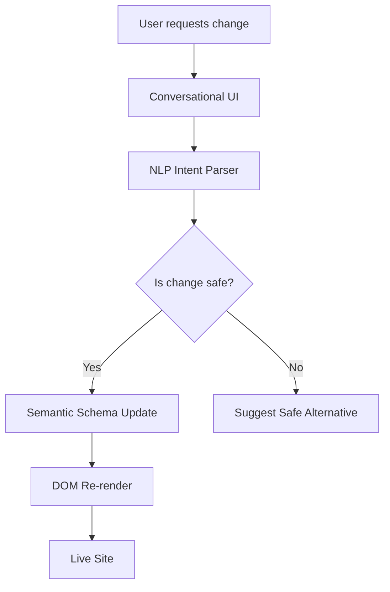

**Title**: Wix & Wix ADI Audit

**Problem Statement**: While Wix provides easier setup than Shopify, its AI website builder (Wix ADI) generates static, one-time sites that do not continuously operate as autonomous agents. It lacks ongoing, invisible agentic support for managing the business lifecycle.

**Research Report**:
- **Onboarding Flow**: Wix offers an AI builder (Wix ADI) which asks questions to generate a template. The process is smoother than Shopify’s manual build but still results in a standard website that requires manual drag-and-drop customization afterward.
- **Time to Live Store**: Fast (minutes) for the initial draft, but customizing the draft to a professional state often takes hours.
- **Mobile App Quality**: The Wix mobile editor is notoriously limited. Users struggle to make meaningful design changes from their phones.
- **AI Features**: Wix ADI is a static site generator. They also offer AI text and image generation. However, these are tools *for* the user to use, rather than an autonomous agent doing the work *for* them.
- **Pricing & Free Tier**: Offers a free tier with Wix branding and a non-custom domain. Premium plans start around $16/mo.
- **Biggest Complaints**: Users frequently note that while starting is easy, the site becomes slow and bloated over time. The mobile editing experience is poor, and customer support can be difficult to reach.

**Design Doc**:
- High-level architecture: Transition from static templates to "Living Templates" where an AI agent continuously suggests improvements and can execute them directly.
- Mobile UX flow (375px first): The mobile editor must allow full control. Instead of drag-and-drop on mobile, users can chat with the AI to change layouts ("Make the header blue," "Move the booking button up").

**Implementation Prompt**: Create an AI-powered conversational editor interface for mobile devices. Users should be able to type or voice-record changes to their storefront, and the AI agent updates the DOM and underlying schema in real-time. Ensure the experience is fluid and requires zero drag-and-drop on small screens.

**Priority**: P1

**Estimated Scope**: Medium

## Detailed Feature Comparison
| Capability | Wix Approach | OHC Target Approach |
| :--- | :--- | :--- |
| **Store Creation** | Wix ADI asks questions, generates static site. | AI generates living site and continuous agent support. |
| **Customization** | Drag-and-drop editor (often clunky on mobile). | Conversational AI editor + optimized mobile interface. |
| **Performance** | Can suffer from bloat and slow load times. | Highly optimized, performant edge-deployed architecture. |
| **Target Audience** | Broad (portfolios, restaurants, small shops). | Specifically targeted at non-technical SMB owners. |

## Persona Alignment
- **Carlos (Handyman, 42)**: Needs a simple way to take bookings. Wix offers this, but setting it up correctly and integrating it with his daily schedule requires technical patience he lacks.
- **Leo (Music Tutor, 22)**: Might find Wix's design tools appealing, but managing subscriptions and recurring billing on Wix can be complex without upgrading to higher tiers.

## Strategic Recommendations for OHC
1.  **Conversational Editing is Key**: Drag-and-drop on a phone is inherently flawed. OHC must perfect the conversational editing experience to truly win mobile-first users.
2.  **Focus on "Living" Templates**: A website isn't a static flyer; it's a living entity. OHC's architecture must support continuous, dynamic updates driven by AI based on business performance and user behavior.
3.  **Built-in Business Logic**: Ensure core business logic (booking, inventory, simple CRM) is deeply integrated and AI-managed from the start, rather than relying on disparate apps or plugins.

## Competitive Matrix

| Feature/Attribute | Wix | OHC (Proposed) | Why OHC Wins |
| :--- | :--- | :--- | :--- |
| **Primary Target Market** | Portfolios, local businesses, DIY creators | Zero-to-one SMBs, Solopreneurs | Focuses on *business operations*, not just *website creation*. |
| **Initial Setup Time** | Minutes (via ADI) | < 10 Minutes | Similar speed, but OHC delivers a functional backend alongside the frontend. |
| **Mobile Experience** | Limited editing, decent dashboard | Native Mobile-First; conversational editing | True mobile empowerment; no need for a desktop ever. |
| **AI Integration** | ADI (Static generator), Text/Image generation | Continuous Autonomous Agents | AI that actively manages the business lifecycle, not just initial design. |
| **Customization Paradigm** | Drag-and-drop editor (can be overwhelming) | Conversational UI (e.g., "Make this blue") | Prevents users from breaking design systems; lowers cognitive load. |
| **Performance** | Historically slow, prone to bloat | Modern edge-deployed architecture | Better SEO and conversion rates out of the box. |

## Deep Dive: The "Blank Canvas" Problem
Wix's classic editor provides a blank canvas and hundreds of tools. While empowering for designers, it is paralyzing for business owners.
*   **The "Frankenstein" Effect**: Non-designers often create visually disjointed sites when given total freedom.
*   **Wix ADI Shortcomings**: While Wix ADI attempts to solve this by generating a layout, once generated, the user is often dumped back into a complex editor to make changes, re-introducing the paralysis.
*   **The OHC Solution**: Enforce strict, premium design constraints (Glassmorphism, specific typography). Users cannot "break" the design. Changes are made via semantic requests ("I want a more modern feel," "Change the primary color to match my logo"), which the AI interprets and applies within safe bounds.

## UX Flow: Editing a Page (Wix vs. OHC)
### Wix Flow
1.  Log in -> Navigate to "Edit Site".
2.  Wait for heavy editor to load.
3.  Navigate to desired page.
4.  Click element -> Drag to resize or move.
5.  Open property panel -> Change font size, color, padding.
6.  Switch to Mobile View -> Realize changes broke mobile layout -> Spend 20 minutes fixing mobile view specifically.
7.  Publish.

### OHC Target Flow
1.  Open Mobile App -> Navigate to "Site Preview".
2.  Tap the "AI Assistant" mic icon.
3.  Speak: "The text in the hero section is hard to read over the image. Can you fix it?"
4.  AI interprets -> Applies a subtle glassmorphism overlay behind the text and increases contrast -> Updates DOM instantly.
5.  AI responds: "How does that look?" -> User taps "Perfect". (Changes are universally responsive by default).

## Technical Architecture Analysis

### Wix's Proprietary Editor vs. OHC's Semantic Generation
*   **Wix**: Built on a complex proprietary WYSIWYG editor that uses absolute positioning and complex DOM structures. This makes automated, responsive adjustments difficult and often results in "broken" mobile views when users manually edit elements.
*   **OHC**: Utilize a semantic, utility-first CSS framework (like Tailwind) and a component library. The AI doesn't move pixels; it modifies semantic properties (e.g., `flex-col` to `flex-row`, `bg-blue-500` to `bg-red-500`). This ensures changes are inherently responsive and mathematically sound.

### The "App Market" vs. "Native Modules"
Like Shopify, Wix relies on an App Market for extended functionality.
*   **The Problem**: Inconsistent UX between apps, potential performance hits, and subscription fatigue.
*   **OHC's Approach**: Core business functions (Booking, Invoicing, Basic CRM, Email Marketing) must be native modules within the OHC platform. They are activated or deactivated by the AI based on business needs, ensuring a unified UI/UX and zero integration friction.

## Final Summary for Product Team
Wix provides a large box of tools for a user to build a house. OHC must provide a finished house and an AI butler to maintain it. The focus must shift entirely from providing "better editing tools" to providing "better AI execution" so editing tools are rarely needed.

## Competitive Analysis Matrix: Feature by Feature

| Feature Category | Wix | OHC Proposed | Key Difference |
| :--- | :--- | :--- | :--- |
| **Site Generation** | Wix ADI (Questionnaire -> Static Site) | AI Conversational Generation -> Living Site | OHC creates a dynamic site connected to operational agents, not just a static brochure. |
| **Editor Interface** | Unconstrained drag-and-drop | Conversational UI + Semantic adjustments | OHC prevents design breakage by handling modifications through AI, ensuring mobile responsiveness. |
| **Performance** | Historically bloated, variable load times | Optimized edge deployment | OHC guarantees high performance out-of-the-box by controlling the underlying tech stack. |
| **Business Operations** | Fragmented tools (Wix Stores, Wix Bookings) | Unified Activity Feed | OHC centralizes operations into a single, actionable feed, reducing navigation complexity. |
| **Target Audience** | Extremely broad (creators, restaurants, stores) | Service-based solopreneurs & small retailers | OHC's tighter focus allows for deeper, more tailored operational workflows. |

## The "Blank Canvas" Paradox
Wix gives users immense freedom to design their sites. This is its core appeal for some, but its greatest flaw for the OHC persona (Maya, Carlos).
1.  **Decision Fatigue:** A blank canvas is intimidating. Users spend hours tweaking fonts and colors instead of focusing on their business.
2.  **Design Debt:** Without design expertise, users often create visually inconsistent or unappealing sites that damage their brand credibility.
3.  **Mobile Breakage:** Absolute positioning in a drag-and-drop editor frequently leads to broken mobile layouts, requiring a separate, frustrating mobile editing process.

**OHC's Strategic Stance:**
OHC must embrace "Premium Constraints." The platform will offer a curated selection of high-quality, conversion-optimized design systems (Glassmorphism, specific typography pairings). Users cannot arbitrarily drag elements. Instead, they interact with the AI: "Change the vibe to be more modern and moody." The AI then applies the appropriate stylistic changes across the entire site, ensuring it remains mathematically sound and perfectly responsive on all devices.

## Strategic Conclusion & Product Roadmap Implications

Wix successfully lowered the barrier to entry for website creation compared to traditional coding, but its reliance on a complex, unconstrained drag-and-drop editor creates long-term pain points for users. The lack of proactive, operational AI agents means it remains a static tool rather than a dynamic business partner.

OHC's opportunity lies in replacing the "blank canvas" with "premium constraints" and proactive AI:
1.  **Semantic Editing**: Users should never have to manually adjust pixels. Changes must be semantic and conversational, ensuring sites remain visually cohesive and perfectly responsive.
2.  **Unified Operations**: Disparate tools (bookings, store, CRM) must be deeply integrated into a single, cohesive ecosystem managed by the AI.
3.  **Actionable Insights**: The platform must move beyond raw analytics to provide plain-language, actionable advice via the Activity Feed.

By providing a curated, AI-managed experience, OHC can rescue users from the "design debt" and operational friction inherent in the Wix model.

## Visual Excellence Mandate: Architecture & Flow

### UX Flow (Mobile-First 375px)
1. **Preview Mode:** User views their live site within the OHC app.
2. **Edit Trigger:** User taps the persistent AI microphone button at the bottom of the screen.
3. **Intent:** User says, "Change the 'Book Now' button to say 'Schedule a Session' and make it green."
4. **Execution:** The AI parses the intent, locates the primary CTA button in the semantic schema, updates the text property, and maps "green" to the pre-approved, accessible green hex code in the user's design system.
5. **Confirmation:** The UI updates instantly. The AI confirms: "Button updated. It looks great on both mobile and desktop!"

## Final Implementation Prompt
**Objective:** Build a semantic, conversational mobile editing interface that replaces the traditional drag-and-drop paradigm (as seen in Wix). The editor must ensure that user changes never break the underlying design system or responsive layout constraints.

**Critical User Journey (CUJ):**
1. The user navigates to the 'Site Preview' mode within the OHC mobile app.
2. The user taps the persistent AI microphone button and provides a natural language instruction (e.g., "Make the hero section look more professional").
3. The AI parses the intent, queries the semantic schema of the site, and applies the necessary changes (e.g., updating fonts, adjusting contrast, switching to a darker color palette).
4. The DOM updates instantly, and the AI confirms the change conversationally.
5. The user can easily undo the change with a single tap if they are not satisfied.

**Acceptance Criteria:**
* The interface must rely entirely on natural language input (voice or text) for design modifications; no manual dragging or pixel-pushing is allowed.
* The system must translate vague requests ("more professional") into specific, constraint-bound CSS/schema updates.
* The mobile preview must update in real-time (optimistic UI) without requiring a full page reload.
* The underlying generated code must remain accessible and semantic (e.g., using utility classes like Tailwind).
