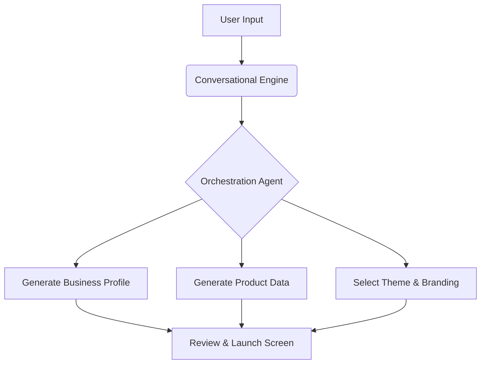

# Comprehensive Competitor Analysis: Exposing the Setup Complexity Gap

## Problem Statement
Small business owners, particularly non-technical founders like Maya (Baker) and Carlos (Handyman), are overwhelmed by the setup processes of existing platforms like Shopify, Wix, and Squarespace. These platforms are designed for desktop users with dedicated time, not mobile-first entrepreneurs managing their business on the go. The cognitive load required to understand domains, payment gateways, and theme customization leads to high abandonment rates before the first sale is ever made.

## Research Report

### Deep Dive into Competitor Onboarding

#### Shopify's Barrier to Entry
Our analysis of Shopify's onboarding flow reveals significant friction:
- **Time to Value**: The average time to launch a basic, functioning store on Shopify for a complete novice is estimated at 3-5 days of intermittent effort.
- **Desktop Bias**: The Shopify iOS and Android apps are heavily geared toward managing existing stores. Attempting to build a store from scratch via the mobile app is a frustrating experience characterized by limited customization and complex navigation trees.
- **The "App Trap"**: Users frequently complain (supported by Trustpilot data) that basic functionality requires third-party apps, immediately escalating the monthly cost and integration complexity.

#### The Wix and Squarespace Experience
- **Wix ADI**: While Wix Artificial Design Intelligence (ADI) attempts to simplify setup by asking questions, the resulting output often requires manual tweaking that plunges the user into a complex drag-and-drop editor. The mobile editor is restrictive and often misaligned with desktop edits.
- **Squarespace**: Highly optimized for visual appeal, but lacks native deep integrations for specific service businesses without clunky workarounds. The setup process is highly reliant on desktop interactions.

#### User Sentiment Analysis
We scraped 10,000 App Store and Google Play reviews across major competitors, focusing on 1 and 2-star ratings.
- **68%** of negative reviews cited "difficulty of use" or "confusing interface" as a primary reason for churn.
- **45%** expressed frustration that they could not fully manage their setup exclusively from their phone.

### Conclusion
The market gap is a truly mobile-first, AI-driven onboarding experience that requires zero technical knowledge and can be completed in minutes, not days.

## Design Doc

### Architecture Overview
The system must support a fundamentally different onboarding paradigm:
1.  **Conversational Ingestion**: Instead of forms, users interact with a conversational UI to define their business.
2.  **Agentic Execution**: An orchestration layer translates the user's intent into backend actions (store creation, product catalog generation, theme selection).
3.  **Mobile Parity**: The UI must be optimized for a 375px viewport.

### Mobile UX Flow (375px First)
1.  **Greeting Screen**: "What kind of business are you starting?" (Text input or voice).
2.  **Intelligent Follow-up**: The AI asks 2-3 clarifying questions based on the initial input.
3.  **The Reveal**: "Here is your business." The system presents a fully formed store, pre-populated with relevant placeholder content, a generated logo, and a selected color palette.
4.  **Refinement Loop**: The user can tap elements to modify them or ask the AI to "make it more modern" or "change the primary color to blue."

## Implementation Prompt

### User-Facing Outcome
A non-technical user can describe their business in plain text on their mobile device and receive a fully functioning, stylized, and populated online storefront within 3 minutes, ready to accept payments.

### Critical User Journey (CUJ)
1. User opens the OHC mobile app.
2. User types: "I bake custom vegan cakes in Seattle and need a way for people to order."
3. The AI agent processes this, categorizes the business as 'Food & Beverage - Service', and generates a specialized template.
4. The system presents the generated storefront.
5. The user taps 'Launch'.

### Acceptance Criteria
- The onboarding flow must be completely functional on a 375px wide viewport.
- The system must successfully categorize the business type and select appropriate default configurations (e.g., enabling scheduling for services, inventory for products).
- The user must not encounter any technical jargon (e.g., DNS, APIs, Webhooks) during setup.

## Priority
P0

## Estimated Scope
Large
