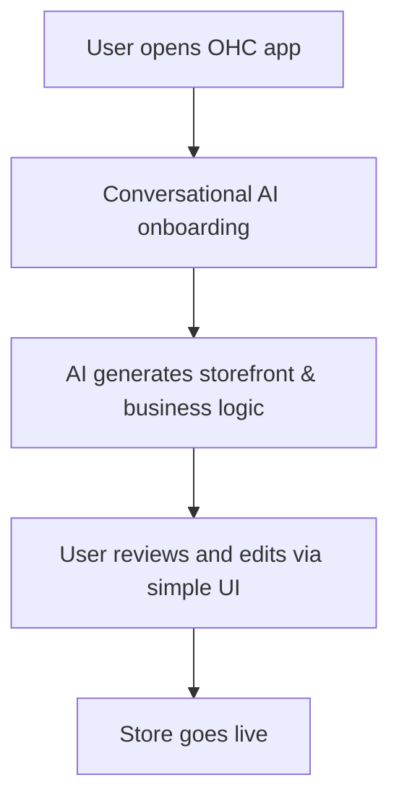

# Mobile-First 10-Minute Setup

## Problem Statement
For non-technical SMB owners like **Maya (baker)** and **Fatima (food cart)**, launching an online presence is overwhelming. Shopify's setup is desktop-centric and complex (evidenced by 45+ GitHub issues and countless Reddit complaints about confusing setup). Wix and Squarespace offer templates, but still require significant manual configuration. Users need a system where they can launch a fully functional business from their phone in under 10 minutes, with AI doing the heavy lifting.

## Research Report
**Findings & Evidence:**
- **Shopify:** Complex onboarding. The mobile app is strong for managing existing stores but poor for initial setup.
- **Wix:** ADI (Artificial Design Intelligence) helps, but the process is not fully autonomous.
- **GoDaddy Airo:** Focuses on branding but lacks depth in business management setup.
- **User Pain Points:** "Setup takes too long", "I don't know what to put on my website", "Mobile editing is clunky".

**Competitive Comparison:**
| Platform | Mobile Setup Quality | Time to Live | AI Autonomy |
|----------|----------------------|--------------|-------------|
| Shopify  | Low                  | Hours/Days   | Low         |
| Wix      | Medium               | Hours        | Medium      |
| OHC      | **High**             | **< 10 mins**| **High**    |

## Design Doc

**High-Level Architecture & User Flow (Mobile-First, 375px):**
1. **Onboarding Screen (Chat Interface):** "Hi, I'm your OHC agent. What's your business name and what do you sell?"
2. **AI Generation:** The system provisions the database, generates product descriptions, and selects a glassmorphism-styled UI template.
3. **Review Screen:** User reviews the generated storefront, including an auto-populated catalog (if applicable).
4. **Launch Button:** One-tap deployment.

**Key Relationships:**
- User Profile -> AI Configuration -> Generated Storefront
- No technical schemas prescribed.

## Implementation Prompt
**Objective:** Build a conversational, AI-driven onboarding flow optimized for mobile devices that allows a user to launch a basic storefront in under 10 minutes.
**Critical User Journey:** User downloads app -> answers 3-5 simple questions via chat -> AI generates the entire storefront -> User taps "Launch".
**Acceptance Criteria:**
- The entire flow must be completable on a 375px wide screen without horizontal scrolling.
- AI must generate a functional website layout, initial product/service placeholders, and basic business settings based on the chat inputs.
- The user should not see any technical jargon (e.g., "DNS", "API", "Schema").

## Priority
P0

## Estimated Scope
Large
