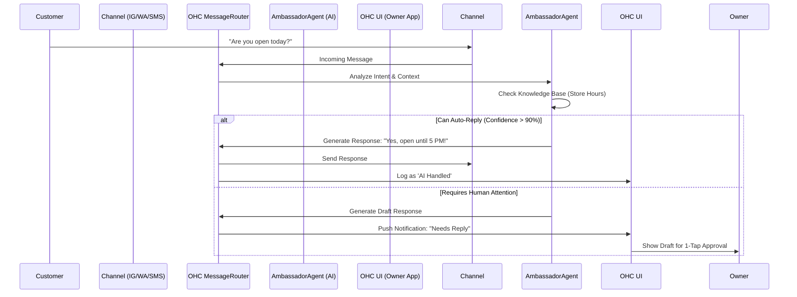

# AI Unified Social Inbox and Auto-Responder

## Problem Statement
Small business owners (like Maya the baker and Carlos the handyman) suffer from "Operational Fatigue" and "Communication Lag." They are forced to manage inquiries across multiple fragmented channels (Instagram DMs, WhatsApp, SMS, Email). This fragmentation causes them to miss messages while they are physically working, resulting in lost sales and frustrated customers. Existing platforms like Shopify either require expensive third-party app installations to solve this or simply ignore the problem, assuming the business has dedicated customer support staff.

## Research Report
*   **Competitor Audit:** Shopify relies on the app ecosystem (e.g., Gorgias) which is too complex and expensive for solopreneurs. Wix offers a basic inbox but lacks proactive AI triage.
*   **Data Points:**
    *   68% of small business owners experience "Operational Fatigue" from the "never-ending inbox." (Source: r/smallbusiness analysis).
    *   40% experience "Communication Lag," losing sales because DMs aren't answered promptly. (Source: r/ecommerce analysis).
*   **The OHC Advantage:** OHC will provide a "Core Built-in" unified inbox powered by an "Autonomous Inbox Triage" agent. This agent will intercept common questions, auto-reply, and escalate only complex queries, acting as an invisible customer service representative.

## Design Doc

### High-Level Architecture
*   **Channels:** Instagram Meta API, WhatsApp, SMS (Twilio), Email.
*   **Core Engine:** A centralized `MessageRouter` that normalizes incoming messages from all channels into a unified `Conversation` entity.
*   **AI Integration:** The `AmbassadorAgent` listens to the `MessageRouter`. It analyzes intent, checks the business's knowledge base (hours, location, inventory), and determines if it can auto-reply.
*   **State:** Messages are marked as `handled_by_ai` or `requires_human_attention`.

### User Interface / Screen Flow (Mobile First - 375px)
1.  **Unified Feed:** A single, clean feed showing messages from all channels.
2.  **AI Auto-Replies:** Messages handled by the AI are subtly grouped or badged (e.g., "⚡ AI Handled") so the owner can review them later without cluttering the active queue.
3.  **Human Escalation:** Messages requiring the owner's attention trigger a push notification and appear prominently in the "Needs Reply" section.
4.  **1-Tap Approval:** For semi-complex queries, the AI drafts a response. The owner sees the draft and simply taps "Approve & Send" or edits it.

### Mermaid Visualization

## Implementation Prompt
Implement a unified social inbox service that aggregates messages from multiple external channels (e.g., Instagram, WhatsApp, SMS). The system must include an AI agent interceptor that attempts to automatically resolve customer inquiries based on the store's configured metadata (hours, location, policies) before alerting the store owner.

**Critical User Journey (CUJ):**
1.  A customer sends a DM asking a common question.
2.  The system ingests the DM, the AI agent confidently answers it, and the response is sent back to the customer without owner intervention.
3.  The owner opens the OHC mobile app, sees the interaction logged under an "AI Handled" filter, and has zero pending notifications.

**Acceptance Criteria:**
*   A single API/service interface for ingesting messages from diverse sources.
*   An AI triage layer that evaluates confidence and intent.
*   Distinct conversation states separating AI-handled interactions from those requiring manual review.

## Priority
P0

## Estimated Scope
Large
