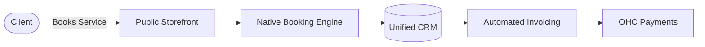

**Title**: Integrated CRM, Booking, and Invoicing
**Problem Statement**: Service-based businesses (like Leo the music tutor or Carlos the handyman) have to string together multiple apps (Calendly, QuickBooks, Mailchimp) to handle scheduling, payments, and client management. This is expensive and prone to data loss.
**Research Report**: AI-native competitors like Durable are winning the service sector by bundling CRM, bookings, and invoicing into a single platform. Shopify fundamentally struggles here because its architecture is heavily biased towards physical product SKUs, forcing service businesses to rely on clunky third-party apps.
**Design Doc**:

The flow must be seamless on mobile: a client books, the provider receives a mobile notification, and an invoice is auto-generated and sent upon completion.
**Implementation Prompt**: Create a unified backend entity structure that links Customers, Bookings/Appointments, and Invoices. The user should be able to view a client's full history (appointments, payments, messages) on a single mobile-optimized screen.
**Priority**: P1
**Estimated Scope**: Large
