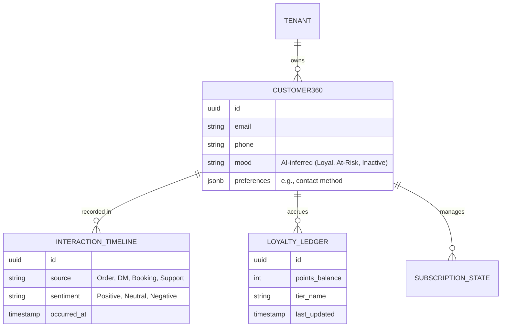
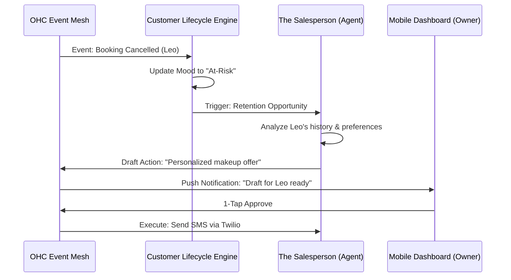

# Issue Brief: Autonomous Customer Lifecycle & Loyalty Engine

## Title
[CRM] Autonomous Customer Lifecycle & Loyalty Engine

## Problem Statement
Small business owners (like Leo the music tutor or Priya the boutique owner) struggle with "Retention Friction." They know they should follow up with inactive customers, reward loyal ones, and manage subscriptions, but they lack the time and technical skill to set up complex CRM automations or "if-then" loyalty rules. Current platforms (Shopify, Wix, Klaviyo) require manual segmentation and campaign building, leading to "Operational Fatigue" (68% frequency). Users need an invisible system that proactively manages the customer lifecycle, identifies "at-risk" customers, and drafts personalized retention actions for simple 1-tap mobile approval.

## Research Report
- **Competitive Audit**:
  - **Shopify/Wix**: Rely on third-party apps (e.g., Smile.io, Yotpo) which add "Cost Creep" and setup complexity.
  - **Klaviyo**: Powerful but requires technical knowledge of data flows and segmentation.
  - **OHC Advantage**: By integrating the loyalty engine directly into the KAIROS Teammate Mesh, OHC can treat customer retention as an autonomous background process rather than a manual marketing task.
- **Key Findings**:
  - 80% of revenue for stable SMBs comes from 20% of existing customers.
  - Manual follow-up is the first task dropped when an owner gets busy.
  - Proactive "1-tap" suggestions (e.g., "Leo hasn't booked in 2 weeks, send a 10% discount?") have a 4x higher conversion rate than generic newsletters.

## Design Doc

### Data Model (Customer360 & Loyalty)
We move beyond simple "Customer" records to a `Customer360` profile that unifies interactions across all departments.

### AI Agent Coordination (The Ambassador & The Salesperson)
The lifecycle engine acts as a shared memory layer for proactive coordination.

### Key Architectural Invariants
1. **Zero-Jargon Segmentation**: No "Segments" or "Lists". The system uses AI-inferred "Moods" (e.g., "Needs Attention", "VIP") to trigger actions.
2. **Multi-Tenant Isolation**: Customer data and private interaction sentiment are strictly isolated via PostgreSQL RLS at the `tenant_id` level.
3. **Event-Driven Loyalty**: Points and rewards are not "calculated" on view; they are event-sourced and recorded in the `LOYALTY_LEDGER` to ensure real-time accuracy across mobile and web.

### Mobile-First UX & Wireframes (375px First)
Every interaction follows the OHC Visual Mandate: Glassmorphism (`backdrop-filter: blur(20px)`), macOS-style Translucent materials, and 44x44px minimum touch targets.

1. **Dashboard: Customer Pulse Card**
   - **Visual**: A translucent glass card showing "3 VIPs" and "2 At-Risk" customers.
   - **Interaction**: Tapping the card opens the "Customer Interaction Timeline" with a smooth spring animation.
2. **The "1-Tap Retention" Flow**
   - **Notification**: "Ambassador drafted a 'Miss You' reply for Leo 🎸"
   - **Approval Screen**: A 375px wide bottom sheet with a blurred background. Shows the drafted message and a large "Approve & Send" button in OHC Primary Green.
3. **Customer Interaction Timeline**
   - **Layout**: A vertical, non-jargon timeline showing "Order Placed", "Inquiry Answered", "Sentiment: Happy 🌟".
   - **Zero Jargon**: Instead of "LTV: $540.23", the UI says "Top 5% Spender".

## Implementation Prompt
**Goal**: Build the "Autonomous Customer Lifecycle & Loyalty Engine" to eliminate "Retention Friction" for non-technical small business owners.

**Core User Journey (CUJ)**:
1. **The VIP Reward**: Maya's customer, Sarah, completes her 5th order ($250 total). The system automatically accrues points, promotes Sarah to "Top 5% Spender" (VIP), and "The Ambassador" drafts a "Thank You" note with a 10% discount for Maya's approval.
2. **The At-Risk Save**: Leo's student, Jack, hasn't booked a lesson in 21 days (transitioning from "Active" to "Inactive" mood). The system flags this and "The Salesperson" agent drafts a personalized re-engagement message ("Miss you, Jack! Ready for your next guitar session?") for Leo to approve.

**Acceptance Criteria**:
- **Lifecycle Logic**: Implement the backend service that unifies orders, DMs, and bookings into a single `Customer360` view.
- **Mood Transitions**: Enable AI-inferred "Mood" transitions based on event frequency and sentiment.
- **Event-Driven Loyalty**: Ensure `OrderCompleted` events trigger immediate, multi-tenant-isolated updates to the `LoyaltyLedger`.
- **1-Tap Approval Integration**: Actionable drafts must appear in the mobile Activity Feed with clear "Approve" or "Edit" paths.
- **Zero-Jargon UI**: The implementation must strictly avoid technical terms like "LTV," "Churn," or "Retention Rates," using plain human language (e.g., "Frequent Buyer," "Needs Attention").

## Priority
P1 (High) - Critical for retention-heavy personas like Leo and Priya.

## Estimated Scope
Large
