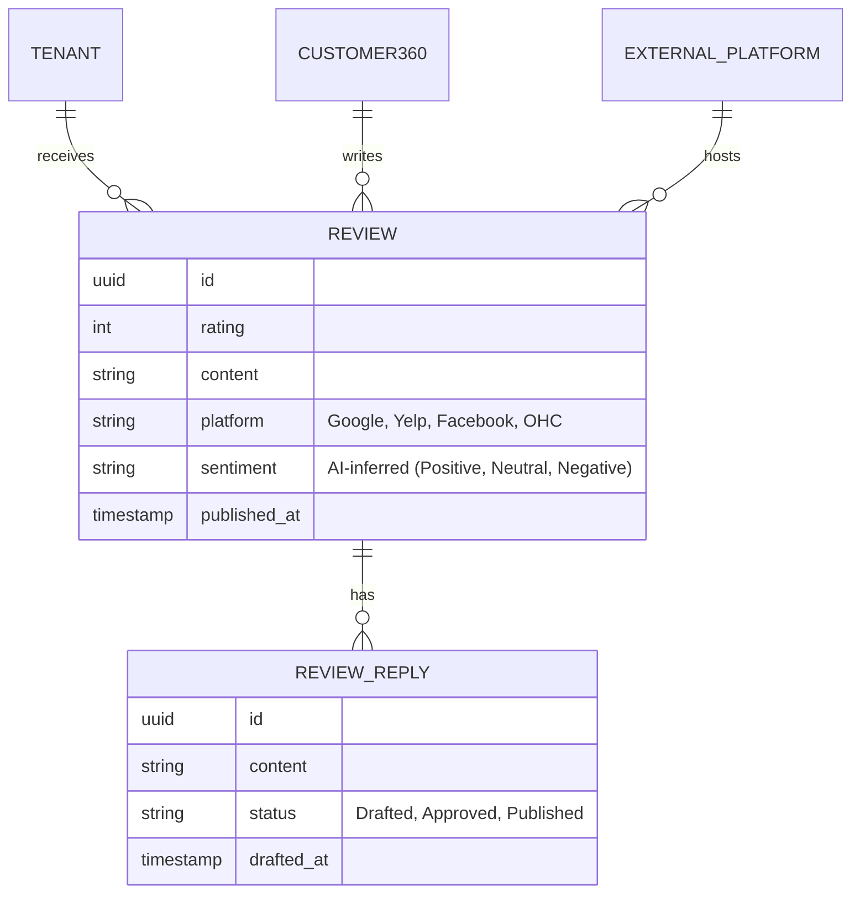
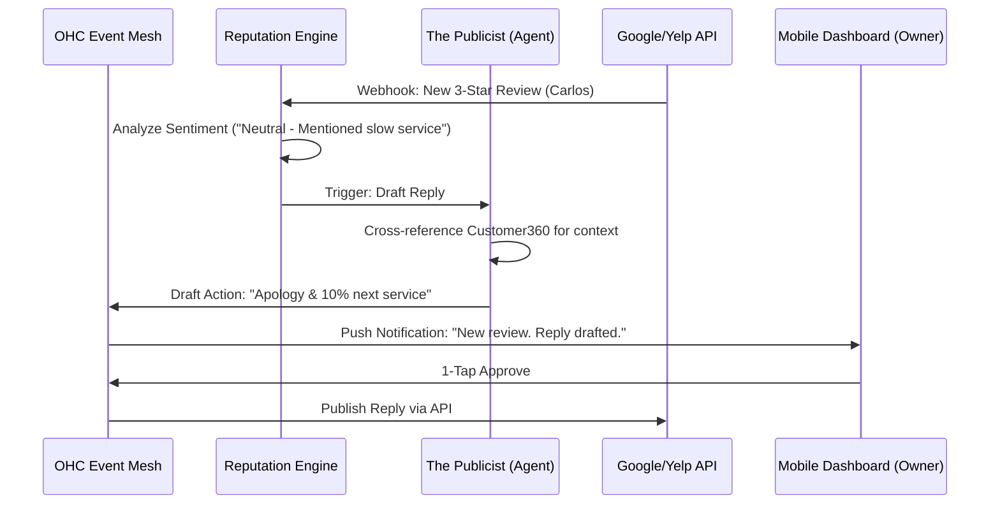

# Issue Brief: Autonomous Reputation & Review Engine

## Title
[CRM] Autonomous Reputation & Review Engine

## Problem Statement
Small business owners (like Carlos the handyman or Maya the baker) know that public reviews on Google, Yelp, and Facebook are critical for their business, but they struggle to actively collect them. Following up with customers to ask for a review takes too much time, and monitoring multiple platforms to reply to reviews (especially negative ones) is overwhelming and often ignored. Current solutions require managing multiple siloed apps, leading to lost reputation and lost revenue. Users need an invisible engine that automatically requests reviews after successful interactions and proactively drafts personalized replies to incoming reviews for simple 1-tap mobile approval.

## Research Report
- **Competitive Audit**:
  - **Shopify / Wix**: Offer basic review collection but mostly for on-site product reviews. They lack native, proactive syndication to Google Local or Yelp.
  - **Podium / BirdEye**: Powerful reputation management tools, but they are expensive, standalone SaaS platforms that add significant "Cost Creep" and require manual context switching for the business owner.
  - **OHC Advantage**: By integrating directly into the KAIROS Teammate Mesh, OHC can leverage the exact moment a service is completed or a product is delivered to trigger an autonomous review request. Furthermore, AI agents can draft context-aware replies to incoming reviews by accessing the `Customer360` memory, making the process effortless.
- **Key Findings**:
  - 92% of consumers read online reviews before choosing a local business.
  - Businesses that reply to reviews see a 12% increase in review volume and higher search rankings.
  - Automated review requests increase review generation by up to 4x compared to manual follow-ups.

## Design Doc

### Data Model (Reputation & Reviews)
We introduce a unified reputation model that aggregates reviews from external integrations into a single multi-tenant ledger.

### AI Agent Coordination (The Publicist & The Ambassador)
The engine coordinates between observing the interaction timeline and external platforms.

### Key Architectural Invariants
1. **Multi-Tenant Isolation**: Review data, external API tokens, and AI-generated drafts must be strictly isolated via PostgreSQL RLS at the `tenant_id` level.
2. **Zero Trust & Security**: External platform integrations (Google, Yelp) must use securely vaulted OAuth tokens.
3. **Rate Limiting & Safety**: The system must enforce strict rate limits on review requests (e.g., no more than one request per customer per 30 days) to prevent spamming and adhere to platform compliance.

### Mobile-First UX & Wireframes (375px First)
Every screen and interaction adheres to the OHC Visual Mandate: Translucent Glass materials, clean modular dashboard cards, and zero jargon.

1. **Dashboard: Reputation Pulse Card**
   - **Visual**: A translucent glass card displaying the average rating (e.g., "⭐️ 4.8") and "2 Replies Needed".
   - **Interaction**: Tapping opens the Unified Review Inbox.
2. **The "1-Tap Review Reply" Flow**
   - **Notification**: "The Publicist drafted a reply to John's 5-star Google review 🌟"
   - **Approval Screen**: A 375px wide bottom sheet with a blurred background. Displays the original review, the drafted context-aware reply, and a large "Approve & Post" button in OHC Primary Green.
3. **Review Request Automation Settings**
   - **Layout**: Simple toggle switches hidden behind an "Advanced Settings" menu. E.g., "Automatically ask for a review 1 day after order delivery."

## Implementation Prompt
**Goal**: Build the "Autonomous Reputation & Review Engine" to help non-technical small business owners passively collect and effortlessly respond to public reviews.

**Core User Journey (CUJ)**:
1. **The Proactive Request**: Carlos completes a plumbing repair and marks the invoice as "Paid". The Reputation Engine waits 24 hours and automatically sends an SMS to the customer with a frictionless link to leave a Google review.
2. **The 1-Tap Reply**: Maya receives a 4-star Yelp review stating "Great cake, but pickup was confusing." "The Publicist" agent immediately detects the review, matches it to the order history, and drafts a polite reply thanking the customer and explaining the new pickup instructions. Maya receives a push notification, reviews the draft on her 375px mobile screen, and taps "Approve." The system publishes the reply to Yelp instantly.

**Acceptance Criteria**:
- **Unified Ledger**: Implement the backend service to ingest, normalize, and store reviews from Google and Yelp into the unified review data model.
- **Trigger Mechanisms**: Enable the Reputation Engine to trigger review requests based on lifecycle events (e.g., Order Delivered, Booking Completed) while respecting cooldown periods.
- **Context-Aware Drafting**: Connect "The Publicist" agent to the unified review ledger and Customer360 to generate personalized, context-aware reply drafts.
- **Mobile 1-Tap Action**: Surface reply drafts in the mobile Activity Feed with clear "Approve" or "Edit" actions that reliably publish the final response to the external platform.
- **Zero-Jargon Configuration**: The UI for enabling review automations must be simple, avoiding terms like "Webhooks," "OAuth," or "Sentiment Analysis."

## Priority
P1 (High)

## Estimated Scope
Medium
