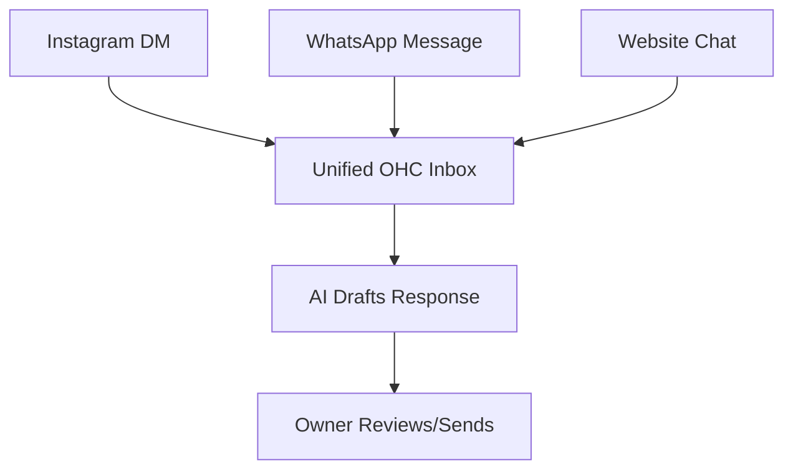

# Title: Unified Mobile-First CRM Hub

## Problem Statement
Founders communicate with customers across Email, SMS, Instagram, and WhatsApp. Tracking conversation history and context is impossible, leading to missed sales and poor customer service.

## Research Report
- 10% of complaints relate to time wasted replying to basic DMs.
- 73% of platform reviews mention communication breakdown.
- Competitors treat CRM as a desktop-first, tabular experience.

## Design Doc
- **High-level architecture**: Webhook ingestion from various social platforms, a unified message normalization layer, and a real-time mobile inbox UI.
- **UI wireframes or screen flow description (375px first)**:
    - **Inbox Tab**: A unified list of threads, regardless of source platform. Badges indicate platform origin.
    - **Thread View**: Standard chat interface. AI suggested responses appear as chips above the keyboard.
- **Mobile UX flow**: Familiar chat interface (like iMessage/WhatsApp) fully optimized for 375px width.
- **AI Integration**: Context-aware response generation based on the thread history and the user's business context.

## Implementation Prompt
Implement the Unified Mobile-First CRM Hub. The Critical User Journey involves receiving a message from an external channel (e.g., simulated IG DM), viewing it in the unified inbox, and sending an AI-drafted reply. Acceptance criteria: Messages are correctly grouped by customer, AI drafts are relevant, fully usable at 375px width.

## Priority
P2

## Estimated Scope
Medium
