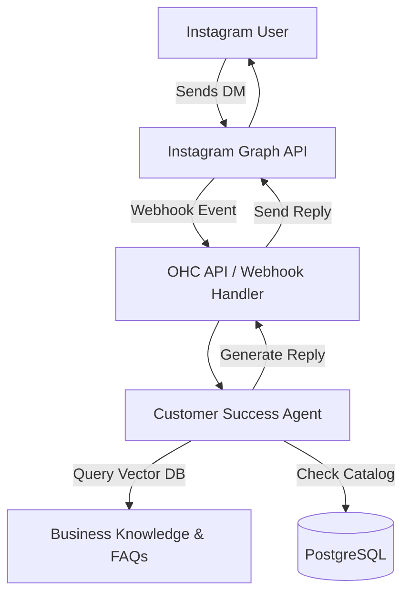

# Problem Statement: Instagram DM Overwhelm for Small Business Owners

Non-technical small business owners, specifically home bakers like Maya (28, baker persona), primarily sell custom products via Instagram DMs. This leads to a massive communication bottleneck: answering the same questions repeatedly ("do you do vegan cakes?", "how much is a 3-tier cake?") instead of actually fulfilling orders or marketing. This manual process is error-prone, hurts response times, causes lost leads, and creates intense burnout.

## Research Report

### The Gap
- **Shopify:** Provides "Shopify Inbox", which allows centralizing chat, but does not provide autonomous agentic replies tailored to the specific context of the business owner.
- **Wix/Squarespace/GoDaddy:** Basic contact forms and auto-reply emails. They lack native, context-aware conversational AI that acts as a true "Customer Success" employee directly on Instagram.
- **OHC's Opportunity:** Implement an "Instagram DM Auto-Responder Agent" in the Customer Success Department. It leverages the business's product catalog and FAQ vector DB to autonomously handle DMs, qualify leads, and close sales by directing users to pre-order storefronts or custom quote forms.

### Data Points
- According to App Store and Trustpilot reviews, a recurring complaint across major e-commerce platforms is the difficulty of managing disjointed communication channels. "I spend 3 hours a day just answering Instagram DMs."
- Small businesses miss an estimated 30-40% of potential leads due to delayed responses on social platforms.
- Maya Persona Validated: The target demographic operates primarily from a smartphone and lacks the technical capability or time to set up Zapier integrations for Instagram AI.

### Feature Gap Matrix

| Feature | OHC (current) | Shopify | Wix | Squarespace | GoDaddy | OHC (proposed advantage) |
|---|---|---|---|---|---|---|
| Instagram DM Integration | Basic Webhook | Yes (Inbox app) | No native DM app | No native DM app | No native DM app | **Full AI Agent Auto-Responder** |
| Context-Aware AI Chat | No | Sidekick (admin only) | No | No | No | **Customer-facing RAG AI** |
| Lead Qualification | No | Manual via Inbox | Manual | Manual | Manual | **Autonomous Lead Qualification** |
| Mobile-First Setup | No | Setup requires desktop | Complex mobile | No | No | **< 2 min mobile setup** |

## Design Doc

### High-Level Architecture
1.  **Webhook Ingestion:** A new or expanded webhook handler in `srcs/server/` to receive Instagram Graph API messages.
2.  **Agent Invocation:** The webhook triggers the Customer Success Agent, passing the conversation history and user query.
3.  **Knowledge Retrieval:** The agent uses RAG to query the business's pgvector knowledge base (pricing, vegan options, delivery radii).
4.  **Response Generation & Delivery:** The agent formats a conversational response, suggesting links to the OHC storefront if appropriate, and sends it back via the Instagram API.
5.  **Analytics:** The interaction is logged as an engagement metric for the Business Advisory Agent to report on later.

### Mobile UX Flow (375px)
- **Setup:** User opens the OHC app, navigates to "Customer Success Agent" department.
- **Connect:** User taps "Connect Instagram" -> OAuth flow -> Selects business page.
- **Knowledge Training:** User is prompted to answer 3 common questions or upload their menu. (UI: Glassmorphism cards, large typography).
- **Toggle:** A large toggle switch: "Let Agent reply to new DMs".
- **Inbox View:** A consolidated inbox view showing conversations, with a badge indicating "Handled by AI" or "Requires Your Attention".

## Implementation Prompt

Implement the Instagram DM Auto-Responder feature.
1.  **Backend:** Add the necessary webhook ingestion routes and Instagram API integration services. Configure the Customer Success Agent to handle incoming DM events, query the tenant's knowledge base, and dispatch replies. Ensure all operations are tenant-isolated using the `tenant_id` context.
2.  **Frontend (Flutter):** Create the "Connect Instagram" onboarding flow and settings toggle within the Customer Success department screen. Implement a basic unified inbox view that highlights AI-handled messages versus manual messages. All designs must adhere to the OHC Premium Token library (Glassmorphism, 375px mobile-first).
3.  **Acceptance Criteria:** A user can connect their Instagram account, enable the AI responder, and incoming test DMs should receive accurate, context-aware automated replies based on the tenant's product data. Ensure the CUJ is covered by a full E2E test.

**Priority:** P1
**Estimated Scope:** Medium
