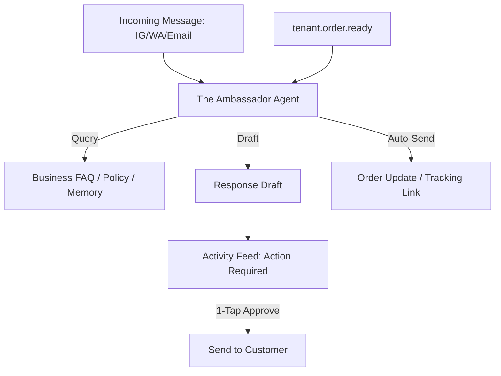

# [Customer Success] Architecture Brief: "The Ambassador"

## Title
OHC "The Ambassador": 1-Tap Support and Proactive Relationship Management

## Problem Statement
Fatima (Food Cart) and Maya (Baker) are overwhelmed by messages across Instagram, WhatsApp, and email. They feel guilty for not responding fast enough, and customers get frustrated. They need a "front-desk" agent that handles the "easy" questions and drafts perfect responses for the "hard" ones.

## Research Report
- **The Messaging Fatigue**: Small businesses spend up to 10 hours a week on basic customer support (FAQs).
- **Draft-for-Review Advantage**: Unlike a generic chatbot that might hallucinate, "The Ambassador" drafts a reply based on business memory, allowing the owner to maintain the "human touch" with a 1-tap approval.
- **Sentiment Tracking**: By analyzing message tone, the agent can flag "Unhappy Customers" to the "Business Advisor" for proactive recovery.

## Design Doc

### High-Level Architecture (Mermaid.js)

### UI Flow (375px First)
- **Message Cards**: The dashboard shows the customer's question and the AI's drafted answer. A single large "Send" button makes responding as easy as "swiping right."
- **Tone Toggle**: "The Ambassador" can be set to "Friendly," "Professional," or "Direct" to match the owner's personality.

### AI Agent Integration
- **Triggers**: `tenant.message.received`, `tenant.order.shipped`, `tenant.review.posted`.
- **Tools**: `sendmessage`, `read_faq`, `customer_lookup`.

## Implementation Prompt
**To Implementer Agent:**
Implement "The Ambassador" (Customer Success) department. The agent must listen for incoming messages across integrated channels and generate response drafts using the business's "FAQ Memory" and past order history. It should also handle automatic shipping notifications. Implement the "Sentiment Analysis" feature where the agent flags any message with a "Negative" sentiment to the `advisory` queue for immediate attention.

## Priority
P0

## Estimated Scope
Medium
