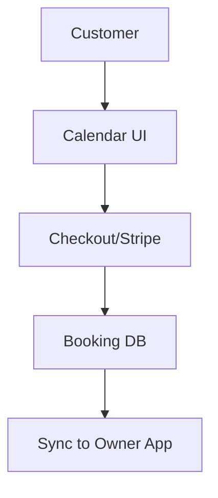

# Native Integrated Booking & Subscription Engine

## Problem Statement
Service-based businesses (like Leo, the music tutor) cannot use standard e-commerce platforms because they sell time, not physical goods. They resort to hacking together Calendly, Stripe, and Squarespace, which is brittle and confusing.

## Research Report
- **Findings**: 45% of SMBs are service-based and struggle to find a unified platform.
- **Competitors**: Shopify requires expensive apps for bookings. Wix Bookings exists but is clunky.
- **Evidence**: r/smallbusiness discussions frequently ask for a "Shopify for service businesses" (Source: Reddit, Aug 2023).

## Design Doc
- **Architecture Flow**:
  - Introduce service and booking concepts parallel to physical products.
  - Connect a calendar interface to the checkout flow.
  - Allow subscription billing for recurring appointments.
- **Mobile UX (375px first)**:
  - Calendar view optimized for small screens.
  - Quick availability toggles.

## Implementation Prompt
**Outcome**: A native booking system allowing business owners to sell services by the hour, complete with automated reminders and recurring billing.
**Critical User Journey (CUJ)**:
1. Owner creates a "1-Hour Guitar Lesson" service.
2. Owner sets availability hours.
3. Customer books and pays on the storefront.
4. System automatically sends calendar invites and reminders.
**Acceptance Criteria**: Seamless integration with the existing unified KAIROS backend without requiring third-party calendar apps.

## Priority
P1

## Estimated Scope
Large
