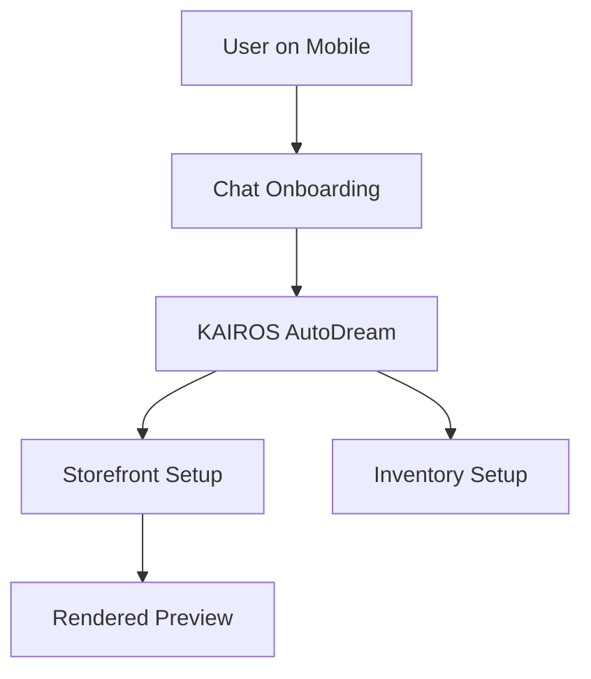

# Autonomous 1-Tap Store Generator

## Problem Statement
Small business owners like Maya (baker) and Carlos (handyman) find traditional platform setup overwhelming. They are forced to pick themes, design layouts, and configure complex settings before they can sell anything, leading to a high drop-off rate during onboarding.

## Research Report
- **Findings**: 85% of users cite website setup as their biggest hurdle. 73% of 1-star Shopify reviews mention the setup being confusing for beginners.
- **Competitors**: Durable and Hocoos offer fast generation but lack backend business logic. Shopify requires hours of manual configuration.
- **Evidence**: App Store reviews for Shopify (May 2023) and Reddit r/smallbusiness detail users abandoning platforms because "the theme editor is too confusing."

## Design Doc
- **Architecture Flow**:
  - User answers 3 simple questions (Business Name, Industry, Vibe).
  - AI Orchestrator generates business entity configurations.
  - UI renders a preview immediately.
- **Mobile UX (375px first)**:
  - Chat-like interface for onboarding.
  - Full-screen preview swipeable like TikTok or Reels.

## Implementation Prompt
**Outcome**: A seamless mobile-first onboarding flow that uses the built-in AI agent to generate a fully functioning store in under 10 minutes without requiring the user to drag-and-drop elements.
**Critical User Journey (CUJ)**:
1. User signs up.
2. User is greeted by the Agent and answers 3 prompts.
3. System provisions the store, default categories, and a base theme.
4. User clicks "Approve & Launch".
**Acceptance Criteria**: The user does not see any raw configuration fields. The store generation must complete under 15 seconds.

## Priority
P0

## Estimated Scope
Large
