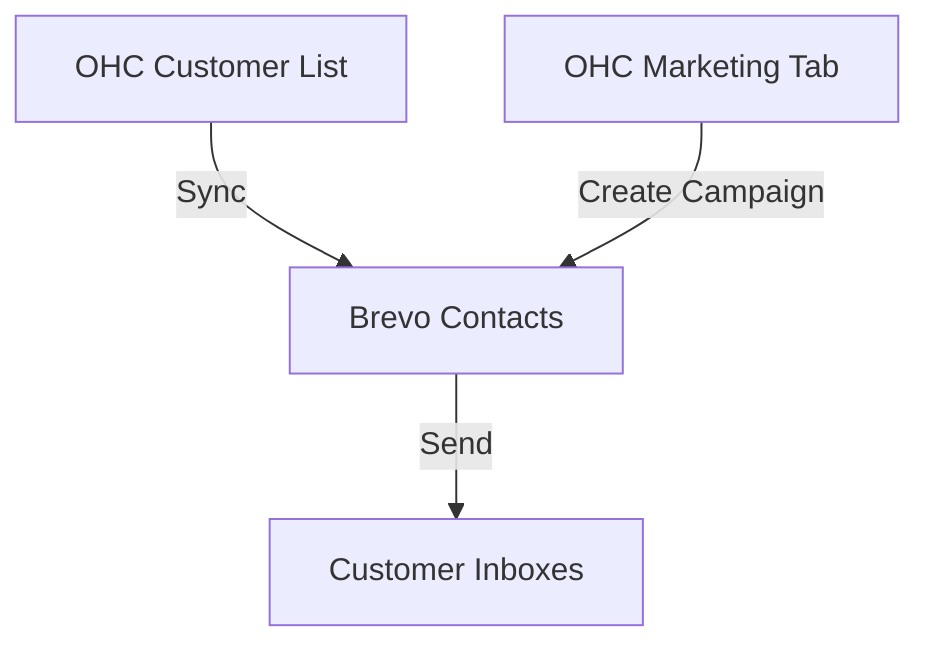

# Email Marketing: Brevo (formerly Sendinblue)

## Problem Statement
Keeping in touch with past customers to offer promotions or updates is crucial for repeat business. Small business owners often struggle with complex marketing tools and fear violating spam laws. They need a simple way to send a newsletter or promo to their existing customer list.

### Persona-Specific Pain Point Summary
- **Bakery Owner (Mike):** "I want to email my customers about holiday pies, but Mailchimp is too complicated for me."
- **Yoga Studio (Lisa):** "I need a simple way to announce class schedule changes to all my students."

## Research Report
**Tool:** Brevo
**Ease of Use:** Known for its straightforward drag-and-drop editor and clear contact management, friendly for beginners. (Source: Capterra reviews)
**Pricing:** Generous free tier (up to 300 emails/day), which is often enough for very small businesses.
**Reputation:** Strong European presence, excellent GDPR compliance.
**Cloud/Standalone:** API is accessible from both Cloud and Standalone environments.

### Comparative Table
| Feature | Brevo | Mailchimp | OHC Fit |
|---|---|---|---|
| Free Limits | 300 emails/day | 1000 sends/mo | Excellent |
| UI Simplicity | High | Medium | Essential |
| API Access | Yes | Yes | Essential |

## Design Doc
### Architecture

### UX Flow
1. User connects Brevo account in OHC Settings.
2. OHC automatically syncs the local "Customers" list to a Brevo list.
3. User can click "Send Newsletter", which redirects them to Brevo's editor or uses an API to send a simple text/image blast.

## Implementation Prompt
Build a "Marketing" section that allows the user to link a Brevo account via API key. Implement an automatic, background, one-way sync from the OHC "Customers" database to a dedicated Brevo list. Add a dashboard metric showing the total number of synced marketing contacts.

## Priority
P2

## Scope
Medium
