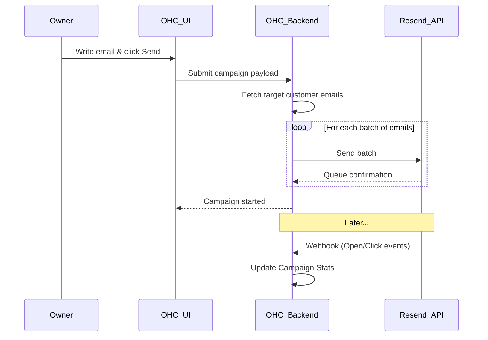

# [Email] Seamless Marketing Campaigns

## Title
Integrated Email Marketing and Customer List Sync

## Problem Statement
As a small business owner, I have a list of customer emails from past sales and inquiries, but doing anything with them is hard. Exporting CSVs, uploading them to clunky tools like Mailchimp, and trying to design a decent-looking newsletter takes hours I don't have. I just want to write a simple update about a new product or a holiday sale and send it to everyone who has bought from me, directly from the tool where my customer data already lives.

## Research Report
**Tools Evaluated:** Mailchimp API, SendGrid/Twilio, Resend, Direct SMTP.

- **Resend:** Developer-first email API built for modern apps.
  - *Ease of Use:* We would build the UI in OHC; the user never sees Resend. They just see a "Send Email Broadcast" button in OHC.
  - *Pricing:* Very cheap. Free tier up to 3,000 emails/month, then $20 for 50,000. Perfect for SMB scale.
  - *Reputation:* Excellent deliverability and modern architecture.
  - *Cloud vs Standalone:* Works flawlessly via API in Cloud mode. Standalone users can either use a centralized OHC proxy or provide their own Resend API key for ultimate privacy.
- **Mailchimp:** Very famous, but their API is notoriously complex and they force users into their ecosystem. High friction for seamless integration.
- **SendGrid:** Solid, but slightly older and more complex templating systems compared to Resend's React Email approach.
- **Recommendation:** Use Resend for underlying delivery. Build a lightweight block-based email editor inside OHC that connects natively to the OHC CRM/Customer list.

## Design Doc
A "Broadcasts" or "Campaigns" tab integrated with the CRM view.
- **Trigger:** The owner selects a group of customers (or "All") and clicks "Create Campaign".
- **Action:** A clean, distraction-free text editor opens (like writing a regular email, but with options to add images or a big button).
- **User View:** The owner types their message, previews it, and hits "Send". OHC handles chunking the list, sending via Resend, and then displays simple stats (Sent, Opened, Clicked) on the dashboard without overwhelming the user with analytics.

## Implementation Prompt
Build a "Broadcast" feature that lets users send bulk emails to their contact list. Provide a very simple, rich-text editor (bold, italics, add image, add link) rather than a complex drag-and-drop builder. The system must automatically handle unsubscription links and opt-out management to ensure spam compliance. Integrate with an API like Resend to handle the actual delivery. Show basic metrics (open rate, click rate) on the campaign's detail page after sending.

## Priority
P2

## Estimated Scope
Medium
