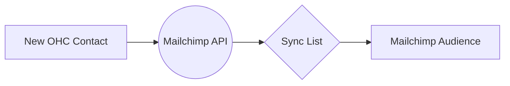

# [Email] Mailchimp Marketing Integration
## Problem Statement
Business owners have a list of customers in OHC but no easy way to send them professional newsletters or promotional offers without manually exporting and importing CSVs.

## Research Report
- **Tool Evaluated**: Mailchimp Marketing API
- **Ease of Use**: Excellent non-technical UI for the end-user on Mailchimp's side.
- **Pricing**: Free up to 500 contacts, then tiered. Great for starters.
- **Reputation**: Market leader for SMBs.
- **Cloud & Standalone**: OAuth 2.0 works well for both environments.

### Pain Points Solved
- Automates syncing of the customer list.
- Saves time on manual data entry.

| Email Tool | Free Tier | UI/UX for SMBs |
| :--- | :--- | :--- |
| Mailchimp | 500 contacts | Excellent |
| SendGrid | None | Developer Focused |
| Brevo | 300 emails/day | Good |

## Design Doc
- **Integration**: OAuth 2.0 connection.
- **Triggers**: Whenever a new customer is added in OHC, push to a designated Mailchimp Audience.
- **User Flow**: Owner connects Mailchimp, selects an "Audience", and checks a box to "Auto-sync customers".

## Implementation Prompt
Build a connection to Mailchimp that allows a business owner to log in and authorize OHC. Provide a toggle to automatically add new OHC contacts to a specific Mailchimp audience so they can immediately start sending marketing emails.

## Priority
P2

## Estimated Scope
Medium
