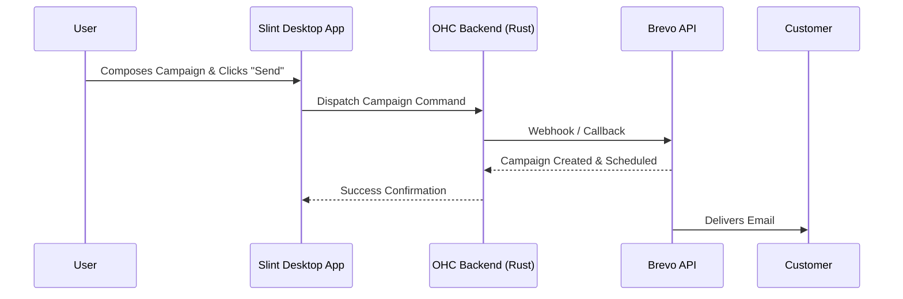

# Brevo Integration

## Problem Statement
Small business owners struggle to manage customer email lists and send promotional campaigns effectively without complex tools.

## Research Report
Brevo (formerly Sendinblue) provides a comprehensive API for transactional and marketing emails.
* **Problem Addressed**: Simplifies email marketing and customer communication directly from the CRM.
* **User Benefit**: "Easy newsletter and transactional email sending directly from your OHC CRM dashboard, without needing a separate marketing tool."
* **Ease of Use (for non-technical users)**: The OHC UI will abstract away the API. However, setting up initial domain authentication (DKIM/SPF) is historically difficult for non-technical users and requires clear, step-by-step guidance.
* **Risks & Trade-offs**: Spam compliance rules (CAN-SPAM/GDPR) must be strictly followed. Requires domain authentication.
* **Pricing Estimate**: Free tier (300 emails/day); paid plans start at $25/month.
* **Compatibility**: Cloud & Standalone.

## Design Doc
The integration will utilize the Brevo REST API to send emails and sync contact lists.

## Implementation Prompt
**Outcome**: Implement the Brevo integration to allow users to manage contacts and send email campaigns directly from the OHC platform.
**Acceptance Criteria**:
1. Users must be able to input their Brevo API key in the Integrations UI.
2. The OHC CRM must be able to sync contact lists with Brevo.
3. Users must be able to compose a simple email campaign in the Slint UI and dispatch it via the Brevo API.
4. The system must provide clear UI guidance on domain authentication requirements.

## Priority
P2 (Medium)

## Estimated Scope
Medium
