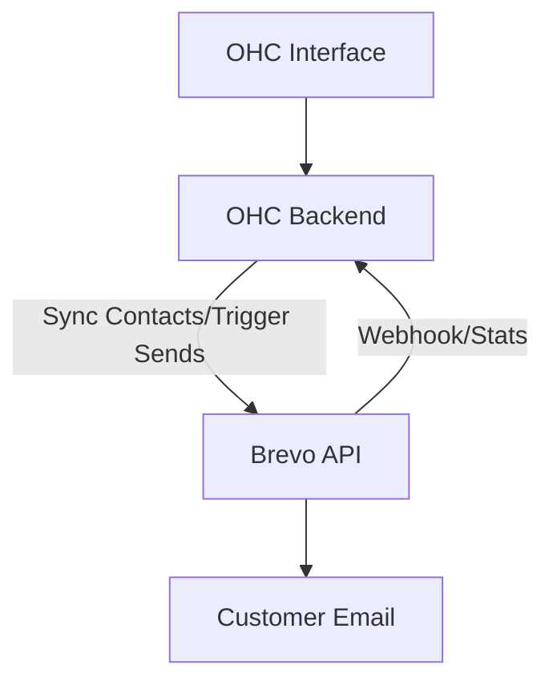

# Research: Email Marketing Integration with Brevo

## Title
Integrate Brevo for Unified Email Marketing and CRM

## Problem Statement
Small business owners struggle to keep their customer lists organized and engage with them effectively. Sending newsletters, promotional offers, or transactional emails requires exporting data to a separate, often complex, email marketing tool. They need an integrated solution to manage contacts and send professional emails directly tied to their customer data.

## Research Report
Brevo (formerly Sendinblue) is a comprehensive customer relationship management (CRM) suite offering email marketing, SMS, WhatsApp campaigns, and automation.
- **Ease of Use**: Brevo provides a drag-and-drop email editor and pre-built templates that make it accessible for non-technical users. Its interface combines marketing campaigns and transactional emails, which simplifies management.
- **Pricing**: They offer a strong "Free forever" plan that includes unlimited contacts and up to 300 emails per day. Paid plans start at $9/month (Starter) for higher sending volumes and removal of the Brevo logo, making it very budget-friendly for small businesses.
- **Reputation**: Brevo is widely recognized as a robust, affordable alternative to Mailchimp. It is praised for its deliverability and all-in-one approach (combining email, SMS, and basic CRM features).
- **Environment Support**: As a SaaS platform, it relies on API integrations. It is perfect for Cloud deployments. For Standalone modes, the OHC backend will need outbound internet access to communicate with the Brevo API to sync contacts and trigger sends.

## Design Doc
The integration will sync the OHC customer list with Brevo and allow triggering of basic campaigns or transactional emails.
1.  **Authentication**: The user connects their Brevo account via API key in the OHC settings.
2.  **Contact Sync**: OHC maintains a two-way sync or pushes customer data (emails, names, tags) to a designated Brevo list.
3.  **Campaign Management**: While complex design happens in Brevo, OHC can display recent campaign performance (open rates, click rates) on the dashboard.
4.  **Transactional Triggers**: OHC can use Brevo's SMTP relay or API to send automated receipts, welcome emails, or booking confirmations.

## Implementation Prompt
Integrate Brevo to handle outbound marketing and transactional emails. Build a synchronization mechanism that keeps an OHC customer list updated within a linked Brevo account. Provide an interface in OHC to view high-level metrics for recent Brevo campaigns. Ensure that transactional emails generated by OHC (e.g., appointment confirmations, receipts) can be routed through Brevo's API to ensure high deliverability. The solution must handle API rate limits and connection errors gracefully.

## Priority
P2

## Estimated Scope
Large
