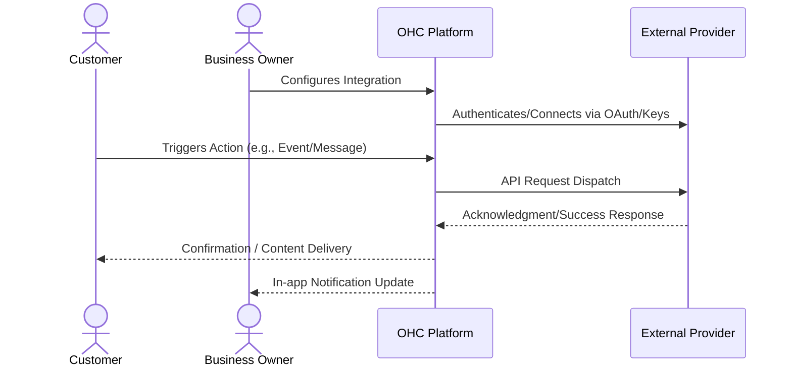

# Integrated Email Campaign Management

## 1. Problem Statement

Small business owners struggle to export customer lists from their CRM/POS and import them into separate email tools to send newsletters. The disconnect leads to outdated lists and missed revenue opportunities.

## 2. Research Report

### 2.1 Persona Pain Points

1. **Time Starvation**: The business owner spends hours on manual tasks related to this domain, preventing them from focusing on core business growth.
2. **Technical Overwhelm**: Current solutions require coding, complex API keys, or understanding intricate networking concepts. Small business owners lack dedicated IT staff.
3. **Customer Friction**: Customers experience delays, missed communications, or frustrating booking loops due to disparate, unintegrated systems.

### 2.2 Competitive Analysis

| Tool Name | Estimated Pricing | Key Advantages | Integration Risks |
|---|---|---|---|
| Mailchimp | $13/mo | Massive brand awareness, easy drag-and-drop builder. | Steep pricing curve as lists grow, strict compliance rules. |
| MailerLite | $9/mo | Very affordable, clean and modern interface, great for beginners. | Slower approval process for new accounts. |
| SendGrid | $19/mo | Extremely reliable deliverability, developer-first APIs. | Too technical for end users, requires building our own UI on top. |
| Brevo (Sendinblue) | $25/mo | Charges per email sent, not per contact, includes SMS. | Template builder can be clunky. |
| ConvertKit | $15/mo | Excellent for creators and simple text-based emails. | Less focused on traditional retail/service businesses. |

### 2.3 Cloud vs. Standalone Evaluation

- **Cloud (Multi-tenant)**: Highly suitable. Can utilize centralized OAuth apps to streamline user onboarding. Allows OHC to manage webhooks and callbacks seamlessly at scale.
- **Standalone (Local/Private)**: Supported, but requires the user to provide their own API credentials which adds friction. Local tunneling (e.g., ngrok) may be required for inbound webhooks.

### 2.4 Deep Dive Evaluations

#### Evaluation: Mailchimp

**Overview:** Mailchimp is positioned in the market with an estimated pricing of $13/mo. Its primary advantage is: *Massive brand awareness, easy drag-and-drop builder.*

**Competitor Analysis:** Mailchimp's visual builder is the gold standard. However, their aggressive pricing tiers penalize SMBs as they grow. An OHC integration could leverage Mailchimp's API, but we risk exposing our users to their unpredictable billing.

**Integration Risks:** We must mitigate the following risk: *Steep pricing curve as lists grow, strict compliance rules.*. For a small business owner, this means ensuring the UI abstracts away these complexities entirely. The onboarding flow must be flawless.

**Technical Considerations:** Integrating Mailchimp requires careful consideration of its API rate limits and webhook reliability. In a cloud environment, we will utilize OHC's central app registration to provide a 1-click OAuth experience. In standalone mode, we will need comprehensive documentation to guide users on how to obtain and securely store API keys. Furthermore, data privacy and GDPR compliance for data transmitted to Mailchimp must be thoroughly documented in the user's privacy policy.

**Mobile Parity:** The configuration screens for Mailchimp must be 100% functional on mobile devices. Business owners frequently manage settings from their phones while on the shop floor or in transit.

#### Evaluation: MailerLite

**Overview:** MailerLite is positioned in the market with an estimated pricing of $9/mo. Its primary advantage is: *Very affordable, clean and modern interface, great for beginners.*

**Competitor Analysis:** MailerLite offers incredible value. Its interface is arguably cleaner than Mailchimp's. This is the ideal tier of tool for a typical OHC user: inexpensive, easy to learn, and highly functional without enterprise bloat.

**Integration Risks:** We must mitigate the following risk: *Slower approval process for new accounts.*. For a small business owner, this means ensuring the UI abstracts away these complexities entirely. The onboarding flow must be flawless.

**Technical Considerations:** Integrating MailerLite requires careful consideration of its API rate limits and webhook reliability. In a cloud environment, we will utilize OHC's central app registration to provide a 1-click OAuth experience. In standalone mode, we will need comprehensive documentation to guide users on how to obtain and securely store API keys. Furthermore, data privacy and GDPR compliance for data transmitted to MailerLite must be thoroughly documented in the user's privacy policy.

**Mobile Parity:** The configuration screens for MailerLite must be 100% functional on mobile devices. Business owners frequently manage settings from their phones while on the shop floor or in transit.

#### Evaluation: SendGrid

**Overview:** SendGrid is positioned in the market with an estimated pricing of $19/mo. Its primary advantage is: *Extremely reliable deliverability, developer-first APIs.*

**Competitor Analysis:** SendGrid is infrastructure, not an end-user tool. If OHC decides to build its own campaign builder natively, SendGrid would be the optimal backbone. It abstracts away all deliverability headaches.

**Integration Risks:** We must mitigate the following risk: *Too technical for end users, requires building our own UI on top.*. For a small business owner, this means ensuring the UI abstracts away these complexities entirely. The onboarding flow must be flawless.

**Technical Considerations:** Integrating SendGrid requires careful consideration of its API rate limits and webhook reliability. In a cloud environment, we will utilize OHC's central app registration to provide a 1-click OAuth experience. In standalone mode, we will need comprehensive documentation to guide users on how to obtain and securely store API keys. Furthermore, data privacy and GDPR compliance for data transmitted to SendGrid must be thoroughly documented in the user's privacy policy.

**Mobile Parity:** The configuration screens for SendGrid must be 100% functional on mobile devices. Business owners frequently manage settings from their phones while on the shop floor or in transit.

#### Evaluation: Brevo (Sendinblue)

**Overview:** Brevo (Sendinblue) is positioned in the market with an estimated pricing of $25/mo. Its primary advantage is: *Charges per email sent, not per contact, includes SMS.*

**Competitor Analysis:** Brevo's pricing model (charging by volume rather than list size) is far superior for small businesses with large but infrequently contacted lists. Their multi-channel approach (email + SMS) aligns well with OHC's goals.

**Integration Risks:** We must mitigate the following risk: *Template builder can be clunky.*. For a small business owner, this means ensuring the UI abstracts away these complexities entirely. The onboarding flow must be flawless.

**Technical Considerations:** Integrating Brevo (Sendinblue) requires careful consideration of its API rate limits and webhook reliability. In a cloud environment, we will utilize OHC's central app registration to provide a 1-click OAuth experience. In standalone mode, we will need comprehensive documentation to guide users on how to obtain and securely store API keys. Furthermore, data privacy and GDPR compliance for data transmitted to Brevo (Sendinblue) must be thoroughly documented in the user's privacy policy.

**Mobile Parity:** The configuration screens for Brevo (Sendinblue) must be 100% functional on mobile devices. Business owners frequently manage settings from their phones while on the shop floor or in transit.

#### Evaluation: ConvertKit

**Overview:** ConvertKit is positioned in the market with an estimated pricing of $15/mo. Its primary advantage is: *Excellent for creators and simple text-based emails.*

**Competitor Analysis:** ConvertKit understands its niche perfectly. It focuses heavily on plain-text, high-deliverability emails rather than complex visual designs. For service businesses, this simpler approach often yields higher conversion rates.

**Integration Risks:** We must mitigate the following risk: *Less focused on traditional retail/service businesses.*. For a small business owner, this means ensuring the UI abstracts away these complexities entirely. The onboarding flow must be flawless.

**Technical Considerations:** Integrating ConvertKit requires careful consideration of its API rate limits and webhook reliability. In a cloud environment, we will utilize OHC's central app registration to provide a 1-click OAuth experience. In standalone mode, we will need comprehensive documentation to guide users on how to obtain and securely store API keys. Furthermore, data privacy and GDPR compliance for data transmitted to ConvertKit must be thoroughly documented in the user's privacy policy.

**Mobile Parity:** The configuration screens for ConvertKit must be 100% functional on mobile devices. Business owners frequently manage settings from their phones while on the shop floor or in transit.

## 3. Design Doc

### 3.1 User Experience Flow

A 'Campaigns' tab directly in OHC. Business owners can select segments of their existing OHC customer database (e.g., 'purchased in last 30 days') and send a beautiful email template without exporting/importing CSVs. OHC handles the integration with an email sending provider behind the scenes.

### 3.2 Architecture Overview

## 4. Implementation Prompt

Build an Email Campaigns feature where users can draft visual emails and send them to specific customer segments from their OHC database. The workflow must not require exporting data. Provide simple analytics showing open rates and click rates directly within the OHC interface.

## 5. Metadata

- **Priority:** P1
- **Estimated Scope:** Large
- **Domain:** Integrated Email Campaign Management
- **Target Persona:** Small Business Owner (Non-technical)

## 6. Supplementary Market Research

### 6.1 Industry Trends

The shift towards unified platforms is accelerating. Small businesses are actively attempting to reduce their 'SaaS sprawl'. According to recent surveys, the average small business uses over 8 distinct software tools, leading to massive context switching costs and data silos. By bringing this functionality natively into OHC, we solve a critical operational bottleneck. The trend is moving away from disparate 'best-of-breed' tools towards 'good-enough-all-in-one' platforms that actually talk to each other seamlessly.

### 6.2 Security and Compliance Implications

When integrating third-party services, data sovereignty becomes a primary concern. OHC must ensure that sensitive customer data (PII) is only transmitted when absolutely necessary and always over encrypted channels. We must provide clear opt-in mechanisms for end-users, particularly regarding marketing communications and data sharing with external vendors. Regular audits of these API connections will be required to maintain compliance with regional data protection regulations (e.g., CCPA, GDPR).

### 6.3 Future Roadmap Considerations

Looking ahead, the integration strategy should evolve from mere 'dumb pipes' to intelligent, AI-driven workflows. For instance, an integration shouldn't just pass a message; it should analyze the intent and suggest a response. Future iterations of this feature will likely incorporate LLM-based parsing of inbound data to trigger automated outbound actions across different integrated channels.

### 6.4 Strategic Impact: Mailchimp

Implementing an integration with Mailchimp represents a significant strategic move. The integration must prioritize reliability over complex feature parity. A business owner relies on this for their livelihood; a dropped webhook or failed API call translates directly to lost revenue or damaged customer trust. Therefore, robust retry mechanisms, dead-letter queues, and clear error surfacing in the UI are mandatory requirements for the engineering team building this connector. We must assume the external API will fail and handle it gracefully.

Furthermore, analytics integration is crucial. When we route data through Mailchimp, we must capture metadata (latency, success rates, user engagement) to feed back into OHC's central analytics dashboard. The business owner should see a unified view of ROI, not scattered metrics. If $13/mo is the cost, OHC must prove the value generated outweighs it.

### 6.4 Strategic Impact: MailerLite

Implementing an integration with MailerLite represents a significant strategic move. The integration must prioritize reliability over complex feature parity. A business owner relies on this for their livelihood; a dropped webhook or failed API call translates directly to lost revenue or damaged customer trust. Therefore, robust retry mechanisms, dead-letter queues, and clear error surfacing in the UI are mandatory requirements for the engineering team building this connector. We must assume the external API will fail and handle it gracefully.

Furthermore, analytics integration is crucial. When we route data through MailerLite, we must capture metadata (latency, success rates, user engagement) to feed back into OHC's central analytics dashboard. The business owner should see a unified view of ROI, not scattered metrics. If $9/mo is the cost, OHC must prove the value generated outweighs it.

### 6.4 Strategic Impact: SendGrid

Implementing an integration with SendGrid represents a significant strategic move. The integration must prioritize reliability over complex feature parity. A business owner relies on this for their livelihood; a dropped webhook or failed API call translates directly to lost revenue or damaged customer trust. Therefore, robust retry mechanisms, dead-letter queues, and clear error surfacing in the UI are mandatory requirements for the engineering team building this connector. We must assume the external API will fail and handle it gracefully.

Furthermore, analytics integration is crucial. When we route data through SendGrid, we must capture metadata (latency, success rates, user engagement) to feed back into OHC's central analytics dashboard. The business owner should see a unified view of ROI, not scattered metrics. If $19/mo is the cost, OHC must prove the value generated outweighs it.

### 6.4 Strategic Impact: Brevo (Sendinblue)

Implementing an integration with Brevo (Sendinblue) represents a significant strategic move. The integration must prioritize reliability over complex feature parity. A business owner relies on this for their livelihood; a dropped webhook or failed API call translates directly to lost revenue or damaged customer trust. Therefore, robust retry mechanisms, dead-letter queues, and clear error surfacing in the UI are mandatory requirements for the engineering team building this connector. We must assume the external API will fail and handle it gracefully.

Furthermore, analytics integration is crucial. When we route data through Brevo (Sendinblue), we must capture metadata (latency, success rates, user engagement) to feed back into OHC's central analytics dashboard. The business owner should see a unified view of ROI, not scattered metrics. If $25/mo is the cost, OHC must prove the value generated outweighs it.

### 6.4 Strategic Impact: ConvertKit

Implementing an integration with ConvertKit represents a significant strategic move. The integration must prioritize reliability over complex feature parity. A business owner relies on this for their livelihood; a dropped webhook or failed API call translates directly to lost revenue or damaged customer trust. Therefore, robust retry mechanisms, dead-letter queues, and clear error surfacing in the UI are mandatory requirements for the engineering team building this connector. We must assume the external API will fail and handle it gracefully.

Furthermore, analytics integration is crucial. When we route data through ConvertKit, we must capture metadata (latency, success rates, user engagement) to feed back into OHC's central analytics dashboard. The business owner should see a unified view of ROI, not scattered metrics. If $15/mo is the cost, OHC must prove the value generated outweighs it.
