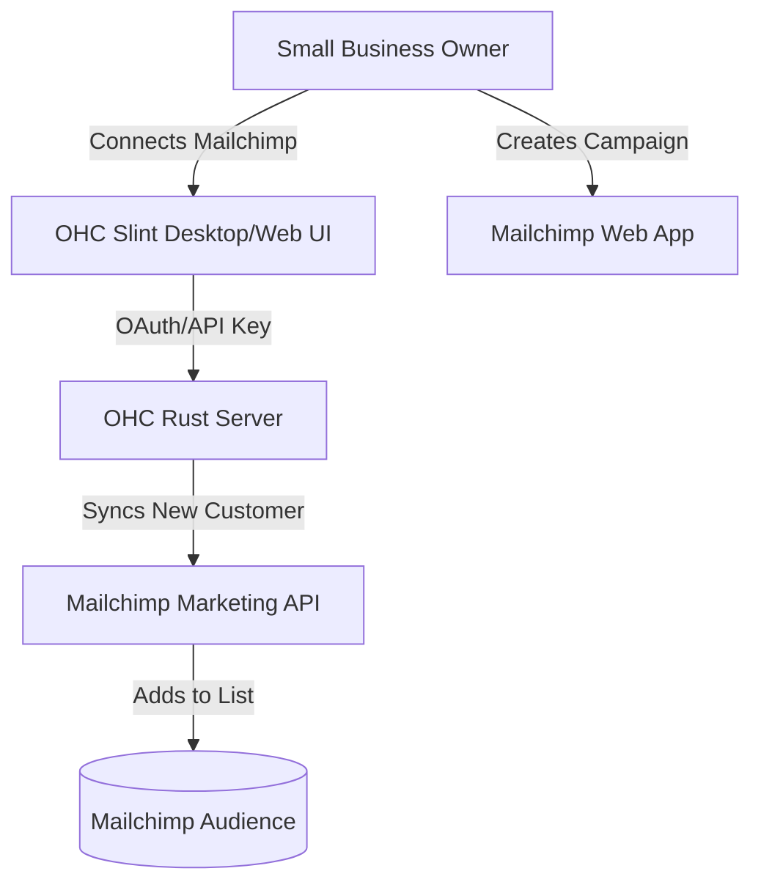

**Title**: Email Marketing Integration: Mailchimp

## Problem Statement
Small businesses need a reliable way to communicate with their customer base at scale (e.g., newsletters, promotions, abandoned cart emails). Building an email marketing engine from scratch is complex and risky due to spam compliance and deliverability issues. They need to easily sync their OHC customer list with a professional email marketing tool to run campaigns seamlessly.

## Research Report
**Tool Evaluated:** Mailchimp
**Category:** Email Marketing
**Overview:** Mailchimp is an industry-standard email marketing and automation platform designed specifically for small to medium-sized businesses.

**Key Features for Small Businesses:**
*   **Drag-and-Drop Builder:** Easy-to-use template designer for professional-looking emails.
*   **Audience Management:** robust segmentation and tagging.
*   **Automations:** Pre-built customer journeys (e.g., welcome series, birthday emails).
*   **Analytics:** Clear reporting on open rates and clicks.

**Environment Compatibility:**
*   **Cloud Mode:** Fully supported via Mailchimp's Marketing API.
*   **Standalone Mode:** Fully supported via Mailchimp's Marketing API.

**Pros:**
*   Massive brand recognition and trust among small business owners.
*   Extensive template library and AI assistance.
*   Generous free tier for early-stage businesses.

**Cons:**
*   Pricing scales steeply as the contact list grows.

## Design Doc

The integration focuses on keeping the OHC customer database seamlessly synchronized with a Mailchimp Audience.

### High-Level UX Flow:
1.  **Integration Hub:** The business owner selects "Connect Mailchimp" in OHC and authenticates via OAuth.
2.  **Configuration:** The user selects which Mailchimp "Audience" (List) OHC should sync with.
3.  **Operation:** Whenever a new customer is added in OHC (e.g., via a booking or sale), OHC automatically pushes that contact to Mailchimp.
4.  **Display:** OHC displays a sync status indicator in the customer CRM view.

## Implementation Prompt
**Objective:** Integrate Mailchimp to automatically sync OHC contacts to a Mailchimp Audience.
**Acceptance Criteria:**
- Create a UI component in Slint for Mailchimp OAuth authorization and Audience selection.
- Implement a backend background worker or event listener that pushes new or updated customer records to the Mailchimp API.
- Handle Mailchimp API rate limits and errors gracefully.
- Ensure the user interface passes the "Grandmother Test" (e.g., "Sync Contacts to Mailchimp").

## Priority
P1

## Estimated Scope
Medium
