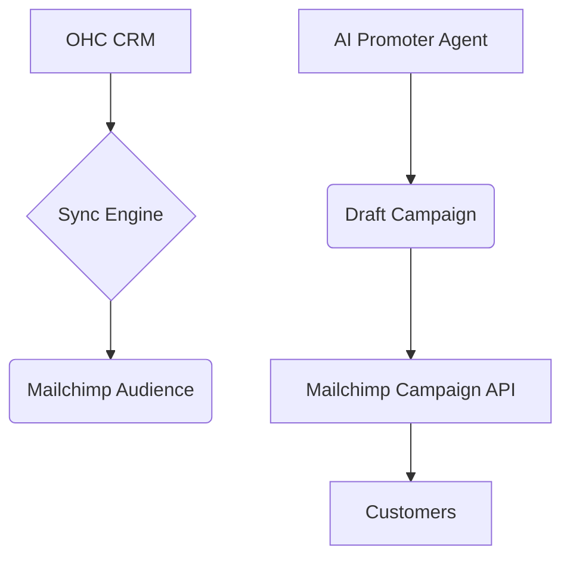

## [Email Marketing] Issue Brief: Mailchimp Integration

**Title**: Scout 🔍: Integrate Mailchimp for Automated Email Campaigns
**Problem Statement**:
Small business owners like Alex (Gym Owner) want to send newsletters and promotional offers to their members but find dedicated email marketing software too complex. They need a simple way to automatically sync their customer list from OHC to a reliable email sender and trigger campaigns without dealing with list management, templates, or bounce handling.
**Research Report**:
- **Tool**: Mailchimp API
- **Evaluation**: Mailchimp is an industry standard for email marketing, offering robust list management, high-quality templates, excellent deliverability, and built-in spam compliance handling.
- **Ease of Use**: Very recognizable brand. OAuth connection is simple for non-technical users.
- **Pricing**: Free tier up to 500 contacts, scalable pricing thereafter. Very accessible for small businesses.
- **Cloud vs. Standalone**: Primarily Cloud. Standalone users can still use it by connecting their personal Mailchimp account via API key or OAuth.
**Design Doc**:

- A user connects their Mailchimp account via the OHC integrations page.
- OHC automatically keeps the OHC customer list synced with a designated Mailchimp Audience.
- The "Marketing/Promoter" AI agent can draft campaigns based on business events (e.g., new product launch) and push them to Mailchimp as drafts for the user to review.
**Implementation Prompt**:
Implement a two-way sync between OHC's internal customer list and Mailchimp Audiences. Provide an OAuth connection flow for Mailchimp. Ensure new customers added in OHC are automatically subscribed in Mailchimp (with proper opt-in handling). Enable the AI Promoter agent to interact with the Mailchimp Campaigns API to create draft newsletters based on recent business updates.
**Priority**: P1
**Estimated Scope**: Medium
