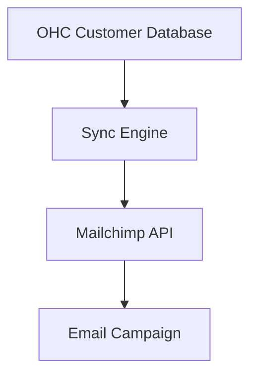

## [Email Marketing] Issue Brief: Mailchimp Campaign Sync

**Title**: Scout 🔍: Mailchimp Audience Integration
**Problem Statement**:
Business owners want to send beautiful newsletters using Mailchimp. Manually exporting CSV files of customer emails is tedious and leads to outdated lists.
**Research Report**:
- **Tool**: Mailchimp Marketing API.
- **Evaluation**: Mailchimp is the most recognizable email marketing tool.
- **Ease of Use**: OAuth connection maps OHC customer tags to Mailchimp audiences.
- **Pricing**: Free for OHC; Mailchimp has its own pricing.
- **Cloud vs. Standalone**: Fully compatible with both modes.
**Design Doc**:
- "Marketing" dashboard includes an "Email Providers" section.
- User connects Mailchimp.
- Any new customer added to OHC is automatically synced to Mailchimp.

**Implementation Prompt**:
Create a one-way sync from OHC to Mailchimp. When a customer is created or updated in OHC, push their email, name, and tags to Mailchimp.
**Priority**: P2
**Estimated Scope**: Small
