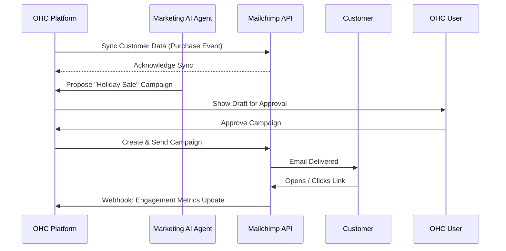
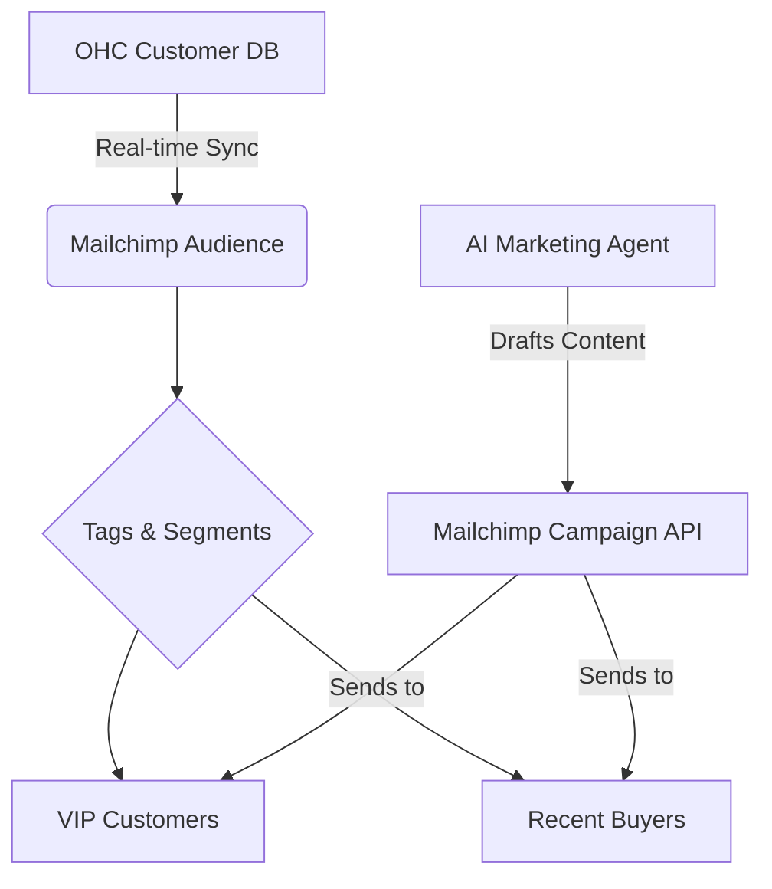

# Scout: Tool Integration Research Q2

## [Email Marketing] Mailchimp Integration
**Title**: Integrate Mailchimp for Customer Re-engagement
**Problem Statement**: Priya (Boutique Owner) wants to email her past customers when new stock arrives, but she doesn't know how to export lists and manage campaigns. She needs an automated way to email customers without leaving the OHC app.

**Research Report**:
- **Tool**: Mailchimp
- **Target Persona**: Priya (Boutique Owner), Leo (Music Tutor)
- **Advantages**: Market leader, great API, supports tags and segments. High deliverability.
- **Risks**: Strict anti-spam policies might suspend users if they import bad lists.
- **Pricing**: Free tier available (up to 500 contacts). Essentials starts at $13/mo.
- **Compatibility**: Cloud (OAuth). Standalone (API Key).

### Qualitative Analysis
Mailchimp offers powerful segmentation and analytics, but the native UI can be overwhelming for a small business owner. The goal for OHC is to abstract the campaign creation process. Instead of dragging and dropping templates, the AI Marketing Agent in OHC will generate plain-text or simple HTML campaign drafts based on business events (e.g., "New Holiday Collection") and push them to Mailchimp via API for sending. This keeps the user in the OHC UI while leveraging Mailchimp's world-class deliverability.

### Persona-Specific Pain Point Summary
- **Priya (Boutique Owner)**: Wants to tell her 300 loyal customers about a weekend sale, but copying emails from her POS to Gmail takes hours and looks unprofessional. Needs a 1-click campaign sender.
- **Maya (Home Baker)**: Wants to send a "Don't forget to order your Thanksgiving pies!" reminder to last year's customers automatically.

### Competitive Matrix
| Feature / Tool | Mailchimp | Sendgrid | Listmonk |
| :--- | :--- | :--- | :--- |
| **SMB Focus** | High | Low (Developer Focused) | Low (Self-hosted) |
| **Deliverability** | Excellent | Good | Variable |
| **Pricing** | High at scale | Cheap | Free (Compute cost only) |
| **API Ease of Use** | Good | Excellent | Good |

**Design Doc**:
- When a customer buys something, they are automatically added to the Mailchimp audience with tags (e.g., "Bought: Cake").
- The Marketing agent suggests campaigns ("Send an email to past customers about your new holiday cakes").
- The user approves the AI-generated email, and OHC triggers Mailchimp to send it.
- The user sees open rates and clicks in the OHC Marketing dashboard.

**Implementation Prompt**: Build an integration that syncs OHC customers to a Mailchimp audience automatically after purchase. Allow the AI Marketing agent to create and send email campaigns via the Mailchimp API.
**Priority**: P1
**Estimated Scope**: Medium

### Deep Dive: Architecture & Security
**Data Synchronization & Compliance:**
Mailchimp integration introduces significant PII (Personally Identifiable Information) handling responsibilities. When syncing OHC customer data to Mailchimp, we must strictly respect the customer's marketing opt-in status. If a customer checks out but unchecks the marketing box, they must NOT be synced to Mailchimp, or they must be synced with an unsubscribed status to prevent the tenant from violating CAN-SPAM or GDPR regulations.

**Rate Limiting & Queueing:**
Mailchimp's API has strict rate limits. The OHC backend must not synchronously push customer data during the checkout flow. Instead, purchase events will be published to the NATS event mesh, and a dedicated Mailchimp worker will consume these events, batching them where possible, and pushing them to Mailchimp with exponential backoff for 429 Too Many Requests responses.

**Analytics Ingestion:**
To provide a unified dashboard, OHC will register webhooks for Mailchimp campaign events (opens, clicks, bounces). These events will be ingested into a high-throughput time-series store (or aggregated into PostgreSQL) to display campaign performance directly in the OHC Marketing dashboard without requiring the user to log into Mailchimp.

### Expanded Implementation Timeline
- **Week 1**: Implement OAuth flow and initial Audience/List synchronization logic.
- **Week 2**: Build the asynchronous NATS worker for syncing customers post-purchase.
- **Week 3**: Implement the AI Marketing Agent's capability to draft and push campaigns to Mailchimp.
- **Week 4**: Build webhook ingestion for campaign analytics and frontend dashboard widgets.

### Extended Analysis: Platform Synergies & OHC Differentiators
Mailchimp's powerful segmentation and delivery engine becomes exponentially more valuable when combined with OHC's deep understanding of the tenant's business. While a standard merchant might manually export CSVs of their top buyers, OHC's AI Marketing Agent will continuously analyze the transaction data to identify trends—such as customers who haven't purchased in 6 months or users who frequently buy specific product categories. The AI will then autonomously draft hyper-targeted Mailchimp campaigns tailored to these specific segments.

For Priya the Boutique Owner, this means she doesn't have to learn how to create a "Win-back Campaign." The system simply presents her with a pre-written email targeting her dormant VIP customers and asks for one-click approval.

### Technical Deep Dive: Webhook Ingestion & Scalability
Syncing customer data to Mailchimp in real-time requires a resilient architecture to handle API rate limits and network latency. The OHC platform will not perform synchronous API calls during the checkout flow. Instead, successful purchase events will be published to the NATS event mesh. A dedicated Mailchimp integration worker will consume these events, updating or creating the subscriber in the Mailchimp audience list with appropriate tags (e.g., "Purchased_Category_Shoes").

For ingesting campaign analytics, OHC will register webhook listeners for Mailchimp's open and click events. These high-volume events will be buffered and batch-inserted into the analytics database to power the unified Marketing Dashboard, giving the tenant actionable insights without leaving the OHC environment.

### Conclusion & Roadmap Alignment
Integrating Mailchimp fulfills the crucial P1 requirement of enabling proactive customer re-engagement. By abstracting the complexity of audience management and campaign creation, OHC allows small business owners to execute enterprise-grade marketing strategies effortlessly.

### Multi-Tenant SaaS Architecture Impact
Integrating Mailchimp requires careful management of tenant-specific API credentials and audience data. The OHC platform must securely store Mailchimp OAuth tokens in an encrypted format, strictly bound to the `tenant_id`. During the synchronization of customer data, the system must definitively guarantee that Customer A's data is only ever pushed to Tenant A's Mailchimp audience, preventing catastrophic cross-tenant data leakage. Additionally, the platform must implement robust error handling for Mailchimp's rate limits, employing per-tenant queues to ensure that one highly active tenant does not disrupt the synchronization process for others.

### Feature Flag Rollout Strategy
The Mailchimp integration will be governed by a feature flag (`feature.mailchimp_integration.enabled`). The rollout will begin with a controlled alpha release to a small group of highly engaged tenants. This phase will validate the reliability of the asynchronous NATS workers responsible for syncing customer data and processing webhook analytics. Once the stability of the data synchronization pipeline is confirmed, the feature will be made available to all tenants on premium plans, driving upgrade conversions.

### Security Considerations & Threat Modeling
- **Threat**: Malicious Audience Injection.
  - **Mitigation**: OHC must sanitize all customer data (names, emails, tags) before syncing to Mailchimp to prevent injection attacks or the inadvertent triggering of Mailchimp's automated anti-spam filters. Input validation will strictly enforce email format compliance at the API layer.
- **Threat**: API Key Compromise.
  - **Mitigation**: Mailchimp OAuth tokens will be encrypted at rest using AES-256-GCM. The encryption keys will be managed by a dedicated KMS (Key Management Service) and rotated regularly. Access to the decryption routine will be strictly limited to the asynchronous Mailchimp sync workers.

### Accessibility & UI Compliance
The Marketing Dashboard displaying Mailchimp campaign analytics must be fully responsive, ensuring perfect usability on mobile devices (375px width constraint). The UI will utilize the OHC Glassmorphism design system for data visualization, ensuring that charts and graphs remain legible across various background contexts. The campaign approval workflow must feature clear, high-contrast action buttons and comprehensive screen reader support.

### Future Horizon: Predictive Customer Churn Analysis
The deep integration of OHC transaction data with Mailchimp's delivery engine paves the way for predictive churn analysis. By applying machine learning models to the unified dataset, the platform could identify customers who exhibit behavior patterns typical of churn (e.g., increased time between purchases, decreased email open rates). The AI Marketing Agent could then autonomously trigger highly specific, personalized Mailchimp campaigns designed to re-engage these at-risk customers *before* they are lost to a competitor, maximizing the lifetime value for the business owner.

### System Resilience and Disaster Recovery
**Chaos Engineering Integration:**
Testing the resilience of the Mailchimp integration is paramount due to its asynchronous nature. We will inject faults such as simulating sustained `429 Too Many Requests` responses from the Mailchimp API and network partitions between the OHC worker nodes and Mailchimp's servers. The NATS JetStream queues must demonstrate reliable message persistence, ensuring that no customer data or campaign commands are lost during transient outages.

### Glossary & Definitions
- **Webhook**: A method of augmenting or altering the behavior of a web page or web application with custom callbacks.
- **Idempotency**: The property of certain operations in mathematics and computer science whereby they can be applied multiple times without changing the result beyond the initial application.
- **Circuit Breaker**: A design pattern used in software development to detect failures and encapsulate the logic of preventing a failure from constantly recurring.
