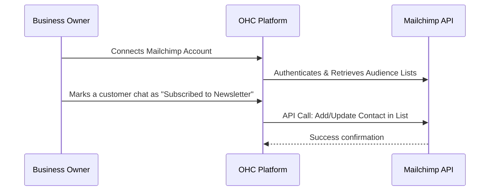

## Email Marketing: Mailchimp

**Title**: Implement Mailchimp Integration for Audience Syncing

**Problem Statement**: Many small businesses build a list of loyal customers but struggle to proactively market to them. Manually exporting contacts from a unified inbox into a marketing tool like Mailchimp is tedious, error-prone, and often neglected, leading to missed revenue opportunities from promotions or newsletters.

**Research Report**: Mailchimp is a widely used, accessible email marketing platform designed specifically for small businesses and e-commerce.
* *Ease of Use*: Very high for non-technical users. It offers drag-and-drop template builders and AI generative features for copy.
* *Pricing*: Free tier available for up to 500 contacts (1,000 monthly sends). Paid plans (Essentials) start at $13/mo for additional templates, a/b testing, and more sends.
* *Reputation*: Very strong brand recognition and trust among small business owners.
* *Mode Compatibility*: Works well in both Cloud (OAuth) and Standalone (API Key).

**Design Doc**:

**Implementation Prompt**: Build a Mailchimp integration that syncs contacts. When an owner connects Mailchimp, OHC should fetch their primary "Audience" list. In the unified inbox customer profile sidebar, add a simple toggle: "Add to Email Newsletter". When toggled on, OHC should automatically sync that customer's name and email to Mailchimp. Label the settings area "Connect my Mailchimp" rather than "API Keys".

**Priority**: P2

**Estimated Scope**: Medium
