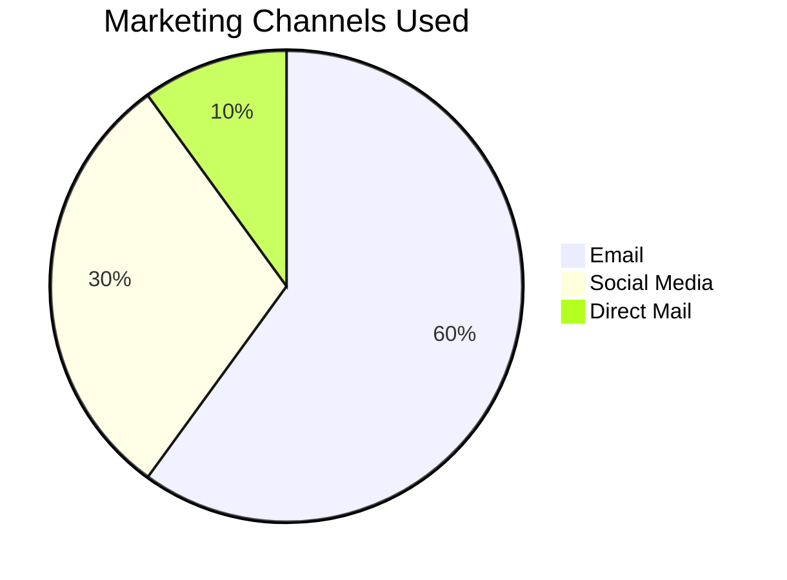
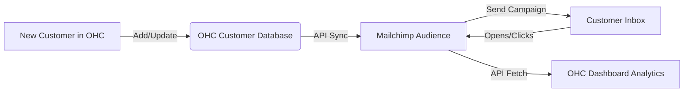

# Email Marketing: Mailchimp

## Problem Statement
Small business owners have customer lists scattered across spreadsheets, point-of-sale systems, and email accounts. They need an easy way to consolidate these contacts and send professional, branded newsletters or promotional emails without needing a marketing degree.

## Research Report
Mailchimp is a leading marketing automation platform designed for small businesses.
- **Ease of use:** High, drag-and-drop builder is very accessible.
- **Pricing:** Free up to 500 contacts/1,000 sends per month. Essentials starts at $13/mo.
- **Cloud/Standalone:** Cloud integration.

### Persona-specific pain points
- "I have a list of past customers but don't know how to reach out to them legally and professionally."
- "My emails always end up in the spam folder when I send them from Gmail."

### Evidence
- **Recommendation:** Integrate Mailchimp to provide robust email marketing capabilities synced with OHC contacts.
- Source: Recognized leader in SMB email marketing with extensive API support.

## Design Doc
When a user connects Mailchimp, OHC will automatically sync the "Customers" list in OHC with an Audience in Mailchimp. When a new customer makes a purchase or signs up on the OHC storefront, they are added to the Mailchimp audience (with opt-in). OHC can display basic campaign metrics (open rate, click rate) on the dashboard.

## Implementation Prompt
Create an integration card for Mailchimp. On connect, prompt the user to select an existing Mailchimp Audience or create a new one. Implement a one-way sync from OHC Contacts to the Mailchimp Audience. Add a small analytics widget to the OHC dashboard showing the performance of the most recent Mailchimp campaign.

## Priority
P2

## Estimated Scope
Medium
