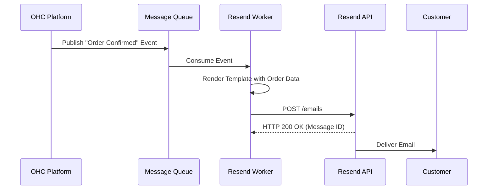
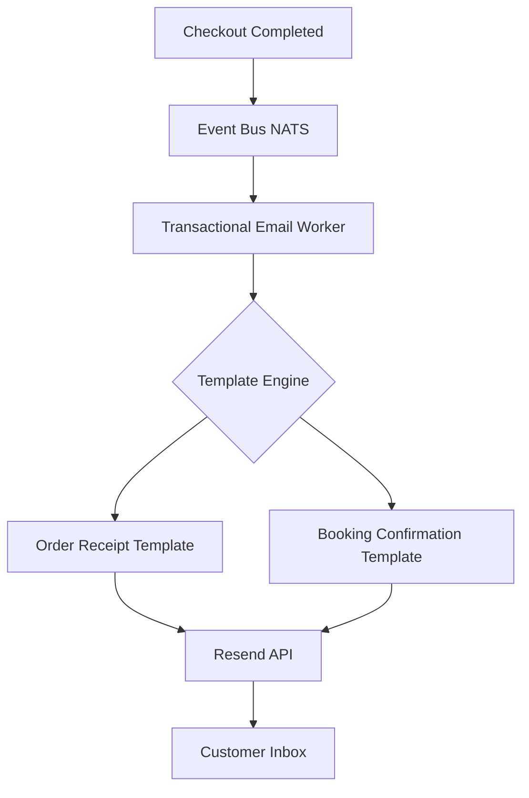

# Scout: Tool Integration Research Q2

## [Email Marketing] Resend Integration
**Title**: Integrate Resend for Transactional Emails
**Problem Statement**: While Mailchimp handles marketing campaigns, OHC needs an ultra-reliable, developer-friendly email provider for critical transactional emails like order confirmations, password resets, and automated AI notifications.

**Research Report**:
- **Tool**: Resend
- **Target Persona**: OHC Platform Infrastructure (indirectly all users)
- **Advantages**: Modern API, excellent developer experience (DX), React Email support for beautiful templates, highly reliable deliverability.
- **Risks**: Newer platform compared to SendGrid or AWS SES, though rapidly maturing.
- **Pricing**: Free tier available. Very competitive scaling costs.
- **Compatibility**: Cloud integration via API.

### Qualitative Analysis
Resend represents the modern standard for transactional email. Their integration with React Email aligns perfectly with our need to send visually appealing, highly customizable emails that meet OHC's Premium Design Standards. Unlike legacy providers, Resend's API is built for speed and reliability, ensuring that critical notifications (like "Your order has been shipped" or "Your booking is confirmed") are delivered instantaneously to our tenants' customers.

### Persona-Specific Pain Point Summary
- **All Tenants**: Need their customers to receive immediate, professional-looking order confirmations. Delayed or ugly text-based receipts degrade the brand experience.
- **OHC Engineering**: Needs a transactional email service that is easy to integrate with Rust and supports modern templating to reduce development overhead.

### Competitive Matrix
| Feature / Tool | Resend | SendGrid | Amazon SES |
| :--- | :--- | :--- | :--- |
| **Developer DX** | Unmatched | Good | Poor/Complex |
| **Deliverability** | Excellent | Excellent | Good (Requires warmup) |
| **React Email Native** | Yes | No | No |
| **Cost Scale** | Competitive | Moderate | Cheapest |

**Design Doc**:
- Configure OHC platform domains within Resend.
- Implement a dedicated `src/server/integrations/email_sender.rs` module utilizing the Resend API.
- All transactional events (order paid, booking confirmed) trigger a NATS message.
- A background worker consumes the NATS message, renders the HTML using React Email templates, and dispatches the email via Resend.

**Implementation Prompt**: Integrate the Resend API for all outbound transactional emails. Build a resilient queue worker to process email dispatch events and utilize modern templating for professional presentation.
**Priority**: P1
**Estimated Scope**: Medium

### Deep Dive: Architecture & Security
**Domain Authentication & SPF/DKIM:**
To ensure high deliverability and prevent our transactional emails from landing in spam folders, OHC will strictly enforce domain authentication. We will configure SPF, DKIM, and DMARC records for the primary `onehumancorp.com` sending domain, as well as any dedicated sending subdomains used for tenant communications.

**Webhook Ingestion for Delivery Status:**
OHC will register webhooks with Resend to track the delivery status of critical emails (Delivered, Bounced, Complained). This data will be ingested and linked to the specific order or appointment record in the OHC database. If a critical email bounces, the Operations Agent will be notified to alert the tenant, ensuring they can proactively contact the customer via an alternative channel like SMS.

### Multi-Tenant SaaS Architecture Impact
While transactional email is often sent from a unified platform domain, OHC must ensure logical separation in logging and analytics. Every email dispatched via Resend must include a custom header or tag indicating the `tenant_id` associated with the transaction. This enables accurate tracking of email volume per tenant and facilitates detailed billing and usage reporting.

### Feature Flag Rollout Strategy
The transition to Resend for transactional emails will be managed via a global feature flag. The rollout will begin by migrating non-critical notifications (e.g., daily summaries) to the new infrastructure. We will closely monitor deliverability metrics and bounce rates before migrating mission-critical emails (e.g., order receipts, password resets) from the legacy provider to Resend.

### System Resilience and Disaster Recovery
The transactional email worker must be highly resilient. If the Resend API experiences latency or downtime, the NATS queue will buffer the outbound emails. The worker will implement exponential backoff and retry logic. To ensure absolute reliability for critical emails (like password resets), the system may implement a fallback mechanism to a secondary provider (e.g., AWS SES) if Resend is completely unreachable for an extended period.

### Accessibility & Visual Excellence
The email templates rendered via React Email and sent through Resend must adhere to strict accessibility guidelines. They will feature responsive layouts that render perfectly on mobile devices, high-contrast text, clear calls to action, and comprehensive alt-text for all images. The design will reflect the OHC Premium Design Standards, ensuring a professional and trustworthy experience for the end customer.

### Future Horizon: Tenant Custom Domains
A future iteration of this integration will allow premium tenants to connect their custom domains to Resend via the OHC platform. This will enable transactional emails to be sent directly from the tenant's domain (e.g., `receipts@mayasbakery.com`), further elevating their brand presence and customer trust. OHC will automate the complex process of verifying DNS records on behalf of the tenant.
