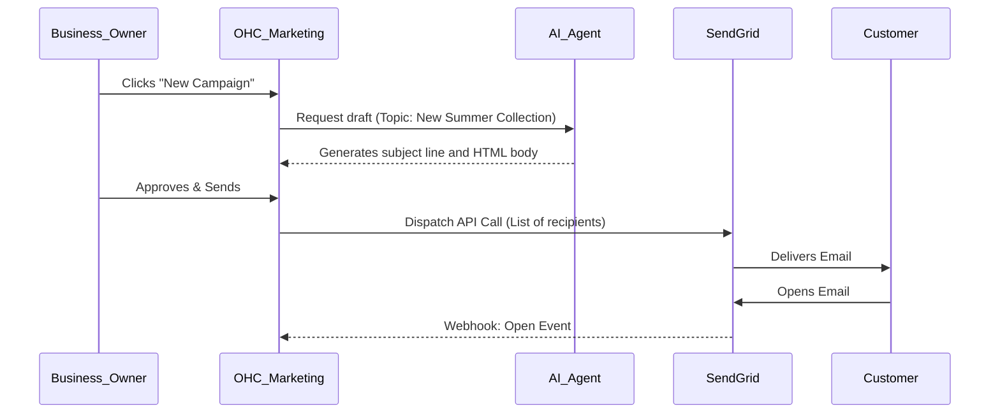

# Native Email Campaign Manager

## Problem Statement
Priya (Boutique Owner) wants to notify past customers about new inventory, but setting up Mailchimp, exporting CSVs, and designing templates is too complex. She needs a way to send beautiful marketing emails natively from OHC using her existing customer list without learning a new tool.

## Research Report
- **Strategy**: Build a native email campaign manager utilizing a transactional email API (SendGrid or AWS SES).
- **Target Persona**: Retailers, artists, and educators with recurring customer bases.
- **Advantages**: Keeps the user within the OHC ecosystem. Enables the AI Marketing agent to autonomously draft and execute campaigns based on real-time sales data.
- **Risks**: High engineering effort to build robust list management, handle unsubscribes, and maintain high deliverability/spam compliance internally.
- **Pricing**: Predictable transactional API costs, easily absorbed into OHC platform fees.
- **Compatibility**:
  - Cloud: Centralized SendGrid/SES account handling all tenant traffic.
  - Standalone: Centralized routing or user-provided SMTP credentials.

## Design Doc
- **User Experience Flow**:
  1. Customers are automatically added to the native OHC customer directory upon purchase.
  2. Business owner navigates to the "Marketing" tab and clicks "New Email Campaign".
  3. The AI Marketing Agent suggests content based on recent inventory additions or upcoming holidays.
  4. User reviews the draft and clicks "Send".
  5. The campaign dashboard shows open and click rates.
- **AI Integration**: The AI Marketing & Advertising Agent acts as the copywriter, analyzes open rates to optimize future send times, and automatically segments the list (e.g., "VIP customers who spent >$100").

### Mobile UX Flow
| Screen | Description |
|---|---|
| Campaign List | History of sent campaigns with high-level stats (Open Rate, CTR). Floating action button for "New". |
| Compose | AI prompt input ("What do you want to announce?"). Live preview of the email. |
| Send Options | Select audience (All, VIPs). "Send Now" vs "Schedule" toggles. |

## Implementation Prompt
Build a native email campaign management system utilizing SendGrid or AWS SES for delivery. The system must allow the AI Marketing agent to create, schedule, and queue campaigns directly from the OHC database. Must include robust list management and mandatory unsubscribe links.

- **Acceptance Criteria**: User can generate an email campaign via AI. Emails are delivered successfully. Unsubscribe links function correctly and update the database. Open rates are tracked and displayed.
- **Priority**: P1
- **Estimated Scope**: Large
