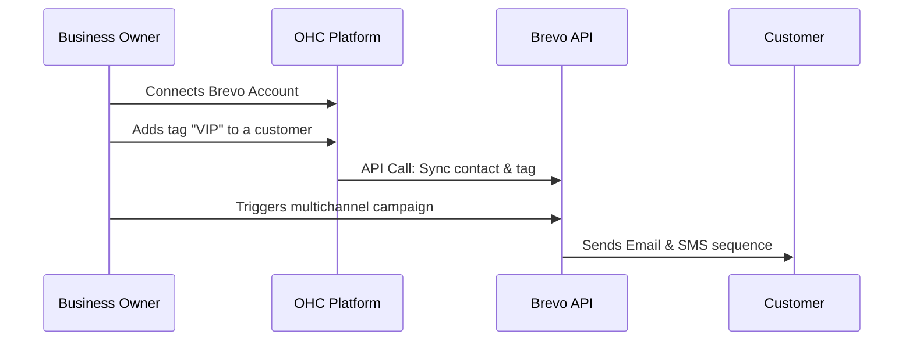

## Email Marketing & Social Media: Brevo (formerly Sendinblue)

**Title**: Implement Brevo Integration for Multichannel Marketing

**Problem Statement**: Small businesses need a way to reach their audience not just through email, but also via SMS and WhatsApp. Using separate tools for email, SMS, and chat widgets creates disjointed customer experiences and fragments data.

**Research Report**: Brevo is a comprehensive marketing platform that has evolved beyond email to include SMS, WhatsApp, and live chat, making it a strong unified alternative to Mailchimp.
* *Ease of Use*: Very high. It offers a unified interface for designing emails, setting up SMS campaigns, and building automated workflows.
* *Pricing*: Strong free tier (300 emails/day, unlimited contacts). Paid plans (Starter) begin at roughly $25/mo for 20k emails. SMS/WhatsApp are pay-as-you-go.
* *Reputation*: Highly regarded, especially in Europe due to strong GDPR compliance, but popular globally as a cost-effective marketing suite.
* *Mode Compatibility*: Well-documented REST API supports both Cloud and Standalone environments securely.

**Design Doc**:

**Implementation Prompt**: Build a Brevo integration focusing on contact synchronization and multi-channel readiness. When connected, OHC should keep customer contact details (email and phone number) in sync with Brevo. In the OHC customer view, add a "Sync to Brevo" toggle. When enabled, any updates to the customer's profile in OHC should automatically reflect in Brevo, allowing the business owner to easily launch email or SMS campaigns from the Brevo platform using up-to-date OHC data. Label this "Connect my Marketing Suite."

**Priority**: P2

**Estimated Scope**: Medium
