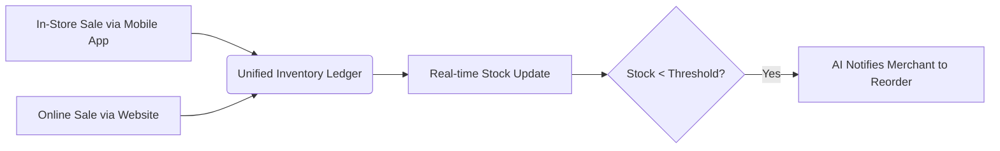

# Title: 1-Click Point of Sale (POS) and Online Inventory Sync

## Problem Statement
Hybrid business owners (like Priya the boutique owner) struggle to keep their physical store inventory synced with their online store. When an item sells in-store, they manually update the website to prevent overselling. This is error-prone and stressful. Existing solutions require expensive Enterprise plans or clunky third-party apps.

## Research Report
- **Finding**: Inventory mismatch is a leading cause of negative customer reviews (selling items out of stock).
- **Competitor Analysis**: Square dominates this because POS and online are one system. Shopify POS is good but expensive.
- **User Evidence**: Trustpilot reviews for ecommerce platforms frequently mention "sold an item that was out of stock because it didn't sync."
- **Recommendation**: OHC needs a native, dead-simple mobile POS feature that perfectly shares the inventory database with the online store, requiring zero setup from the user.

## Design Doc

- **UX Flow**: Merchant opens OHC mobile app -> Taps "Sell in Person" -> Scans barcode or taps item -> Processes payment. Inventory is instantly deducted globally.

## Implementation Prompt
Implement a unified inventory management system. Build a mobile-optimized view for processing in-person transactions that directly decrements the central inventory database. Ensure race conditions are handled gracefully (e.g., simultaneous online and in-store purchase of the last item). Include low-stock push notifications powered by the background agent.

## Priority
P1

## Estimated Scope
Large
