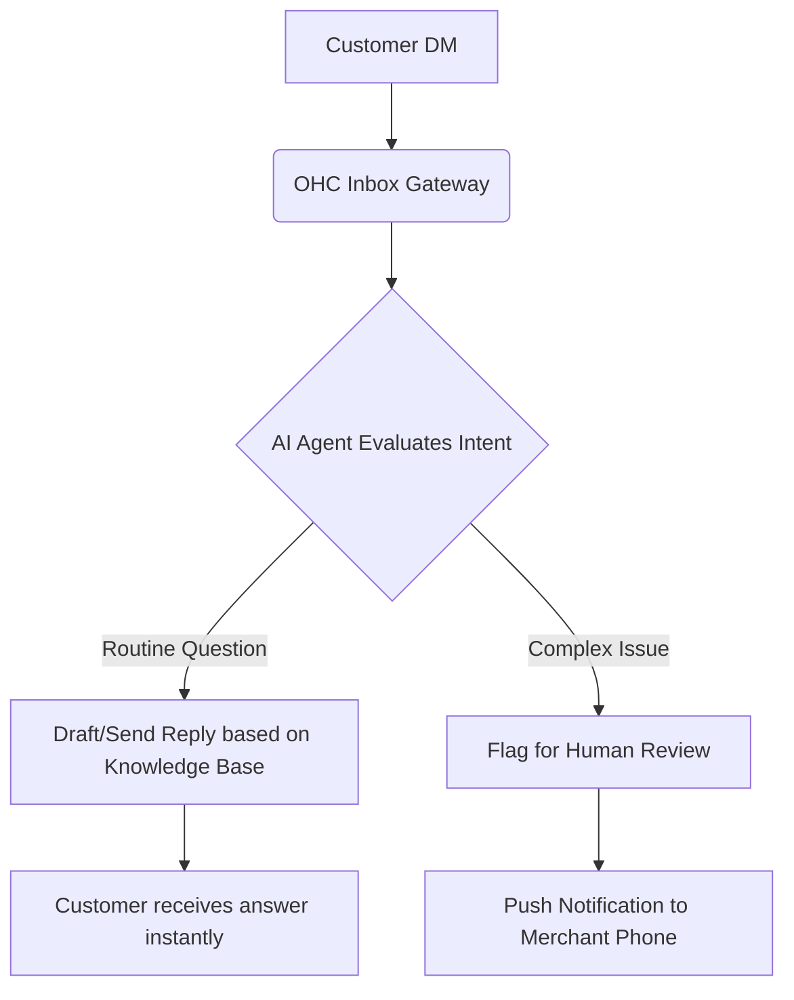

# Title: AI Auto-Replies for Customer DMs

## Problem Statement
Small business owners (like Maya the baker) spend up to 2 hours a day answering routine questions in Instagram/Facebook DMs ("What are your hours?", "Do you ship to Texas?"). This manual work pulls them away from actually running their business. Current tools require complex rule-based chatbots that are hard to set up and feel robotic.

## Research Report
- **Finding**: 40% of small businesses cite "customer communication" as a top time-sink.
- **Competitor Analysis**: Shopify offers "Sidekick" for the merchant, but doesn't autonomously talk to customers. Wix has basic auto-responders.
- **User Evidence**: Reddit r/smallbusiness is filled with posts asking how to manage the flood of simple DMs.
- **Recommendation**: Implement an autonomous agent that reads DMs, accesses the store's knowledge base (hours, policies, inventory), and drafts or automatically sends replies.

## Design Doc

- **UX Flow**: Merchant goes to "Inbox Settings" -> Enables "AI Auto-Reply" -> Uploads any specific documents or relies on website data.
- **Mobile First**: Push notification when AI can't answer. 1-tap approval for drafted responses.

## Implementation Prompt
Create an autonomous AI agent service that integrates with social media messaging channels. The agent should parse incoming customer messages, query the merchant's business context, and formulate a conversational response. If the confidence score is high, it sends the response. If low, it drafts the response and notifies the merchant for approval. Ensure the tone is friendly and matches the brand.

## Priority
P0

## Estimated Scope
Medium
