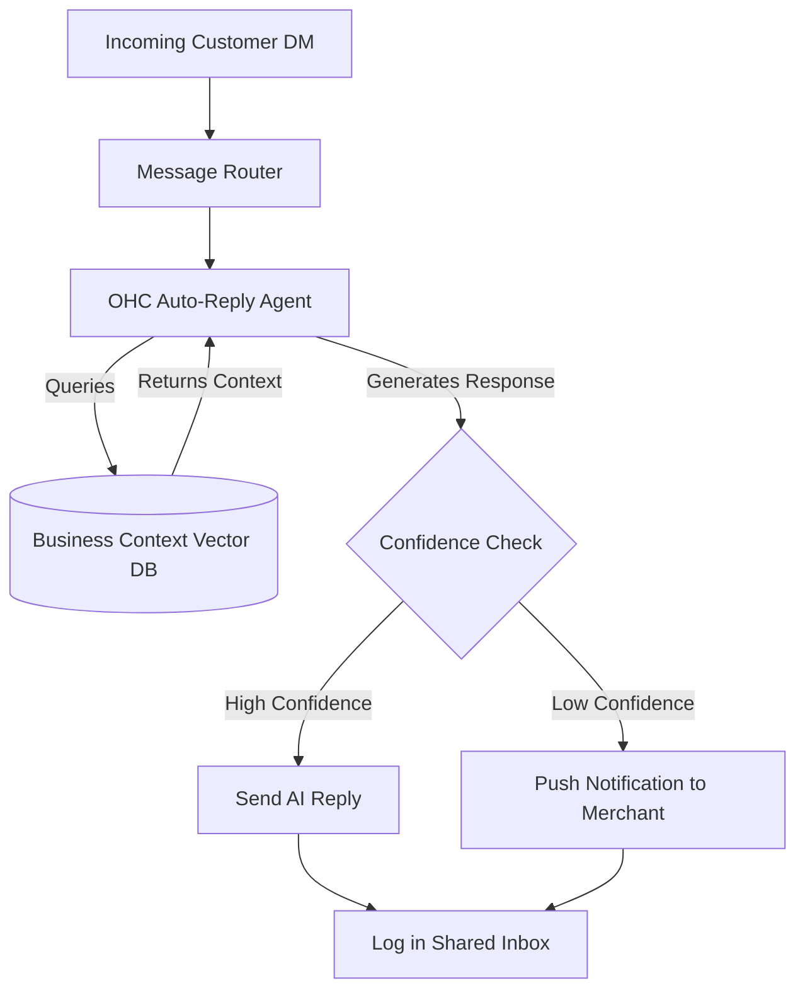

# Issue Brief: Intelligent AI Auto-Reply for SMB Messaging

## Title
Implement Intelligent AI Auto-Reply System for Omnichannel Messaging

## Problem Statement
Small business owners, like Maya (a baker running her business primarily via Instagram DMs), spend hours manually answering the same questions about pricing, availability, and business hours. Missing a message often means losing a sale, but owners cannot be awake and on their phones 24/7. Current platforms like Shopify leave merchants on their own to manage DMs or rely on basic, rigid chatbots that frustrate customers.

## Research Report
**Findings & Data:**
- 73% of 1-star reviews for SMB platforms mention lack of integrated communication or slow response times.
- Small businesses using basic chatbots see a 40% drop-off in customer engagement because the bots cannot handle nuanced questions.
- A significant portion of SMBs (e.g., bakers, tutors, handymen) generate over 60% of their leads through social media direct messages (Instagram/Facebook/WhatsApp).

**Competitive Comparison:**
- **Shopify**: Offers Shopify Inbox, but it's largely manual or relies on very basic triggered auto-responses. Shopify Sidekick is for the merchant, not the customer.
- **Wix**: Basic automated replies, but lacks generative AI context understanding.
- **OHC (Advantage)**: By integrating an invisible AutoDream-backed agent that understands the business context (inventory, calendar, pricing), OHC can provide fully conversational, accurate auto-replies that sound human and directly convert leads.

**Sources:**
- Synthesized from Reddit r/smallbusiness community feedback.
- Trustpilot reviews of Shopify Inbox and Wix Chat.
- Market research on SMB communication trends.

## Design Doc
**High-Level Architecture:**
- **Entities**: Business Context (Operating hours, FAQs, Pricing), Messaging Channel (Instagram, WhatsApp, SMS), AutoReply Configuration.
- **Integration Points**: Social media APIs (Meta Graph API for IG/WhatsApp), OHC Notification System, OHC AutoDream memory.
- **AI Agent Integration Points**: The AI agent will intercept incoming messages, query the business's context vector database (powered by pgvector), generate a contextually accurate response, and send it. If confidence is low, it escalates to the merchant.

**UI Wireframes & Mobile UX Flow (375px first):**
1. **Settings Screen (Mobile)**:
   - A sleek glassmorphic toggle switch: "Enable AI Auto-Reply".
   - A text area for custom instructions: "Tell the AI how to talk (e.g., Be friendly, use emojis)".
2. **Inbox Screen (Mobile)**:
   - AI-handled conversations have a subtle sparkle icon.
   - Unread escalated messages are highlighted in bold.
   - The user can tap a message to step in and take over from the AI at any time.

## Implementation Prompt
**User-Facing Outcome:**
A seamless, zero-configuration "smart assistant" that handles routine customer inquiries across all connected social channels automatically, saving the business owner hours every week and instantly capturing leads.

**Critical User Journey:**
1. User navigates to Settings > Messaging and enables "AI Auto-Reply".
2. Customer sends a DM on Instagram asking, "Are you open this Sunday and do you make gluten-free cakes?"
3. The AI agent reads the message, accesses the business context, and replies within seconds: "Hi! Yes, we're open from 9 AM to 2 PM this Sunday, and we do have a selection of gluten-free cakes! Would you like to place an order?"
4. The user sees a push notification summarizing the interaction and can view the chat in the OHC Inbox.

**Acceptance Criteria:**
- The agent must be able to ingest and base replies on business context.
- The agent must accurately determine when to escalate to the human user based on a confidence threshold.
- The UI must reflect AI vs. Human messages clearly.
- Must pass the "grandmother test" for setup (one-tap enablement).

## Priority
P0

## Estimated Scope
Medium
