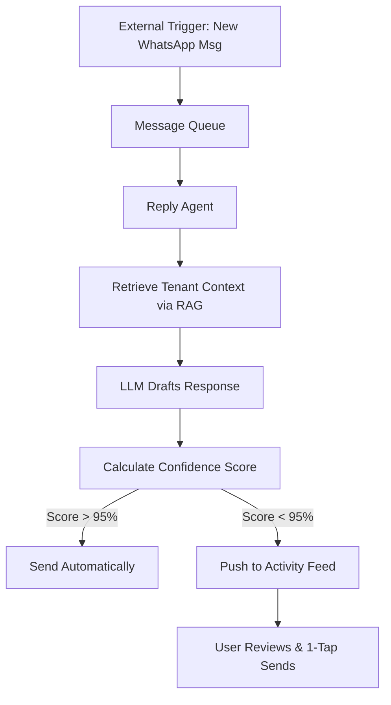

**Title**: OHC AI Differentiation Manifesto

**Problem Statement**: Competitors (Shopify, Wix) treat AI as a reactive "copilot" or static site generator. Small business owners (like Carlos the handyman or Fatima the food cart operator) don't want a copilot; they want an "autopilot" that handles mundane tasks autonomously.

**Research Report**:
Current market AI offerings are limited to text/image generation and chat assistants (e.g., Shopify Sidekick). The highest perceived value for SMBs lies in invisible automations that save time and recover revenue.
- Auto-replying to customer messages saves hours per day and captures leads that Carlos misses while working.
- Auto-writing product descriptions saves 30 minutes per upload for Priya's boutique.
- Auto-generating social posts removes the biggest marketing barrier for Maya's bakery.
- Auto-sending follow-up emails recovers abandoned carts without user intervention.
- AI-generated weekly business insights provide plain-language updates for Fatima, making her feel in control without needing to parse complex analytics dashboards.

**Design Doc**:
- High-level architecture: An event-driven architecture where specific triggers (e.g., missed call, new product image uploaded, abandoned cart) fire events to autonomous AI Agents (ReplyAgent, ContentAgent, MarketingAgent).
- UI flow: A unified "Activity Feed" where the user simply approves or rejects AI actions via 1-tap buttons on mobile. No complex configuration menus.

**Implementation Prompt**: Implement an autonomous background agent that monitors missed customer messages (e.g., via SMS integration). When a message is missed, the AI drafts a context-aware reply and pushes an actionable notification to the user's mobile app. The user can tap "Send" or "Edit" with a single click.

**Priority**: P0

**Estimated Scope**: Large

## Deep Dive: The 5 Core Automations

### 1. Autonomous Inquiry Responder
*   **Mechanism**: Monitors connected channels (WhatsApp, SMS, Email). Uses LLM to draft contextually appropriate responses based on business rules and past interactions.
*   **User Experience**: User receives a notification: "Drafted reply to John regarding plumbing quote. [Review & Send]".
*   **Business Impact**: Prevents lost leads, improves customer satisfaction.

### 2. Instant Content Generator
*   **Mechanism**: User uploads a photo of a new item (e.g., a cake). Computer vision identifies the item. LLM generates a catchy product title, detailed description, and suggested pricing based on market data.
*   **User Experience**: Upload photo -> AI presents drafted product listing -> User taps "Publish".
*   **Business Impact**: Drastically reduces time to list new products, encouraging more frequent updates.

### 3. Proactive SEO Agent
*   **Mechanism**: Background process analyzes site performance, keywords, and local search trends. Automatically updates meta descriptions, image alt tags, and structured data.
*   **User Experience**: Invisible to the user unless they view the "Activity Feed" showing completed SEO optimizations.
*   **Business Impact**: Improves organic discoverability without requiring user expertise.

### 4. Unified Activity Feed
*   **Mechanism**: Centralized event bus aggregates all actions (sales, bookings, AI drafts, system alerts) into a single chronological feed.
*   **User Experience**: Replaces complex navigation menus with a simple, scrollable feed of actionable items.
*   **Business Impact**: Reduces cognitive load, keeps users focused on high-value tasks.

### 5. Living Mobile Editor
*   **Mechanism**: NLP interface for site modifications. Parses commands like "Make the background darker" or "Add a contact form" and translates them into DOM/schema updates.
*   **User Experience**: Chat interface replacing drag-and-drop tools on mobile.
*   **Business Impact**: Enables true mobile-first management, empowering users to run their business entirely from their phones.

## Competitive Matrix: AI Capabilities

| AI Feature | Shopify (Sidekick) | Wix (ADI/Tools) | OHC (Agents) | OHC Advantage |
| :--- | :--- | :--- | :--- | :--- |
| **Site Generation** | Manual/Template | Static Generation | Dynamic Generation | Instantly creates a *living* site connected to backend agents. |
| **Content Creation** | Prompt-based (Magic) | Prompt-based | Context-aware (Auto) | AI drafts content *before* the user asks, based on triggers (e.g., photo upload). |
| **Customer Support** | Third-party apps | Third-party apps | Native Autonomous Agent | AI actively monitors inboxes and drafts replies, awaiting 1-tap approval. |
| **Business Insights** | Standard Analytics | Standard Analytics | Narrative Activity Feed | Translates raw data into plain-language actionable advice. |
| **UX Paradigm** | Copilot (Reactive) | Tool (Reactive) | Autopilot (Proactive) | Moves from "help me do this" to "I did this for you, approve it". |

## Deep Dive: The "Proactive vs. Reactive" Paradigm Shift
The current generation of AI tools in e-commerce (like Shopify Magic) are essentially sophisticated autocomplete features. They require the user to formulate a prompt and initiate the action.
*   **The Reactive Tax**: The user must still remember to write the email, optimize the SEO, or post on social media. They just do it slightly faster.
*   **The Proactive Solution (OHC)**: OHC's agents run on cron jobs and event listeners. If a cart is abandoned, the Marketing Agent doesn't wait for a prompt; it immediately drafts a personalized recovery email and pushes a notification to the Activity Feed: "Drafted recovery email for Sarah's $45 cart. Send?"

## UX Flow: Handling a Customer Inquiry (Status Quo vs. OHC)
### Status Quo (Shopify + 3rd Party App)
1.  Customer sends Instagram DM asking about business hours.
2.  Business owner misses notification while working.
3.  Hours later, owner opens Instagram, types out reply manually.
4.  If using an AI tool, owner opens tool, copies message, prompts AI to write reply, copies back to Instagram.

### OHC Target Flow
1.  Customer sends message via OHC-provided unified inbox widget or integrated social channel.
2.  OHC `ReplyAgent` intercepts message, checks business context (hours are stored in knowledge graph).
3.  `ReplyAgent` drafts response: "Hi! We're open until 6 PM today."
4.  Owner receives push notification: "New message. Draft ready: 'Hi! We're open...'. [Send] [Edit]"
5.  Owner taps "Send" from lock screen. Total time spent: 2 seconds.

## Technical Implementation Considerations

### Event-Driven Architecture (EDA)
To achieve true autonomy, OHC must adopt a robust EDA.
*   **Triggers**: System events (new user signup), external webhooks (Stripe payment success, Twilio SMS received), scheduled crons (daily SEO audit).
*   **Message Broker**: Use NATS or Kafka to handle high-throughput event routing reliably.
*   **Agent Workers**: Serverless functions or dedicated microservices that listen for specific events, query the LLM (e.g., OpenAI API) with relevant context, and execute the resulting actions.

### Context Management (The "Brain")
An AI agent is only as good as its context.
*   **Knowledge Graph**: OHC must maintain a dynamic knowledge graph for each tenant (business). This includes operating hours, pricing, past customer interactions, brand voice, and inventory status.
*   **RAG (Retrieval-Augmented Generation)**: Before the `ReplyAgent` drafts a response, it must query the tenant's knowledge graph to ensure the reply is factually accurate and on-brand.

### The "Human-in-the-Loop" (HITL) Fallback
While autonomy is the goal, safety is paramount.
*   **Confidence Scoring**: If the LLM indicates low confidence in a drafted action (e.g., a complex customer complaint), the system must degrade gracefully by placing the action in the Activity Feed for explicit user approval, rather than executing it automatically.
*   **Progressive Autonomy**: Users should be able to toggle the level of autonomy. (e.g., "Draft replies for me" vs. "Send replies automatically").

## Final Summary for Product Team
The AI differentiation is not about using a better LLM; it's about building a better infrastructure *around* the LLM. The moat is created by deeply integrating the AI into the operational workflows (EDA, RAG) so that it possesses context no third-party tool could ever access.

## Competitive Analysis Matrix: Feature by Feature

| AI Capability | Industry Standard (e.g., Shopify Magic) | OHC Autopilot Approach | Key Difference |
| :--- | :--- | :--- | :--- |
| **Trigger Mechanism** | User-initiated (click a button) | Event-driven (background monitoring) | OHC AI acts independently based on system events, not waiting for user commands. |
| **Output Type** | Text/Image suggestions | Actionable drafts & system changes | OHC AI proposes concrete business actions (e.g., a drafted email), not just content. |
| **Context Awareness** | Limited to the immediate task | Deeply integrated Knowledge Graph | OHC AI understands the business's operating hours, pricing, and past interactions. |
| **User Interface** | Dedicated chat window or tool panel | Integrated Activity Feed cards | OHC AI actions are seamlessly woven into the user's daily workflow. |

## The "Copilot vs. Autopilot" Dilemma
Current AI tools in the market are marketed as "copilots." They sit beside the user and offer suggestions when asked. This still requires the user to be the primary operator, dedicating time and attention to the task.
1.  **The Cognitive Burden:** The user must remember what needs to be done, navigate to the appropriate tool, formulate a prompt, and review the output.
2.  **The Operational Bottleneck:** The business only moves as fast as the owner can operate the copilot.

**OHC's Strategic Stance:**
OHC must build an "Autopilot." The AI agents must be the primary operators of the business's digital presence. They run autonomously in the background, handling routine tasks (SEO updates, initial inquiry responses, abandoned cart recovery) and only surfacing to the user when approval is required or a complex edge case arises. This fundamentally changes the user's role from "operator" to "manager," freeing them from the operational bottleneck.

## Strategic Conclusion & Product Roadmap Implications

The transition from AI "Copilots" to AI "Autopilots" is the defining shift in the next generation of business software. OHC's differentiation rests entirely on its ability to successfully implement autonomous, background agents that tangibly reduce the user's workload.

To achieve this, OHC must prioritize:
1.  **Robust Event Infrastructure**: The foundation of autonomy is a reliable Event-Driven Architecture capable of handling millions of triggers and routing them to the appropriate agents.
2.  **Contextual Supremacy**: The AI is only as good as its context. The dynamic Knowledge Graph and RAG implementation must be flawless.
3.  **Trust by Design**: The Unified Activity Feed is the critical interface for building trust. Users must clearly see what the AI proposes to do, have an easy mechanism to approve or reject actions, and feel entirely in control.

By delivering true automation, OHC transforms from a software subscription into an indispensable digital employee.

## Visual Excellence Mandate: Architecture & Flow

### UX Flow (Mobile-First 375px)
1. **Trigger:** A customer asks, "Do you have gluten-free options for the chocolate cake?" via WhatsApp.
2. **Notification:** A push notification appears on the user's phone: "New message from Sarah. AI drafted a reply."
3. **Review:** The user taps the notification, opening the Activity Feed. The card shows the customer's message and the drafted reply: "Hi Sarah! Yes, our chocolate cake can be made gluten-free for a $5 surcharge. Would you like to order?"
4. **Action:** The user taps the prominent green "Send Now" button. The card disappears. Total time: 3 seconds.

## Final Implementation Prompt
**Objective:** Develop the core Event-Driven Architecture (EDA) and the first iteration of the `ReplyAgent`. The system must autonomously draft responses to simulated customer inquiries and present them in the Unified Activity Feed for 1-tap approval.

**Critical User Journey (CUJ):**
1. A simulated customer inquiry event is fired into the message queue (e.g., an incoming SMS payload).
2. The `ReplyAgent` worker picks up the event, retrieves the specific tenant's context (business hours, FAQs) using RAG.
3. The LLM drafts a contextually accurate and polite response.
4. The drafted response is pushed to the Unified Activity Feed UI as a high-priority card.
5. The user opens the Activity Feed, reads the draft, and taps "Send Now," triggering the final API call to deliver the message.

**Acceptance Criteria:**
* The backend must successfully implement a message broker (e.g., NATS) to handle incoming events asynchronously.
* The `ReplyAgent` must utilize a mock or real RAG implementation to inject business context into the LLM prompt.
* The generated response must be visible as a distinct card in the Activity Feed component.
* Tapping the "Send Now" button must trigger a successful (mock) delivery confirmation and remove the card from the active feed.
