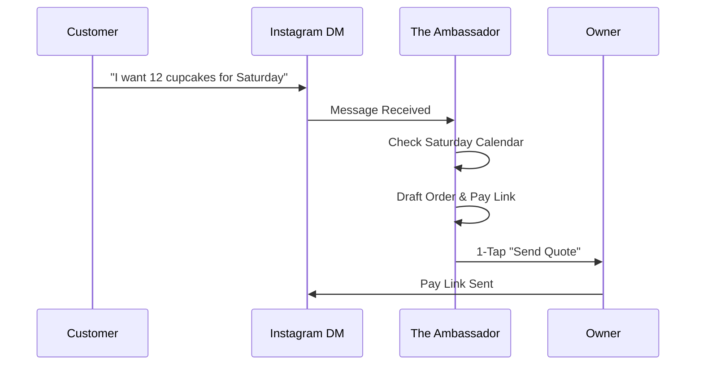

# Issue Brief: AI-Driven Social Commerce Bridge

## Problem Statement
Maya (baker) gets 90% of her leads from Instagram DMs, but converting those DMs into a "paid order" requires manual effort and back-and-forth that she misses while baking.

## Research Report
- **Market Reality:** "Social Commerce" is the primary growth engine for Gen Z/Millennial founders.
- **The Gap:** DMs are a "black hole" where data is lost. Shopify's "Inbox" is just a chat tool.
- **OHC Opportunity:** Connect the "Ambassador" agent directly to the DM stream to turn conversations into Checkouts.

### Comparative Table: Social Commerce
| Feature | OHC | Shopify Inbox | ManyChat |
| :--- | :--- | :--- | :--- |
| **Intent Detection** | AI (Autonomous) | Manual Tagging | Rule-Based |
| **Checkout Integration** | Instant Pay Link Gen | Manual Link Copy | Limited |
| **Memory** | Global Business Context | Last 5 Messages | None |

## Design Doc
### High-Level Architecture
- **Social Bridge (The Ambassador):** Listens to DM events (via MCP/Webhook).
- **Intent Extraction:** Recognizes phrases like "How much for a dozen?" or "Are you free Saturday?".
- **Cart-in-Chat:** The agent generates a "Custom Payment Link" and drops it into the chat draft for Maya to approve.

## Implementation Prompt
Build an integration between "The Ambassador" (Customer Success) and the "Finance" department. When a customer expresses purchase intent in a message, the Ambassador should prepare a "Draft Order" and a corresponding Payment Link, presenting it to the owner as a 1-tap "Send Payment Request" button.

## Priority
P0

## Estimated Scope
Medium
