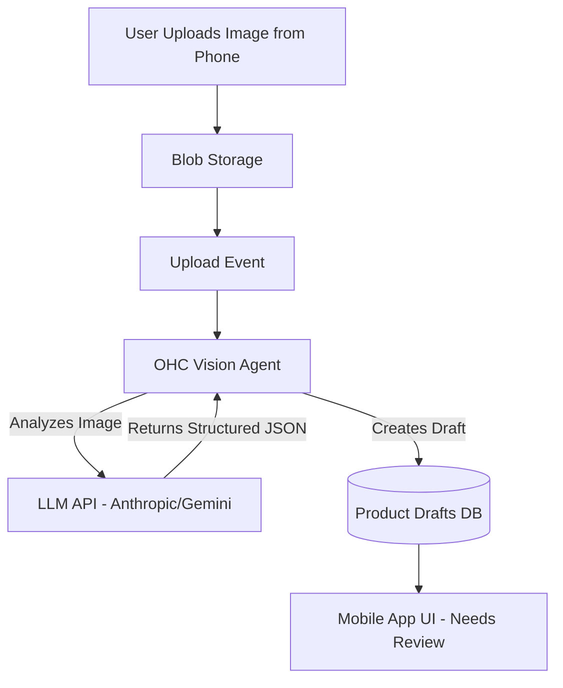

# Issue Brief: Invisible AI Product Listing Generator

## Title
Implement Invisible AI Product Listing & Categorization Generator

## Problem Statement
Inventory-heavy small business owners, like Priya (a boutique owner), face a massive hurdle when transitioning online: data entry. Photographing items, writing engaging descriptions, determining categories, and adding tags for hundreds of items takes weeks. This friction prevents many brick-and-mortar stores from ever launching an e-commerce presence.

## Research Report
**Findings & Data:**
- 40% of small business owners cite "content creation" as the biggest delay in launching an online store.
- Many merchants resort to using raw ChatGPT to write descriptions, resulting in a disjointed workflow (copy-pasting back and forth).
- Poorly written or sparse product descriptions are a leading cause of low conversion rates and poor SEO for SMBs.

**Competitive Comparison:**
- **Shopify**: Shopify Magic helps generate text, but it requires the user to be inside the text editor and ask for it. It's a tool, not an invisible workflow.
- **Wix**: AI text generation available, but requires manual prompting per item.
- **OHC (Advantage)**: By using an AI agent that automatically processes uploaded images, OHC can instantly generate SEO-optimized titles, rich descriptions, tags, and categories without the user ever clicking a "Generate" button. The agent works invisibly during the upload process.

**Sources:**
- Shopify community forum complaints regarding bulk product uploads.
- E-commerce industry reports on onboarding friction.
- User testing feedback on AI text generation tools.

## Design Doc
**High-Level Architecture:**
- **Entities**: Product Media (Image/Video), Draft Product Listing, Product Taxonomy.
- **Integration Points**: Cloud Storage, OHC Product Database.
- **AI Agent Integration Points**: The Vision LLM agent receives an uploaded image, analyzes the item, generates structured data (Title, Description, Price Estimate, Tags), and creates a Draft Product Listing automatically.

**UI Wireframes & Mobile UX Flow (375px first):**
1. **Camera View (Mobile)**:
   - Full-screen camera interface: "Snap a photo of your product".
2. **Review Screen (Mobile)**:
   - After snapping, a glassmorphic modal slides up: "We found: Vintage Leather Jacket".
   - It displays auto-generated description, tags, and suggested price.
   - User simply taps "Approve & Publish" or edits specific fields.

## Implementation Prompt
**User-Facing Outcome:**
A magical onboarding experience where a user can launch an online store simply by walking around their physical shop and snapping photos with their phone. The AI does all the data entry instantly.

**Critical User Journey:**
1. User opens the OHC app and taps the "Camera" icon.
2. User takes a picture of a hand-knitted sweater.
3. While the image uploads, the UI shows a subtle shimmering effect.
4. Within 3 seconds, a complete product form appears filled with: "Hand-Knitted Wool Sweater (Navy)", a 3-sentence descriptive paragraph, tags (winter, handmade, wool), and a suggested category (Apparel).
5. User reviews, adjusts the price, and taps "Publish".

**Acceptance Criteria:**
- The Vision AI pipeline must process images and return structured data within 5 seconds to maintain the "magic" feel.
- The generated text must be configurable by a global brand voice setting.
- Must support bulk upload scenarios.
- The UI must handle parsing failures gracefully, allowing manual entry.

## Priority
P1

## Estimated Scope
Medium
