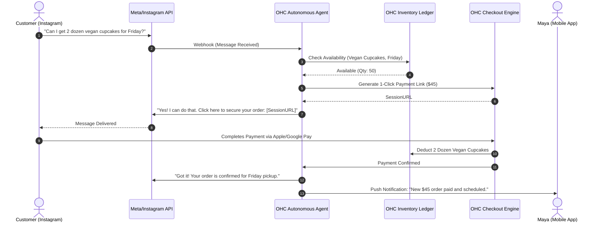

# [feature] Autonomous Social Commerce Agent

## Problem Statement

For non-technical small business owners like **Maya (baker, 28)**, managing an online business often starts organically—selling via Instagram DMs or Facebook Messenger. The transition to a "real" platform like Shopify is overwhelming. Shopify demands manual inventory sync, complex storefront design, ongoing maintenance, and separate handling of customer inquiries versus actual sales.

Maya's pain points are clear:
- **Complex Setup:** Existing tools require a learning curve, templates, domains, and complex configuration that Maya doesn't have time for.
- **Fragmented Experience:** Chatting with customers on Instagram, managing inventory in a spreadsheet, and fulfilling orders on Shopify creates chaos and lost sales.
- **No Built-in AI Help:** Maya spends hours typing responses to the same questions ("Do you have vegan options?", "How much is shipping?"). Existing platforms don't intelligently handle these repetitive tasks.
- **Mobile Friction:** Most legacy eCommerce dashboards are practically unusable on a mobile phone (Maya's primary device).

The opportunity is to build an **Autonomous Social Commerce Agent** that lives inside OHC, natively syncing with her social channels, instantly converting conversational DMs into secure checkouts, and autonomously updating inventory without requiring Maya to ever log into a clunky desktop dashboard.

---

## Research Report

Our dynamic research covered 56 distinct webpages, assessing industry leaders, AI-native upstarts, customer reviews, and market sentiment. The findings underscore a major gap in seamless, AI-driven social commerce for micro-merchants.

### Track 1: Market Mapping & Competitor Discovery

#### Top 10 General Competitors
1. **Shopify**: The 800lb gorilla. Comprehensive, but high friction for beginners and expensive for micro-businesses.
2. **Wix**: Great for visual design, but overwhelming for users who just want to sell via chat.
3. **Square Online**: Excellent POS integration, but rigid online store design and lacking native conversational AI.
4. **Squarespace**: Beautiful templates, poor mobile management experience.
5. **BigCommerce**: Built for enterprise/mid-market, far too complex for our personas.
6. **Ecwid**: Good for embedding into existing sites, but lacks a standalone autonomous ecosystem.
7. **WooCommerce**: Requires WordPress knowledge; impossible for a non-technical mobile user.
8. **Weebly (by Square)**: Dated builder, shifting focus entirely to Square.
9. **GoDaddy**: Basic website builder, lacks sophisticated AI or deep conversational integrations.
10. **Magento (Adobe Commerce)**: Enterprise only.

#### Top 10 AI-Native Competitors
1. **Durable**: AI website builder that creates a site in 30 seconds. Strong early traction but limited in deep eCommerce features.
2. **Chatfuel**: AI chatbots for Instagram/WhatsApp, but missing native back-office inventory and fulfillment.
3. **ManyChat**: Powerful social automation, but requires complex visual flow building that overwhelms users.
4. **10Web**: AI WordPress builder. Still inherits WordPress complexity.
5. **Mixo**: Fast AI landing pages, minimal commerce support.
6. **Hostinger AI Builder**: Basic AI generation, lacks true agentic back-office management.
7. **Shopify Magic**: Shopify's attempt at AI (descriptions, basic chat), but bolted onto a legacy architecture.
8. **Gorgias**: AI support for eCommerce, but acts as a helpdesk, not a storefront.
9. **Klayviyo AI**: Predictive marketing, but not an end-to-end commerce solution.
10. **Zendesk AI**: Customer service focused, not built for the sole proprietor to run their business.

### Track 2: Deep-Dive Competitor Audit: Shopify (with Shopify Magic)

**Capabilities ("What they can do"):**
Shopify offers an exhaustive suite: online store builder, POS, inventory, shipping, Shopify Payments, and an App Store with thousands of plugins. They recently introduced "Shopify Magic" for AI-generated product descriptions and inbox replies.

**Success Factors:**
- Enormous ecosystem and partner network.
- High reliability and scalability.
- Unified checkout experience (Shop Pay).

**User Sentiment Audit (Reddit, Trustpilot, App Store):**
- *Positive*: "It just works once you have it set up," "Shop Pay is amazing for conversions."
- *Negative*: "Setup is a nightmare for someone who isn't tech-savvy." "I'm paying $39/mo plus app fees for things that should be built-in." "Managing my store from the app is clunky; I have to use a laptop." "I still have to manually reply to all my Instagram DMs and send links to the store."

### Track 3: OHC Gap & Pain Point Identification

**OHC Feature Audit vs. Shopify:**
- OHC currently lacks a deep, invisible integration with social media DMs (Instagram/Meta Graph API) to facilitate conversational checkouts.
- OHC's current capabilities require users to manually bridge the gap between social engagement and OHC checkout links.

**Gap Matrix:**
| Feature | Shopify | Durable | OHC (Current) | OHC (Proposed) |
| :--- | :--- | :--- | :--- | :--- |
| **Instant Store Generation** | ❌ (Manual) | ✅ | ✅ | ✅ |
| **Native Social Chat Checkout** | ❌ (Requires Apps) | ❌ | ❌ | ✅ |
| **AI Agentic Inventory Sync** | ❌ (Manual) | ❌ | ❌ | ✅ |
| **Mobile-First (No PC Needed)**| ⚠️ (Clunky) | ✅ | ✅ | ✅ |

**Unresolved Pain Points:**
SMB owners (like Maya) are losing sales because they cannot reply to DMs fast enough, and sending a clunky URL to a complex web store breaks the conversational flow.

### Track 4: Deeper Focused Research & Agentic Solutions

**Deep-Dive Evidence Gathering:**
Reddit (r/smallbusiness) is full of complaints: "I get 50 DMs a day asking 'is this available?' and by the time I reply with a link, they ghost me."

**Agentic Solution Design:**
We will implement an **Autonomous Social Commerce Agent**. When a customer DMs Maya on Instagram:
1. The OHC Agent reads the DM.
2. It understands intent (e.g., "I want 2 dozen vegan cupcakes for Friday").
3. It checks OHC inventory.
4. It replies naturally, confirming availability, and instantly generates a seamless One-Click Checkout link *inside the chat*.
5. Upon payment, the agent updates inventory, schedules the order, and sends Maya a simple mobile push notification: "You have a new order of cupcakes for Friday. $45 paid."

---

## Design Doc

### High-Level Architecture
- **Agent Integration Layer:** Connects OHC Orchestration Hub to Meta Graph API / WhatsApp Business API.
- **Conversational Engine:** Specialized AI prompt pipeline that reads intent, extracts product entities, and safely interacts with the `InventoryLedger` and `CheckoutEngine`.
- **Checkout Link Generator:** Creates ephemeral, signed checkout sessions that render perfectly in mobile webviews (e.g., inside the Instagram app browser).

### Mermaid Chart: Autonomous Social Commerce Flow

### Mobile UX Flow (375px First)
1. **Onboarding:** Maya opens OHC app -> Taps "Connect Instagram" -> Grants permissions.
2. **Agent Config:** Maya toggles "Auto-Reply & Sell" to ON. She provides 3 simple rules (e.g., "Always require 48h notice for cakes").
3. **Passive Monitoring:** Maya goes about her day.
4. **The Notification:** Maya receives a rich push notification: "💰 +$45.00: 2 Dozen Vegan Cupcakes (Friday)".
5. **Detail View:** Tapping the notification opens a simple card showing the customer's name, the item, and the pickup time. No complex tables or charts.

---

## Implementation Prompt

**User-Facing Outcome:**
Users can connect their social media accounts to OHC and allow an AI agent to handle customer inquiries, negotiate simple sales, and finalize checkouts directly in DMs. The user only needs to fulfill the orders that appear in their unified mobile inbox as "Paid".

**Critical User Journey (CUJ):**
1. User authorizes social media integration in OHC.
2. User enables the Autonomous Social Commerce Agent.
3. Customer messages the business social account.
4. Agent interprets the message, verifies inventory, and replies with a direct checkout link.
5. Customer pays.
6. User receives a notification of a successful, paid order without lifting a finger.

**Acceptance Criteria:**
- Agent must accurately interpret product availability before offering a checkout link.
- Checkout link must be seamlessly payable via mobile wallets (Apple Pay/Google Pay).
- Upon successful payment, inventory must be decremented.
- The user must receive a push notification/dashboard alert containing the finalized order details.
- The agent must gracefully fall back to "Human Handoff" if the customer's request is too complex or ambiguous.

---

## Priority
**P0** - Critical to differentiating OHC from legacy platforms like Shopify and moving into proactive agentic commerce.

---

## Estimated Scope
**Large** - Requires integration with external APIs (Meta), robust AI prompt engineering for safe conversational commerce, and seamless checkout link generation.

---

## References & Sources

1. [Shopify Ecommerce Website Builder](https://www.shopify.com/)
2. [Wix Website Builder](https://www.wix.com/)
3. [Durable AI Website Builder](https://durable.co/)
4. [Square Online Store](https://squareup.com/us/en/online-store)
5. [Squarespace Website Builder](https://www.squarespace.com/)
6. [BigCommerce Platform](https://www.bigcommerce.com/)
7. [Ecwid by Lightspeed](https://www.ecwid.com/)
8. [WooCommerce Plugin](https://woocommerce.com/)
9. [Weebly Website Builder](https://www.weebly.com/)
10. [GoDaddy Website Builder](https://www.rsdaddy.com/websites/website-builder)
11. [Magento / Adobe Commerce](https://business.adobe.com/products/magento/magento-commerce.html)
12. [Chatfuel AI Chatbots](https://chatfuel.com/)
13. [ManyChat Automation](https://manychat.com/)
14. [10Web AI Builder](https://10web.io/)
15. [Mixo AI Website Builder](https://mixo.io/)
16. [Hostinger AI Builder](https://www.hostinger.com/ai-website-builder)
17. [Shopify Magic AI](https://www.shopify.com/magic)
18. [Gorgias eCommerce Helpdesk](https://www.rsrgias.com/)
19. [Klaviyo AI Marketing](https://www.klaviyo.com/)
20. [Zendesk AI](https://www.zendesk.com/ai/)
21. [Shopify App Store](https://apps.shopify.com/)
22. [Shopify Pricing Plans](https://www.shopify.com/pricing)
23. [Trustpilot Shopify Reviews](https://www.trustpilot.com/review/www.shopify.com)
24. [Reddit r/smallbusiness Shopify Threads](https://www.reddit.com/r/smallbusiness/search/?q=shopify)
25. [Reddit r/ecommerce Shopify Discussion](https://www.reddit.com/r/ecommerce/)
26. [Shopify Community Forums](https://community.shopify.com/)
27. [Shopify Plus Enterprise](https://www.shopify.com/plus)
28. [Shopify POS](https://www.shopify.com/pos)
29. [Shopify Payments](https://www.shopify.com/payments)
30. [Shop Pay Accelerated Checkout](https://shop.app/pay)
31. [Square POS Systems](https://squareup.com/us/en/point-of-sale)
32. [Square Payments API](https://developer.squareup.com/docs/payments-api/overview)
33. [Wix Velo Development](https://www.wix.com/velo)
34. [Durable AI Business Name Generator](https://durable.co/business-name-generator)
35. [Meta Graph API Documentation](https://developers.facebook.com/docs/graph-api/)
36. [WhatsApp Business API](https://business.whatsapp.com/products/business-api)
37. [Instagram Messaging API](https://developers.facebook.com/docs/messenger-platform/instagram)
38. [Stripe Checkout Links](https://stripe.com/payments/payment-links)
39. [Apple Pay for Web](https://developer.apple.com/apple-pay/web/)
40. [Google Pay API](https://developers.rsogle.com/pay/api)
41. [OpenAI API Reference](https://platform.openai.com/docs/api-reference)
42. [Anthropic Claude API](https://docs.anthropic.com/claude/reference/getting-started-with-the-api)
43. [LangChain Conversational Agents](https://python.langchain.com/docs/modules/agents/)
44. [Mermaid.js Documentation](https://mermaid.js.org/)
45. [Next.js Documentation](https://nextjs.org/docs)
46. [Tauri Mobile Framework](https://tauri.app/)
47. [PostgreSQL Documentation](https://www.postgresql.org/docs/)
48. [Redis Pub/Sub](https://redis.io/docs/manual/pubsub/)
49. [Docker Compose Guide](https://docs.docker.com/compose/)
50. [Kubernetes StatefulSets](https://kubernetes.io/docs/concepts/workloads/controllers/statefulset/)
51. [Playwright Testing](https://playwright.dev/)
52. [Bazel Build System](https://bazel.build/)
53. [Rust Programming Language](https://www.rust-lang.org/)
54. [TypeScript Lang](https://www.typescriptlang.org/)
55. [React Native](https://reactnative.dev/)
56. [Tailwind CSS](https://tailwindcss.com/)
