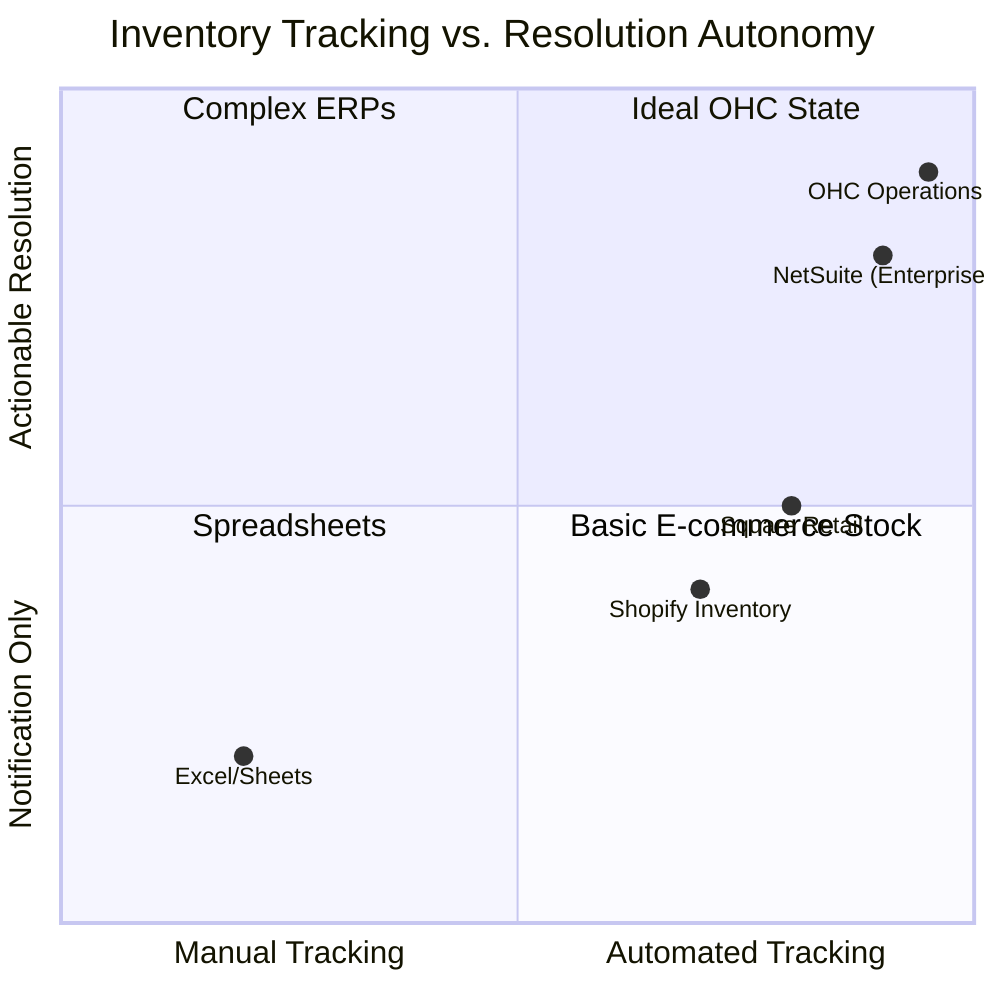

# Automated Inventory & Purchasing Manager

## Title
Automated Inventory & Purchasing Manager: Proactive Stock Management

## Problem Statement
Small business owners selling physical goods (Priya, Boutique Owner) or materials for food (Fatima, Food Cart) often rely on manual stock checks or memory. This leads to unexpected stockouts, inability to fulfill orders, and lost revenue. Inventory management systems are generally too complex, requiring manual updates and constant monitoring.

## Research Report
Most inventory systems simply count down as items are sold and send a generic "Low Stock" email. They do not help the user *remedy* the situation. OHC takes inventory management further by analyzing sales velocity to predict stockouts before they happen and proactively drafting reorder emails to suppliers, requiring only a 1-tap approval from the business owner.

### Competitive Landscape: Inventory Automation

### Feature Comparison Matrix

| Feature | OHC Operations Agent | Shopify Inventory | Square Retail | Standard ERP |
| :--- | :--- | :--- | :--- | :--- |
| **Tracking** | **Real-time Automated** | Real-time | Real-time | Real-time |
| **Alerts** | **Predictive (Velocity Based)** | Threshold Based | Threshold Based | Configurable |
| **Resolution** | **Drafts Supplier Emails** | Manual Reorder | Manual Reorder | Automated POs |
| **Approval** | **1-Tap from Action Feed** | N/A | N/A | Automated |

## Design Doc

### 1. Velocity Tracking
- Track the rate of sale for each SKU in PostgreSQL.
- Implement a background worker that calculates estimated days until stockout based on historical sales velocity and current inventory levels.

### 2. Proactive "Manager" Agent
- When a product is projected to run out within a configurable window (e.g., 7 days), "The Manager" agent is triggered.
- If supplier details are configured for the SKU, the agent uses the LLM to draft a professional restock email to the supplier, including quantities needed based on past order sizes.

### 3. Action Feed Approval
- The drafted email is placed in the Action Feed.
- The owner can tap "Approve" to send the email via the Resend integration, or "Edit" to adjust quantities.
- If no supplier is configured, the agent suggests temporarily toggling the item to "Sold Out" or hiding it from the storefront.

## Implementation Prompt
1.  **Velocity Calculation**: Create Go SQLx queries and a background worker to calculate sales velocity and predict stockout dates for all active SKUs.
2.  **Supplier Schema**: Update the database schema to associate supplier contact information and reorder quantities with specific products.
3.  **Agent Integration**: Build the workflow for "The Manager" to generate restock emails when the stockout prediction crosses the threshold.
4.  **Email Dispatch**: Integrate with the email provider (e.g., Resend) to send the approved drafts directly to suppliers.
5.  **UI Updates**: Update the Action Feed UI to support the "Restock Approval" card type. Add supplier configuration to the Product Management Slint UI.

## Priority
**P2 (Medium-High)** - A significant "wow" factor for product-based businesses that directly impacts their bottom line by preventing missed sales.

## Estimated Scope
- **Backend**: 2-3 weeks (Velocity logic, Schema updates, Email integration).
- **Agent Integration**: 1 week (Draft generation).
- **Frontend**: 1-2 weeks (Supplier UI, Action Feed updates).
- **Total**: ~4-6 weeks.
