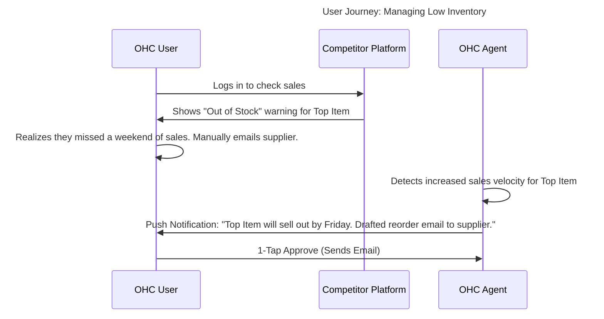

# Issue Brief: Automated Inventory & Purchasing Manager (The Manager)

## Problem Statement
For product-based businesses (like Priya's Boutique or Fatima's Food Cart), manual inventory tracking is a constant source of friction. Owners frequently discover they are out of stock only when a customer tries to buy an item, leading to lost sales and poor customer experiences. Competitors offer inventory tracking, but it requires manual updates and active monitoring. OHC needs "The Manager" (Operations Agent) to autonomously monitor stock levels, predict depletion rates, and automatically draft purchase orders or alert the owner to restock before items run out.

## Research Report

### Competitive Landscape Analysis
- **Shopify:** Robust inventory management system, but relies on the user setting manual low-stock alerts. Does not automatically generate purchase orders without third-party apps.
- **Wix:** Basic inventory tracking. Alerts exist but are passive (email notifications).
- **Square:** Good integration with POS, but forecasting and automated reordering require advanced (and expensive) tiers.

### Persona-Specific Pain Point Summary
- **Priya (35, Boutique Owner):** Needs to know when her popular "Summer Dress" in Medium is running low so she can reorder from her supplier before the weekend rush. She forgets to check the dashboard until it's too late.
- **Fatima (50, Food Cart):** Needs to know if she's running low on chicken halfway through the day so she can update her digital menu to "Sold Out" before customers try to order it for pickup.

### OHC vs Competitor Gap Analysis
| Feature | Shopify (Native) | Square | OHC Target (The Manager) |
| :--- | :--- | :--- | :--- |
| **Low Stock Alerts** | Manual Thresholds | Manual | **AI Predicted & Contextual** |
| **Actionable Alerts** | Passive (Email) | Passive | **Proactive (Drafted Reorder/Status Change)** |
| **Forecasting** | No (requires apps) | Advanced Tiers | **Built-in (Demand Prediction)** |
| **UI Integration** | Dashboard | Dashboard | **1-Tap Approval via Push Notification** |

### User Journey Comparison

### Specific Recommendations
- **OHC should** implement predictive inventory alerts based on sales velocity, rather than just static thresholds, **because** this feels like having a real store manager rather than a dumb alarm.
- **OHC should** allow the agent to automatically toggle items to "Sold Out" on the public storefront to prevent overselling, a common issue for micro-businesses.

## Design Doc

### High-Level Architecture
- **Velocity Tracker:** A background job that analyzes recent order events against current inventory levels to calculate "days remaining" for each SKU.
- **Agent Action (The Manager):** When an item is predicted to run out soon, The Manager generates an actionable alert. If supplier information is available, it drafts a purchase order email. If not, it suggests marking the item as "Low Stock" or "Sold Out" on the storefront.
- **Auto-Protect:** If inventory hits zero, The Manager automatically updates the product status to prevent further sales, pushing a notification to the owner.

### Mobile UX Flow (375px First)
1.  **Notification:** "Alert: 'Summer Dress (M)' is selling fast and will run out tomorrow. Tap to review."
2.  **Action Card:** Opening the app shows a card with options: "Draft Restock Email", "Hide from Store", or "Ignore".
3.  **One-Tap Execution:** Tapping "Draft Restock Email" shows a pre-written email to the supplier, ready to send with one tap.

## Implementation Prompt
Implement the Predictive Inventory Manager. Create a service that calculates inventory depletion velocity based on recent order history. When velocity indicates an impending stockout, trigger "The Manager" agent to create a `PendingAgentAction` that notifies the user and offers actionable next steps (e.g., drafting a restock email or updating the storefront status). Ensure these alerts are surfaced prominently in the Flutter mobile UI.

## Priority
P2

## Estimated Scope
Medium
