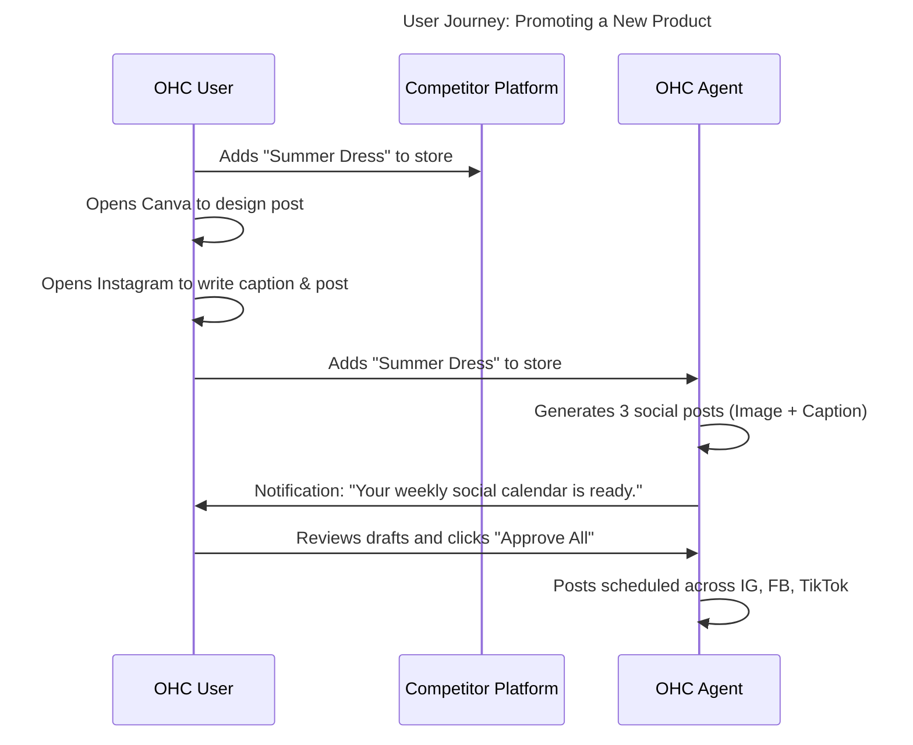

# Issue Brief: Automated Social Media Calendar (The Promoter)

## Problem Statement
"Marketing Dread" is a top 3 pain point for small business owners. Consistent social media presence is crucial for discovery, but owners like Priya (The Boutique Owner) lack the time, design skills, and copywriting ability to maintain it. Competitors require users to manually create posts or use disjointed third-party apps (e.g., Buffer, Hootsuite). OHC needs "The Promoter" (Marketing Agent) to automatically generate and schedule a week's worth of social content whenever a new product or service is added, making marketing effortless.

## Research Report

### Competitive Landscape Analysis
- **Shopify:** Integrates with Facebook/Instagram, but users must manually create ads and organic posts. Third-party apps are required for scheduling.
- **Wix:** Has a built-in social post maker, but it is manual. The user selects a template, writes the text, and schedules it.
- **Canva (Indirect Competitor):** Great for design, but disconnected from the business's inventory and operational context.

### Persona-Specific Pain Point Summary
- **Priya (35, Boutique Owner):** Receives new clothing stock weekly. She spends 3 hours taking photos, editing them, writing captions, and posting to Instagram. She often skips weeks when she's too busy, leading to drops in sales.

### OHC vs Competitor Gap Analysis
| Feature | Shopify (Native) | Wix | Third-Party (Buffer) | OHC Target (The Promoter) |
| :--- | :--- | :--- | :--- | :--- |
| **Content Generation** | Manual | Manual | Manual | **Auto-Generated (Text & Image)** |
| **Inventory Context** | Syncs Catalog | Syncs Catalog | None | **Deeply Integrated** |
| **Scheduling** | Manual | Manual | Manual | **Auto-Scheduled (Smart Times)** |
| **Effort Required** | High | Medium | High | **Zero (1-Tap Approve)** |

### User Journey Comparison

### Specific Recommendations
- **OHC should** trigger a social media generation pipeline immediately upon a new product creation event **because** striking while the iron is hot (and the user is engaged in the app) increases marketing consistency.
- **OHC should** provide 1-tap approval for an entire week's calendar **because** batch processing approvals minimizes cognitive load on the user.

## Design Doc

### High-Level Architecture
- **Event Trigger:** Listens for `ProductCreated` or `ServiceAdded` events on the NATS mesh.
- **Generation Pipeline:** "The Promoter" uses the LLM provider to draft 3-5 platform-specific captions (IG, FB) and utilizes an image generation tool (or applies a premium Glassmorphism template to the uploaded product photo) to create visual assets.
- **Scheduling Engine:** Saves the generated assets as `ScheduledPost` entities in PostgreSQL, utilizing a lightweight task scheduler to publish them via Meta Graph APIs at optimal times.
- **Mobile-First UX:** A "Marketing Calendar" view where upcoming posts are displayed as a horizontal scrollable list of cards on the 375px screen.

### Mobile UX Flow (375px First)
1.  **Creation Flow Completion:** After adding a product, a celebratory animation plays, followed by: "The Promoter is drafting your social posts..."
2.  **Review Screen:** A simple swipeable carousel of the drafted posts with the generated image and caption.
3.  **Approval:** A primary "Approve Schedule" button at the bottom.

## Implementation Prompt
Implement the Automated Social Media Calendar feature. Create a worker that listens for product creation events and triggers "The Promoter" to generate corresponding social media content. Define the `ScheduledPost` schema in the database. Implement the scheduling logic to interact with external social media APIs (stubbed for now, or using a mock integration layer). Build the Flutter UI component that presents the generated calendar to the user for one-tap approval.

## Priority
P2

## Estimated Scope
Medium
