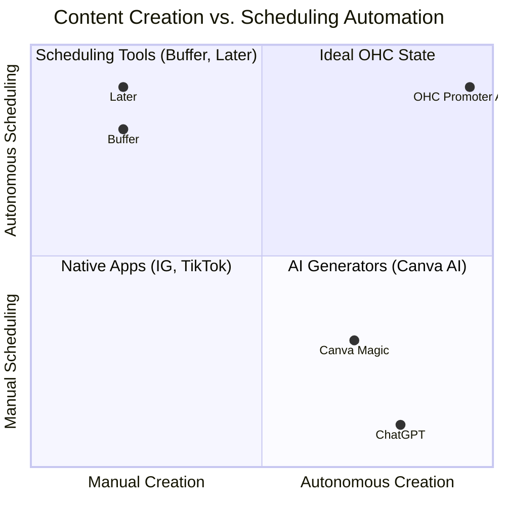

# Automated Social Media Calendar

## Title
Automated Social Media Calendar: Proactive Marketing for "Marketing Dread"

## Problem Statement
Business owners like Priya (Boutique Owner) suffer from "Marketing Dread." They lack the time, design skills, and copywriting expertise to consistently post on social media. Despite knowing it's essential for growth, their channels often sit dormant because opening Instagram and starting from a blank slate is too intimidating while running a store.

## Research Report
Our research shows that while tools like Buffer or Later exist, they only solve the *scheduling* problem, not the *creation* problem. AI tools like Canva or ChatGPT help with creation but require prompt engineering and platform-hopping. OHC's differentiation is treating content generation as a background event. When an operational event occurs (e.g., adding a new product), the marketing work should happen automatically.

### Competitive Landscape: Social Media Tools

### Feature Comparison Matrix

| Feature | OHC Promoter Agent | Buffer / Later | Canva AI | Standard E-commerce |
| :--- | :--- | :--- | :--- | :--- |
| **Trigger Mechanism** | **Event-Driven (e.g., New Product)** | Manual | Manual | N/A |
| **Content Generation** | **Fully Autonomous (Image + Copy)** | None | Manual Prompt | Basic Sharing |
| **Cross-Platform** | **IG, FB, TikTok** | Multiple | N/A | Varies |
| **Approval Flow** | **1-Tap from Action Feed** | Manual Scheduling | Download/Upload | Manual |

## Design Doc

### 1. Event Triggers
- Utilize the NATS mesh to listen for `ProductAdded`, `InventoryRestocked`, or `PromotionCreated` events.

### 2. "The Promoter" Agent Logic
- Upon receiving a trigger, "The Promoter" agent accesses the product metadata, images, and the business's brand voice guidelines (stored via pgvector embeddings).
- The agent utilizes the LLM to draft a week's worth of varied social media posts (e.g., "Sneak Peek", "Now Available", "Styling Tips").

### 3. Review & Scheduling UI
- The generated calendar is presented in the unified Action Feed.
- The business owner can tap "Approve All" or individually edit captions.
- Approved posts are queued in the AI Job Queue (PostgreSQL `SKIP LOCKED`) for timed publication via the Meta Graph API.

## Implementation Prompt
1.  **Event Subscription**: Configure "The Promoter" agent to subscribe to product/inventory events on the NATS mesh.
2.  **Prompt Engineering**: Develop robust system prompts for "The Promoter" to generate platform-specific copy (e.g., shorter for IG, conversational for TikTok) based on product data.
3.  **Media Handling**: Ensure product images are automatically optimized (WebP format) and staged in GCS/MinIO for API posting.
4.  **Job Queue**: Implement the scheduling logic using the existing PostgreSQL job queue for delayed execution of API calls.
5.  **API Integration**: Integrate with Meta Graph API for automated posting to linked Instagram/Facebook accounts.
6.  **UI Implementation**: Build the "Marketing Calendar" review view in Slint, optimizing for a 375px mobile screen.

## Priority
**P2 (Medium-High)** - Critical for differentiation, but requires the core inventory/product features to be stable first.

## Estimated Scope
- **Backend**: 2-3 weeks (Event wiring, Scheduling logic, Meta API integration).
- **Agent Integration**: 1-2 weeks (Prompt tuning and content generation flow).
- **Frontend**: 1-2 weeks (Calendar UI and approval flow).
- **Total**: ~5-7 weeks.
