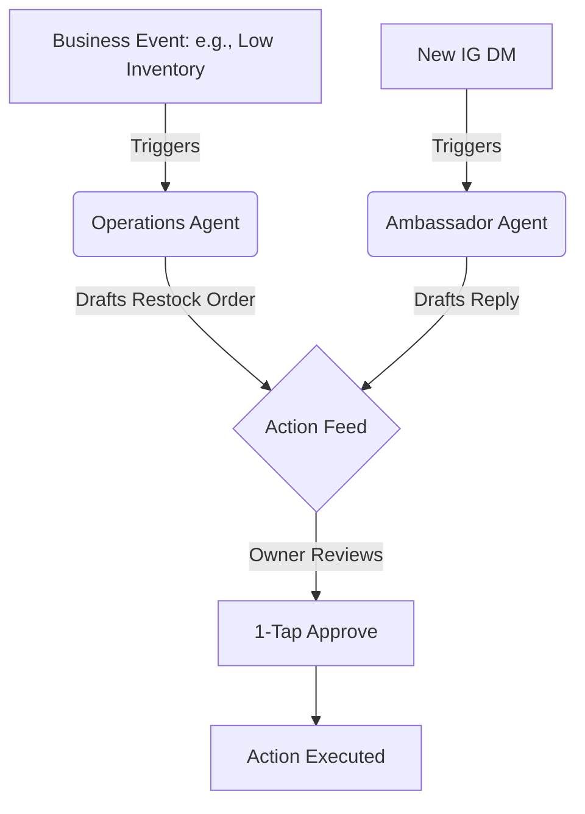

# Feature Brief: Autonomous Action Feed

## Problem Statement

Small business owners—from bakers to handymen—are fundamentally underserved by current digital tools. They seek **business autonomy** but are instead handed **technical chores**. The entry barrier is plagued by setup complexity, jargon, and high operational fatigue. Tools like Shopify are designed for professional e-commerce operations, not a solo entrepreneur running a business from an iPhone while serving a customer in person. The opportunity for OHC is to leapfrog these legacy systems by treating AI not as a reactive tool, but as a proactive, invisible teammate that handles the operational friction. The overarching theme from reviews is that the **platform should work for the owner, not the other way around**.

## Research Report

### Context and Persona Mapping

*   **Setup Complexity (73% complaint rate):** Users are alienated by DNS, liquid templates, and complex shipping configurations.
*   **Operational Fatigue (68% complaint rate):** The "never-ending inbox" across DMs, emails, and comments leads to lost sales.
*   **Marketing Dread (55% complaint rate):** Content creation is the #1 reason businesses stall after 3 months.

**Competitor Gap Analysis:**
*   **Shopify:** Complex onboarding (30m+). No true free tier. AI (Sidekick) is a reactive chatbot, not a proactive agent.
*   **Wix/Squarespace:** Easier setup but still firmly rooted as "website builders," not end-to-end business managers.
*   **Durable:** Winning on speed (30s site generation) but extremely thin on actual business management features.

**OHC The Leapfrog Strategy:**
The data indicates that the "generative website" is now table stakes. The true differentiation lies in **Ongoing Autonomous Operations**. OHC must transition from a software platform to a literal "digital employee." Instead of tools requiring prompts, OHC provides *teammates* triggered by events (e.g. The Silent Ambassador for Customer Success, The Vigilant Manager for Operations).

## Design Doc

### Core Architectural Decisions
*   **Mobile-First Setup (375px native):** Onboarding and operations must assume the user is exclusively on a phone.
*   **Event-Driven Agent Architecture:** Agents subscribe to the OHC internal event mesh rather than waiting for a user prompt.
*   **1-Tap Approval Loop:** Agents queue actions in a unified "Action Feed" on the dashboard. The user acts as the approver, not the creator.

### The Autonomous Action Loop (Mermaid)

## Implementation Prompt

**Target Outcome:** Build the "Autonomous Action Feed" (The unified dashboard inbox).

**User Journey:**
1. A background agent detects a business event (e.g., an unread message or a low inventory item).
2. The agent generates a proposed action (e.g., a drafted reply or a drafted purchase order).
3. The proposed action is surfaced on the mobile dashboard in the `Action Feed`.
4. The user (business owner) reviews the card and taps exactly once ("Approve" or "Send") to execute the action, or taps "Edit" to modify it.

**Requirements:**
*   Implement the UI for the Action Feed, optimized strictly for 375px mobile view.
*   The feed should handle at least two types of agent-generated cards: a "Message Draft" and an "Operational Alert."
*   Do not prescribe specific database schemas or API contracts; design the data structure to handle abstract "Action Cards" that can be fulfilled asynchronously.
*   Ensure the UX feels native, utilizing glassmorphism or premium OHC design tokens, with clear optimistic UI updates when an action is approved.

## Priority
P0

## Estimated Scope
Medium
