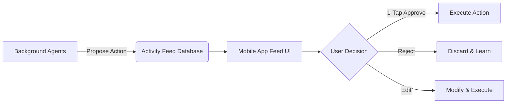

# Title: Autonomous Activity Feed for 1-Tap Agent Approvals

## Problem Statement
In the OHC vision, AI agents perform tasks invisibly in the background (drafting emails, adjusting inventory, answering customer queries). However, completely autonomous action can erode user trust if the business owner feels they are losing control. Small business owners need a way to review, approve, and oversee what their AI "employees" are doing without being forced to manually execute the tasks themselves.

## Research Report
*   **Context:** Trust is the primary barrier to AI adoption for critical business functions. Owners fear an AI might send an inappropriate email or change a price incorrectly.
*   **Competitor Analysis:** Current tools either require manual execution (Shopify, Wix) or offer full automation with limited visibility (Zapier automations). There is a gap for "human-in-the-loop" interfaces designed for non-technical users.
*   **Persona Pain Point (Leo):** Leo wants the AI to handle scheduling follow-ups with his music students, but he wants to glance at the emails before they go out, just to be sure. He doesn't want to write them, just approve them.
*   **Recommendation:** Implement an "Agent Activity Feed" as the primary operational UI. This feed acts like an inbox for agent-proposed actions, allowing the owner to approve, reject, or edit actions with a single tap.

## Design Doc
*   **High-Level Architecture:**
    *   **Agent Task Queue:** A system where agents publish `ProposedAction` payloads instead of executing them immediately (unless configured for full autonomy).
    *   **Activity Feed UI:** A mobile-optimized list view acting as the central hub of the OHC app.
*   **UI/UX Flow (Mobile First - 375px):**
    *   **Visual Style:** Inspired by a social media feed or a modern email inbox.
    *   **Card Design:** Each card represents a proposed action.
        *   *Icon:* Indicates the agent (e.g., Marketing, Concierge).
        *   *Headline:* What the agent wants to do (e.g., "Drafted a follow-up email to Sarah").
        *   *Preview:* A snippet of the email or the proposed price change.
        *   *Actions:* Prominent buttons for [Approve], [Edit], [Reject].
    *   **Motion Tokens:** Using OHC Premium tokens, approving an action should swipe the card away with a satisfying, subtle animation (≤ 300 ms, cubic-bezier(0.4, 0, 0.2, 1)).

## Implementation Prompt
Design the data schema for the `ActivityFeed` and `ProposedAction` entities. The schema must support polymorphic action types (e.g., `EmailAction`, `InventoryAction`, `RefundAction`) so the UI can render appropriate preview components. Implement the state machine for an action (Pending -> Approved/Rejected -> Executed -> Completed/Failed). Create the GraphQL or REST endpoints necessary for the mobile app to fetch pending actions, submit approvals, and fetch the history of completed actions.

## Priority
P0

## Estimated Scope
Large
