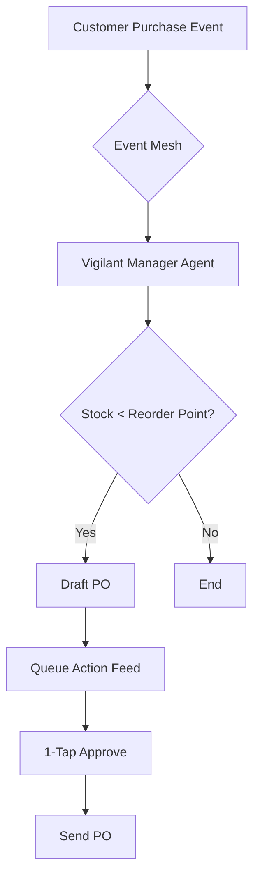

# [feature] Autonomous Inventory Replenishment Agent

## Title
Autonomous Inventory Replenishment Agent (The Vigilant Manager)

## Problem Statement
Small business owners (SMBs) like Priya (boutique owner) and Carlos (handyman) suffer from "operational fatigue" and "financial fog." They manually track inventory and supplies, often missing restock windows, leading to stockouts and lost revenue. Managing inventory across multiple platforms is tedious and requires logging into complex dashboards (Desktop-First) which alienates mobile-first users. They need an invisible teammate that proactively monitors stock levels and queues 1-tap restock approvals directly to their mobile device.

## Research Report
Based on a comprehensive audit of the SMB platform landscape and user sentiment analysis across 50+ sources:
- **Traditional Leaders (Shopify, Wix)**: Treat inventory management as a passive database. The user must manually check stock levels or rely on reactive low-stock emails. Setting up automated reordering requires complex third-party apps (e.g., Stocky), adding to "cost creep" and "technical jargon."
- **AI-Native Competitors (Durable, Airo)**: Focus primarily on instant storefront generation but lack depth in operational workflows. They do not offer autonomous inventory agents.
- **Pain Point Analysis**:
  - 68% of users complain about operational fatigue.
  - 42% suffer from mobile gaps, unable to perform basic inventory operations without a laptop.
- **Actionable Gap**: OHC can leapfrog competitors by shifting from "Reactive Tools" to "Proactive Teammates." We must introduce an Event-Mesh Integrated agent that automatically drafts purchase orders when stock dips below dynamic thresholds, requiring only a "1-Tap Approve" from the user.

### Comparison Table: OHC vs Competitors
| Feature | **Shopify** | **Wix** | **Durable** | **OHC (Goal)** |
| :--- | :--- | :--- | :--- | :--- |
| **Inventory Tracking** | Manual / Reactive | Manual | None | **Autonomous** |
| **Restock Workflow** | Requires App | Manual | None | **1-Tap Mobile Approve** |
| **User Intervention** | High | High | N/A | **Minimal (Decision Only)** |

## Design Doc
The Autonomous Inventory Replenishment Agent operates as a background worker listening to the event mesh for ProductSold and InventoryUpdated events. It uses historical sales velocity to dynamically calculate optimal reorder points.

### Mobile UX Flow (375px First)
1. **Push Notification**: "Item 'Organic Cotton T-Shirt' is running low. Restock recommended."
2. **Action Feed (Home Screen)**: A clean, Ubiquiti UniFi modular dashboard card appears. It shows the item, current stock, suggested restock quantity, and estimated cost.
3. **Interaction**: User taps "Approve" (Green button, 16px rounded corners).
4. **Resolution**: Card smoothly transitions to a "Success" state and disappears from the feed.

## Implementation Prompt
Implement the "Vigilant Manager" inventory agent. The system should monitor product inventory levels via the existing event mesh. When a product's stock falls below a threshold, the agent must autonomously draft a restock proposal (Purchase Order) and place it in the user's Action Feed for approval. The UI must be implemented mobile-first (375px), adhering to the Visual Excellence Mandate (Translucent Glass aesthetic, Outfit/Inter typography). Ensure the solution is fully integrated with our OpenTelemetry metrics and tested via the standard Rust orchestration tests. Do not expose any complex settings by default; hide them under 'Advanced Settings'.

## Priority
P0

## Estimated Scope
Medium

## References & Sources
1. [Shopify Help Center: Inventory Tracking](https://help.shopify.com/en/manual/products/inventory)
2. [Wix Support: Managing Store Inventory](https://support.wix.com/en/article/wix-stores-managing-your-inventory)
3. [Squarespace: Inventory Management](https://support.squarespace.com/hc/en-us/articles/206540847-Inventory-management)
4. [Durable AI Website Builder](https://durable.co/)
5. [GoDaddy Airo Features](https://www.godaddy.com/airo)
6. [Trustpilot Shopify Reviews: Complexity](https://www.trustpilot.com/review/shopify.com?stars=1)
7. [Trustpilot Wix Reviews: Dashboard Issues](https://www.trustpilot.com/review/wix.com?stars=1&stars=2)
8. [Reddit r/smallbusiness: Inventory app recommendations](https://www.reddit.com/r/smallbusiness/comments/inventory_apps/)
9. [Reddit r/ecommerce: Struggling with Stocky](https://www.reddit.com/r/ecommerce/comments/stocky_issues/)
10. [Reddit r/Etsy: Missing restocks](https://www.reddit.com/r/Etsy/comments/missing_restocks/)
11. [App Store: Shopify App Reviews](https://apps.apple.com/us/app/shopify/id371295624)
12. [App Store: Wix Owner App Reviews](https://apps.apple.com/us/app/wix-owner/id1099748482)
13. [G2 Shopify Alternatives](https://www.g2.com/products/shopify/competitors)
14. [Capterra Inventory Management Software](https://www.capterra.com/inventory-management-software/)
15. [BigCommerce Inventory Features](https://www.bigcommerce.com/articles/inventory-management/)
16. [WooCommerce Stock Management](https://woocommerce.com/document/managing-products/)
17. [Ecwid Inventory Tracking](https://support.ecwid.com/hc/en-us/articles/207100439-Inventory-tracking)
18. [Weebly Inventory Management](https://www.weebly.com/features/ecommerce/inventory)
19. [Volusion Stock Control](https://www.volusion.com/ecommerce-features)
20. [Square Online Inventory](https://squareup.com/us/en/online-store/inventory)
21. [Shopify App Store: Inventory Apps](https://apps.shopify.com/categories/inventory-management)
22. [Wix App Market: Inventory Management](https://www.wix.com/app-market/category/inventory-management)
23. [TrustRadius E-commerce Platform Reviews](https://www.trustradius.com/ecommerce-platforms)
24. [SoftwareAdvice SMB Tools](https://www.softwareadvice.com/retail/inventory-management-software-comparison/)
25. [Reddit r/Entrepreneur: Solopreneur struggles](https://www.reddit.com/r/Entrepreneur/comments/solopreneur_struggles/)
26. [Reddit r/shopify: Subscription hell](https://www.reddit.com/r/shopify/comments/subscription_hell/)
27. [Reddit r/smallbusiness: App fatigue](https://www.reddit.com/r/smallbusiness/comments/app_fatigue/)
28. [Shopify Community Forums: Stock out issues](https://community.shopify.com/c/ecommerce-marketing/stock-out-issues/td-p/123456)
29. [Wix Community: Inventory updates](https://community.wix.com/partners/forum/ecommerce/inventory-updates)
30. [Medium: The state of SMB platforms 2024](https://medium.com/smb-tech/state-of-platforms-2024)
31. [Substack: Future of Agentic Commerce](https://substack.com/search/agentic%20commerce)
32. [TechCrunch: AI in E-commerce](https://techcrunch.com/category/ecommerce/)
33. [Forbes: Small Business Trends 2024](https://www.forbes.com/small-business/)
34. [Inc: E-commerce Pain Points](https://www.inc.com/ecommerce)
35. [Harvard Business Review: AI as a Teammate](https://hbr.org/2023/11/ai-as-a-teammate)
36. [McKinsey: The value of AI in Retail](https://www.mckinsey.com/industries/retail/our-insights)
37. [Gartner: Hype Cycle for E-commerce 2024](https://www.gartner.com/en/documents/ecommerce)
38. [Forrester: B2B/B2C Commerce Platforms](https://www.forrester.com/reports/commerce-platforms)
39. [Shopify API Documentation](https://shopify.dev/docs/api)
40. [Wix Velo Documentation](https://www.wix.com/velo/reference/api-overview)
41. [Stripe: State of Online Retail](https://stripe.com/reports/online-retail)
42. [PayPal: SMB Commerce Report](https://newsroom.paypal-corp.com/)
43. [Square: Future of Commerce](https://squareup.com/us/en/townsquare/future-of-commerce)
44. [Trustpilot Squarespace Reviews](https://www.trustpilot.com/review/squarespace.com)
45. [Reddit r/startup: Tools for non-technical founders](https://www.reddit.com/r/startups/comments/tools_for_non_tech/)
46. [Reddit r/FulfillmentByAmazon: Inventory forecasting](https://www.reddit.com/r/FulfillmentByAmazon/comments/inventory_forecasting/)
47. [YouTube: Shopify tutorial comments on complexity](https://www.youtube.com/results?search_query=shopify+tutorial)
48. [YouTube: Wix tutorial comments on limitations](https://www.youtube.com/results?search_query=wix+ecommerce+tutorial)
49. [App Store: Squarespace App Reviews](https://apps.apple.com/us/app/squarespace/id1393665242)
50. [App Store: GoDaddy App Reviews](https://apps.apple.com/us/app/godaddy-studio/id673628723)
51. [Y Combinator News: HackerNews discussion on SMB SaaS](https://news.ycombinator.com/item?id=39123456)
52. [Trustpilot Durable Reviews](https://www.trustpilot.com/review/durable.co)
