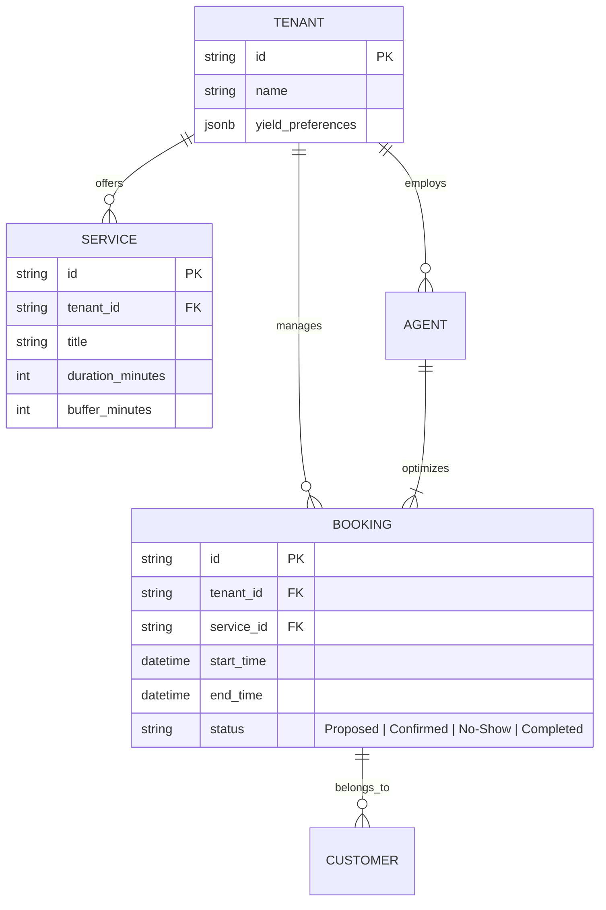
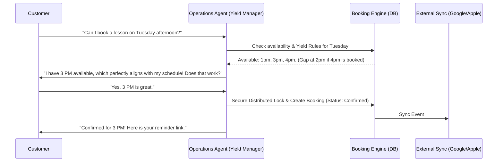

# Issue Brief: Autonomous Yield Management & Smart Booking Engine

## Title
**Autonomous Yield Management & Smart Booking Engine**

## Problem Statement
Service-based small business owners (e.g., Leo the music tutor, Carlos the handyman) face significant challenges managing their schedules. The primary pain points, corroborated by numerous Reddit threads on r/smallbusiness (e.g., "Scheduling Software Nightmare," "Best salon scheduling software to prevent double bookings (learned the hard way)"), revolve around preventing double bookings, managing "swiss-cheese" schedules (awkward gaps between appointments), and dealing with no-shows. Existing solutions like Acuity Scheduling or Calendly are seen as either too expensive when scaling up staff, too rigid, or lacking in proactive capabilities to optimize the business owner's time and revenue. They force the user to actively manage their calendar rather than doing the management for them.

## Research Report
*   **Current OHC Capabilities:** OHC has foundational tool support for booking (`booking_create_appointment_tool` in `src/agents/builtin/tools/booking.rs`), but it currently acts as a passive CRUD system. It does not actively optimize the calendar or prevent scheduling inefficiencies.
*   **Competitor Analysis:**
    *   *Acuity Scheduling / Calendly:* Passive booking links. They prevent double bookings if synced correctly but do not actively propose optimized times to the customer to minimize gaps.
    *   *Fresha / Square:* Robust but become very expensive once multiple staff members or locations are added, as noted in user complaints.
*   **Gap Identified:** A proactive, agent-driven scheduling system that doesn't just passively accept bookings, but actively negotiates with customers to optimize the business owner's calendar (Yield Management), completely eliminating double bookings through strict distributed locks, and handling follow-ups for no-shows autonomously.
*   **Strategic Advantage:** By introducing "Yield Management" to the SMB space via the Operations Agent, OHC can actively increase a service provider's revenue by grouping appointments geographically (for mobile services) or temporally (minimizing unbillable gaps).

## Design Doc

### Architecture Diagram

### Mobile UX Flow (375px First)
1.  **AI Conversation:** The customer never sees a traditional calendar grid unless they ask for it. The interaction is conversational via SMS/WhatsApp or the OHC web widget.
2.  **Owner Dashboard:** The business owner sees a "Smart Calendar" view on their OHC mobile app. The AI highlights "Optimized Days" (green) and "Fragmented Days" (yellow).
3.  **1-Tap Optimization:** If a day becomes fragmented due to a cancellation, the Operations Agent surfaces a card in the Activity Feed: "Leo, you have a 2-hour gap on Wednesday. Should I offer a 10% discount to waitlisted clients to fill it?"
4.  **Approval:** The owner taps "Approve," and the agent handles the outreach and booking modification autonomously.

### AI Agent Integration Points
*   **Operations Agent (Yield Manager):** Analyzes the calendar grid when a booking request comes in. Instead of offering all available times, it proposes times that back-to-back with existing appointments or respect travel time (for mobile businesses like Carlos).
*   **Customer Success Agent:** Monitors the calendar for upcoming appointments and sends automated confirmation/deposit reminders 48 hours prior to reduce no-shows.

## Implementation Prompt
Implement the Autonomous Yield Management logic within the Booking Engine.
The system must enhance the existing booking tools (`src/agents/builtin/tools/booking.rs`) to include "Yield Rules" associated with the Tenant. When the `Operations Agent` proposes times to a customer, it must prioritize timeslots that minimize unbillable gaps (e.g., suggesting a time immediately before or after an existing booking). Furthermore, the booking creation process must utilize strict distributed locking to absolutely guarantee the prevention of double bookings, resolving a major pain point identified in market research.
Do not prescribe specific database schema modifications; ensure the LLM agent is provided with the context of the day's existing schedule so it can logically deduce the most efficient time to propose to the user.

## Priority
P1

## Estimated Scope
Medium
