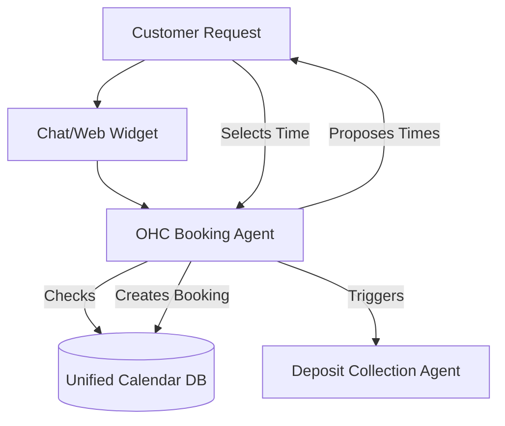

# Issue Brief: Intelligent Unified Mobile Booking & Scheduling System

## Title
Implement Intelligent Unified Mobile Booking & Scheduling System

## Problem Statement
Service-based small business owners like Carlos (a handyman) and Leo (a music tutor) struggle with chaotic, manual scheduling. They juggle texts, emails, and phone calls to find available times. Existing platforms like Calendly are separate tools that don't integrate well with their central business operations (billing, CRM), and comprehensive platforms like Shopify are built for products, not services. Setting up a booking system usually requires desktop navigation, which is impossible for mobile-first users.

## Research Report
**Findings & Data:**
- 68% of service-based SMBs report that missed calls or delayed responses lead to lost bookings.
- The majority of complex setup complaints on platforms like Squarespace relate to their Acuity Scheduling add-on being disconnected from the core website builder.
- Service businesses are the fastest-growing segment of the creator economy, yet most "store builders" treat services as a generic "digital product."

**Competitive Comparison:**
- **Shopify**: Highly optimized for physical/digital goods. Services require clunky third-party apps with separate subscriptions.
- **Wix**: Wix Bookings is functional but complex to set up. The mobile app interface is overwhelming for quick edits.
- **Squarespace**: Uses Acuity, which is powerful but feels like a separate product bolted on.
- **OHC (Advantage)**: By integrating an invisible agent that handles calendar synchronization and natural language booking requests, OHC can offer a booking system that feels entirely conversational for the customer and is managed entirely via the mobile UI for the business owner.

**Sources:**
- Reddit r/smallbusiness and r/sidehustle discussions on scheduling struggles.
- Analysis of Squarespace and Shopify app store reviews for booking plugins.
- Industry reports on the growth of the service economy.

## Design Doc
**High-Level Architecture:**
- **Entities**: Service Offering, Staff Member/Resource, Availability Block, Booking Appointment.
- **Integration Points**: Google Calendar/Apple Calendar sync, Stripe for deposit collection.
- **AI Agent Integration Points**: The AI agent parses natural language availability requests ("Do you have time next Tuesday afternoon?") into structured calendar queries and proposes available slots directly in chat.

**UI Wireframes & Mobile UX Flow (375px first):**
1. **Calendar View (Mobile)**:
   - A clean, daily timeline view using the Premium Outfit font.
   - Glassmorphic event blocks showing confirmed vs. pending appointments.
2. **Add Service Flow**:
   - Conversational setup: "What service do you offer?" -> "Piano Lesson". "How long is it?" -> "60 minutes". "Price?" -> "$50".
   - Generates a booking link instantly.

## Implementation Prompt
**User-Facing Outcome:**
A seamless mobile booking system that allows business owners to define their availability and services in minutes from their phone. Customers can book and pay deposits through a conversational AI assistant or a clean, modern web interface.

**Critical User Journey:**
1. User taps "Add Booking Service" on the mobile dashboard.
2. User enters "Guitar Lesson", "60 mins", "$60".
3. User connects their personal Google Calendar with one tap.
4. OHC provides a unique booking link.
5. Customer clicks link, selects a time, pays a $20 deposit via Stripe integration.
6. The appointment appears automatically on the owner's calendar.

**Acceptance Criteria:**
- The system must prevent double-booking across connected external calendars.
- The UI must allow full management (creation, editing, cancellation) entirely from a mobile screen.
- Deposit collection must be integrated seamlessly.
- Must pass the "grandmother test" for creating a new service.

## Priority
P1

## Estimated Scope
Large
