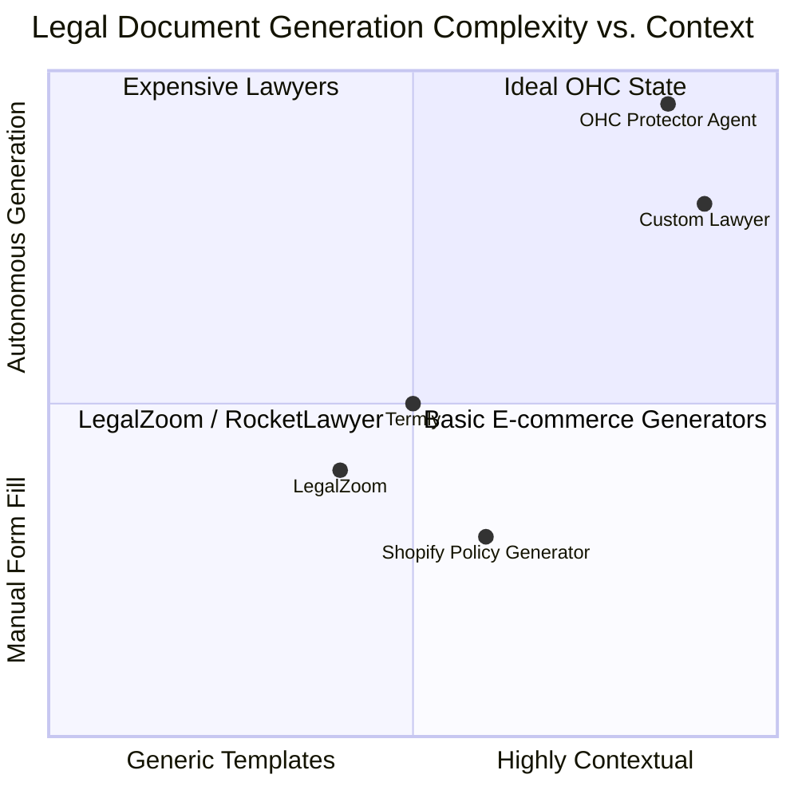

# One-Tap Legal Compliance

## Title
One-Tap Legal Compliance: Removing the Fear of Liability for SMBs

## Problem Statement
Small business owners (especially service providers like Handymen or Food Cart operators) live in fear of liability but cannot afford expensive lawyers or complex legal zoom templates. Generating basic Terms of Service, Privacy Policies, or custom liability waivers is an intimidating roadblock to launching a business.

## Research Report
While platforms like Shopify offer basic generators, they require the user to fill out lengthy forms and copy-paste text. They do not adapt dynamically to the business model (e.g., a home baker needs different clauses than a freelance plumber). OHC uses "The Protector" agent to automatically generate and attach contextual legal documents based on the business's profile and active features.

### Competitive Landscape: Legal Tools

### Feature Comparison Matrix

| Feature | OHC Protector Agent | Shopify Generators | LegalZoom |
| :--- | :--- | :--- | :--- |
| **Generation Method** | **Autonomous based on Profile** | Manual Form Fill | Questionnaires |
| **Contextual Adaptation** | **Yes (Service vs. Product)** | Limited | High (but manual) |
| **Updates** | **Automatic on Feature Change** | Manual | Manual |
| **Integration** | **Native to Checkout/Booking** | Copy/Paste | External |

## Design Doc

### 1. Document Generation Engine
- "The Protector" agent uses the Scribe Proactive RAG MCP to access a database of legally verified clauses and templates.
- When a business profile is created or modified (e.g., adding a physical product vs. a service), the agent triggers document generation.

### 2. Contextual Waivers
- For service bookings, the agent can generate specific liability waivers (e.g., "Not responsible for existing plumbing issues") that are automatically attached to the Stripe checkout flow or booking confirmation.

### 3. User Interface
- A simple "Legal & Compliance" tab in the dashboard showing active policies with a "Regenerate" button.

## Implementation Prompt
1.  **Template Storage**: Set up a pgvector collection of standard legal clauses and constraints for the LLM to use as context.
2.  **Agent Logic**: Implement "The Protector" agent workflow to generate Markdown documents (ToS, Privacy Policy, Return Policy) using the business profile data as input.
3.  **PDF/HTML Conversion**: Create a Go service to convert the generated Markdown into clean HTML (for the website) and PDF (for waivers/contracts).
4.  **Checkout Integration**: Ensure that generated policies are automatically linked in the public storefront footer and booking checkout flows.
5.  **UI Implementation**: Build the Legal tab in the Slint UI for the business manager to view and manage these documents.

## Priority
**P3 (Medium)** - Important for trust and safety, but core commerce features take precedence.

## Estimated Scope
- **Backend**: 2 weeks (Agent logic, RAG setup, Markdown conversion).
- **Integration**: 1 week (Checkout/Storefront linking).
- **Frontend**: 1 week (Legal management UI).
- **Total**: ~4 weeks.
