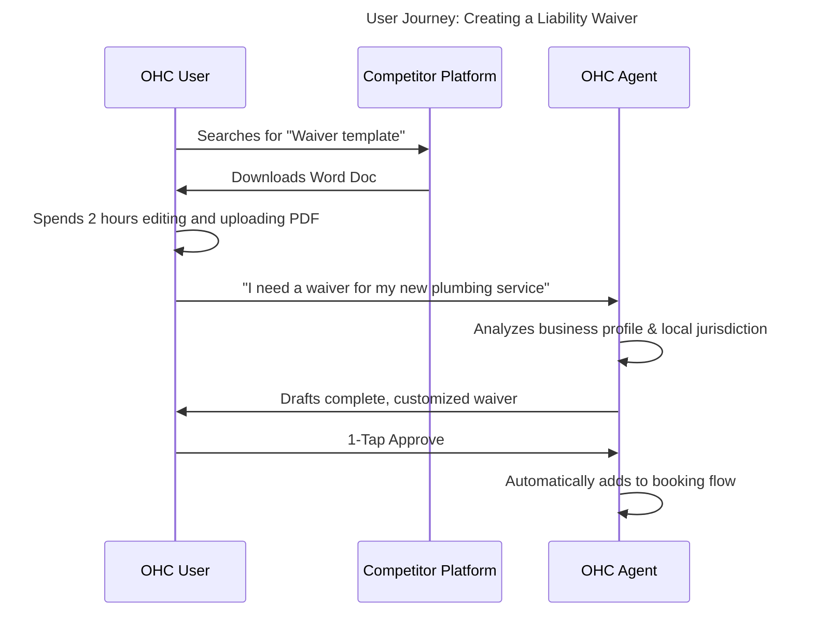

# Issue Brief: One-Tap Legal & Compliance Setup (The Protector)

## Problem Statement
Legal and compliance requirements (Terms of Service, Privacy Policies, Cookie Banners, customized contracts) are terrifying for non-technical small business owners. They often operate without proper protection because hiring a lawyer is too expensive and writing it themselves is intimidating. Competitors provide generic templates that users must manually edit, which still leaves them anxious about making mistakes. OHC needs "The Protector" (Legal & Compliance Agent) to automatically generate, maintain, and apply necessary legal safeguards based on the specific business type and jurisdiction.

## Research Report

### Competitive Landscape Analysis
- **Shopify:** Offers policy generators, but they are generic templates. The user must read through them and fill in the blanks manually.
- **Wix:** Similar template approach. No proactive compliance checking.
- **Squarespace:** Basic templates. No context-aware generation based on the specific services offered.

### Persona-Specific Pain Point Summary
- **Carlos (42, Handyman):** Needs a simple liability waiver and service agreement before starting big jobs, but he just does hand-shake deals because creating contracts is hard.
- **Maya (28, Home Baker):** Worried about food allergy liabilities. Needs a clear, legally sound disclaimer on her site and order forms, but doesn't know how to write one.

### OHC vs Competitor Gap Analysis
| Feature | Shopify Policy Gen | Wix | OHC Target (The Protector) |
| :--- | :--- | :--- | :--- |
| **Generation Method** | Fill-in-the-blank Template | Template | **Fully Context-Aware AI Generation** |
| **Maintenance** | Manual | Manual | **Proactive (Agent updates when laws/business change)** |
| **Custom Contracts** | N/A | N/A | **Yes (e.g., Service Agreements on demand)** |
| **Integration** | Manual linking | Manual | **Auto-applied to website footer & checkout flows** |

### User Journey Comparison

### Specific Recommendations
- **OHC should** automate the generation of standard policies (Privacy, ToS) during the onboarding phase **because** it removes a major psychological barrier to launching.
- **OHC should** integrate "The Protector" directly into the checkout and booking flows to dynamically append necessary disclaimers (e.g., food allergens, liability waivers) **because** context-specific protection is highly valued by service and food businesses.

## Design Doc

### High-Level Architecture
- **Compliance Engine:** An AI-driven service that takes the business profile (industry, location, products/services) and generates legally sound policy documents using specialized system prompts.
- **Dynamic Policy Injection:** Generated policies are stored in the database and dynamically injected into the generated storefront footer and checkout/booking flows.
- **Contract Generation Request:** Users can request specific documents via natural language ("I need a catering contract for a wedding next week"). The agent generates it and saves it to a `documents` table for review and sending.

### Mobile UX Flow (375px First)
1.  **Setup Complete Screen:** After generating the initial store, a card appears: "The Protector has generated your Privacy Policy, Terms of Service, and a basic Allergy Disclaimer. [Review Documents]"
2.  **Document Viewer:** A clean, readable text view of the generated policy.
3.  **On-Demand Interface:** A simple chat interface within the "Legal" tab where the owner can ask for specific contracts.

## Implementation Prompt
Implement the Legal & Compliance generation capabilities. Create a specialized agent profile for "The Protector." Hook this agent into the initial store generation pipeline so that it automatically creates and saves default Privacy Policy and Terms of Service documents based on the user's business description. Ensure these documents are accessible via the API so the frontend can dynamically render them in the storefront. Build a simple UI component in the mobile app to view these generated documents.

## Priority
P3

## Estimated Scope
Medium
